摘抄、归纳、推理
> 1. 准确提炼事实
> 2. 分析和归纳，推断或评论
> 3. 发现问题，提出方案和解决措施
> 4. 准确规范、简明扼要

---
#### 单一题（要素明确）
> 要素：问题，影响（意义、危害），对策
> 
> 赋分方式：按点（词）赋分

#### 综合题（要素不明确）
> 要素：内涵，原因，影响（意义、危害），对策
> 
> 赋分方式：
> 
> 	- 分层次（要素）
> 	- 按点（词）赋分

#### 公文题（有格式、要素多、语言可能得分）
> 判断内容：量词+问种（一篇发言稿）
> 
> 要素：问题，影响（意义、危害），对策
> 
> 赋分方式：
> 
> 	- 格式
> 	- 语言
> 	- 内容：分层次（多要素）+ 关键词

#### 作文题（议论文）
> 赋分方式：
> 
> 	- 内容客观（基于材料）
> 	- 文章结构
> 	- 语言
> 	- 材料外的实例

---
---
#### 审题
#### 材料分析
> - 自然段的首位处
> - 有观点的句子：政府、专家、群众、媒体等的观点
> - 有关联词的句子：转折、并列、因果、递进等
> - 标点：分号、顿号、引号、破折号

#### 答案组织
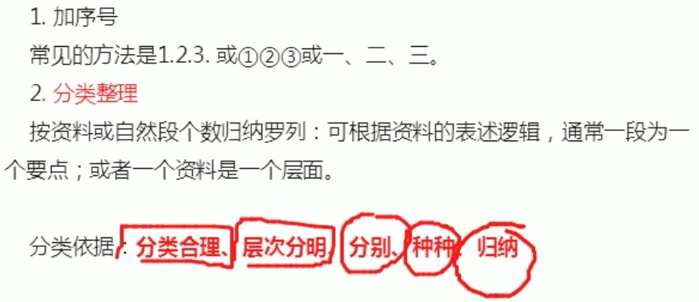

---
### 单一题
1、问题类
> 1. 感情色彩：摘抄、归纳
> 2. 反推意识：建议+对策 推问题

2、影响类
> 1. 时间顺序
> 2. 感情色彩

> - 过去的问题，反推积极影响

3、政策类
> 1. 直接摘抄
> 2. 问题反推
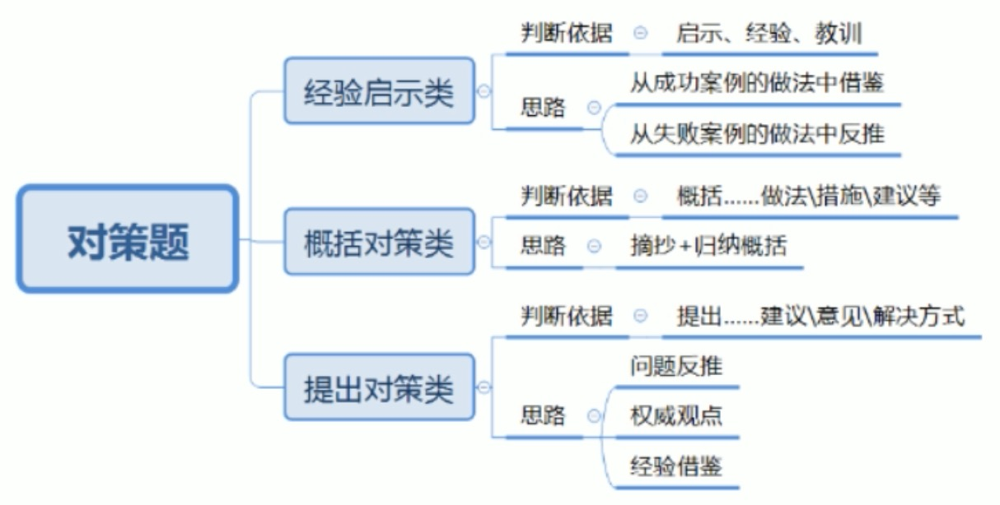

### 综合题
> 1. 词：释义（定义）+ 相关要素（原因、影响、实例等）+ 对策
>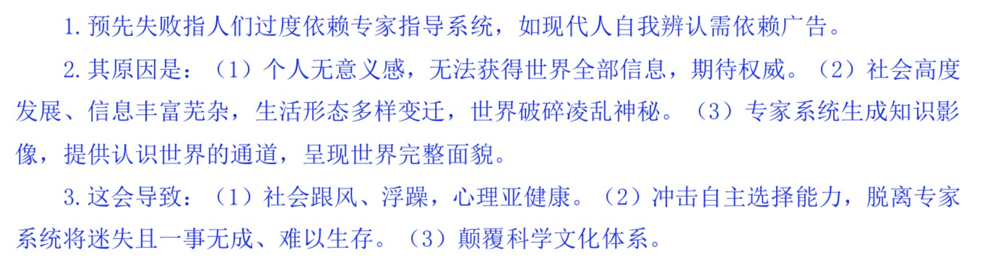

> 2. 短语、句子：释义（定义）+ 相关要素（问题、原因、影响等）+ 对策
>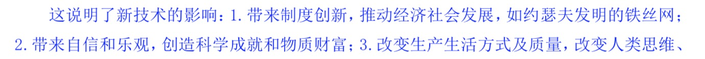
>

### 公文题
>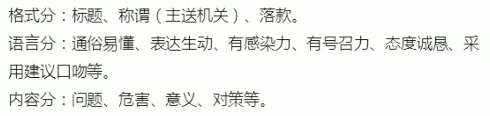
>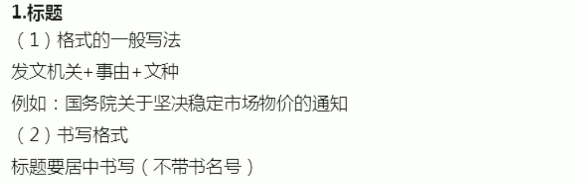
>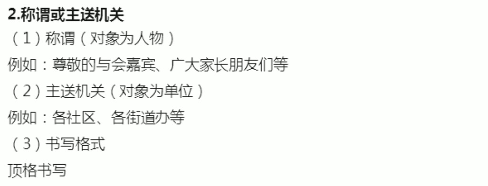
>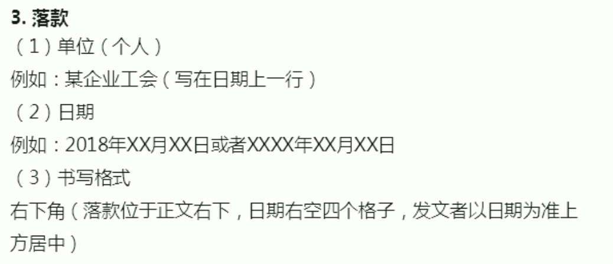

>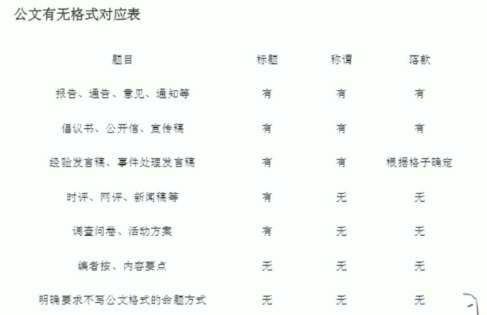

1、方案类
>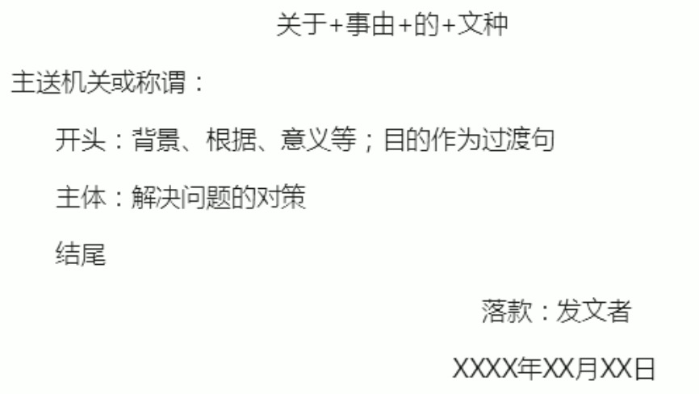

>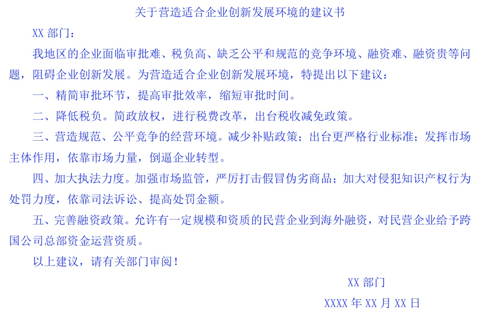

2、总结类
>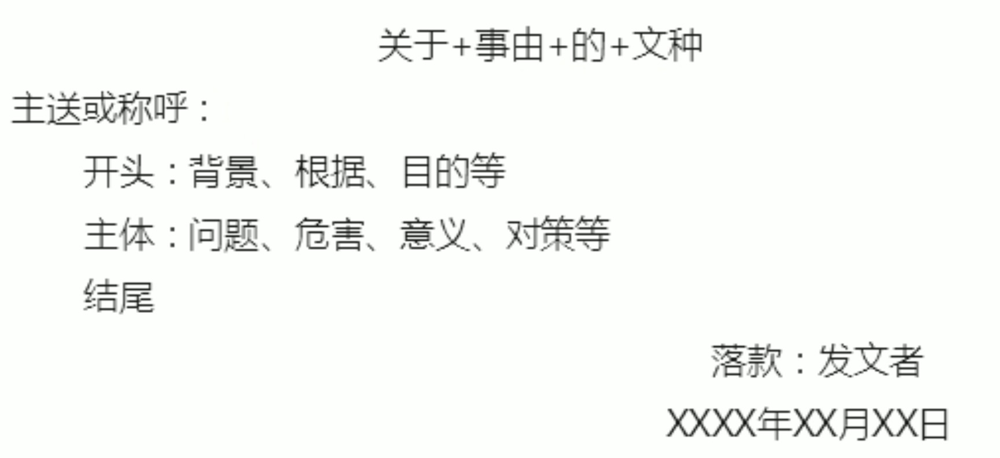
>提到什么写什么

>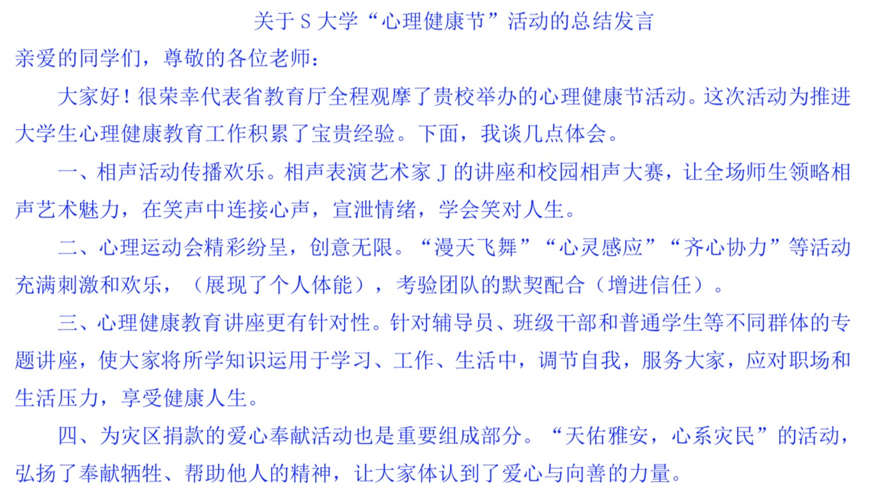
>

3、宣传类
>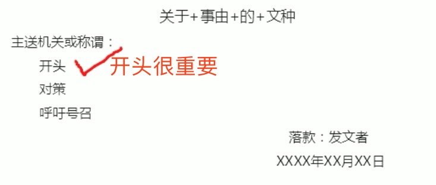
>
>负面信息 —— 活动 —— 意义 —— 对策 —— 再次呼吁

>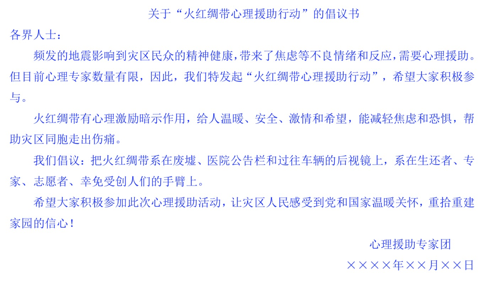

4、评论类
>

>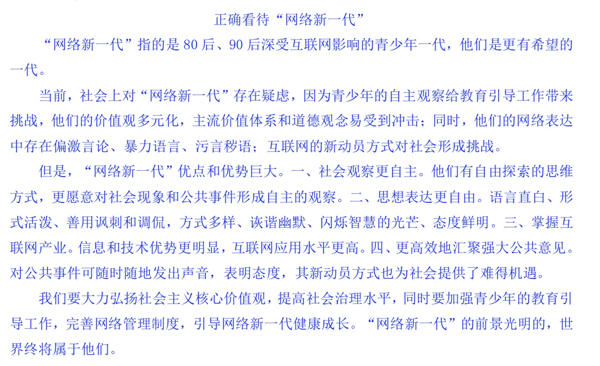

---
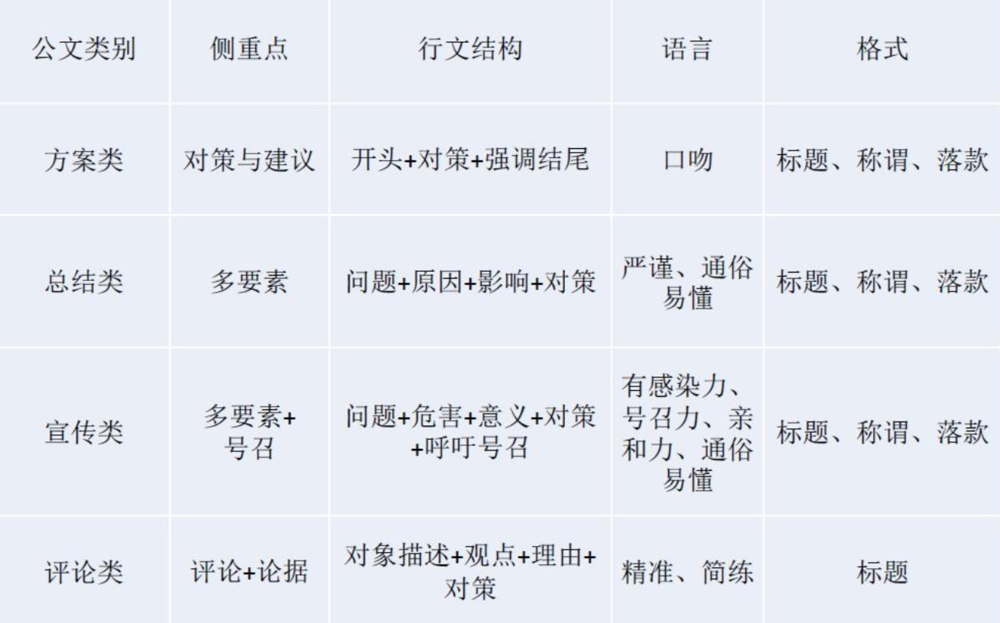