### 带入排除法

- 多位数问题、余数问题、年龄、不定方程
- 选项信息充分：分别、各、比
- 复杂类：想放弃的题型

具体用法：

- 先排除：个位数法、大小、奇偶、倍数
- 再代入：常识、好算、特殊问法

--
### 奇偶特性
加减

- 同奇同偶则为偶，一奇一偶这位奇
- 和差同性 

乘

- 一偶为偶则为偶，全部为奇则为奇

具体用法：

- 不定方程
- 求和、求差
- 2倍、平均
- 质数（逢质必2）

--
### 倍数特性 （化成最简分数）
题型特征：A/B = 3/5

- A 为 3 的倍数
- B 为 5 的倍数
- A + 5 为 8 的倍数
- B - A 为 2 的倍数

适用于：

- 比例、百分数、分数、倍数
- 平均分（平均分组）

整除判定法则：

- 拆分（大数拆小数）。。。415 / 35 = 350 + 65 不能被35整除
- 因式分解（拆成互质）

口诀法：

- 被 2、5 整除，当且仅当末1位数字能否被 2、5 整除
- 被 4、25 整除，当且仅当末2位数字能否被 4、25 整除
- 被 8、125 整除，当且仅当末3位数字能否被 8、125 整除
- 被 3、9 整除，当且仅当各位数的和能被 3、9 整除

--
### 方程法

普通方程

- 设：设小不设大
- 列：等量
- 解：消元

不定方程

- 奇偶性
- 倍数特性（等式左右两边有共同因子）
- 尾数法（系数（a.b）出现0或5）
- 带入排除法

不定方程组
	
	a1x + b1y + c1z = m
	a2x + b2y + c2z = n
	
- 消元 --> 不定方程 

----
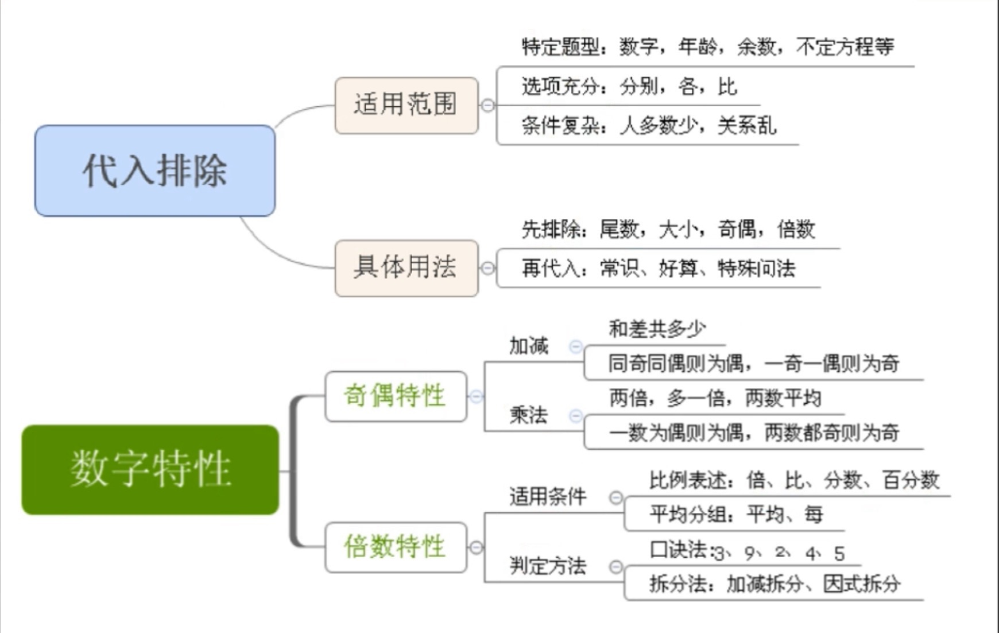

---
### 工程问题

总工程 S = 效率 V * 时间 T

1、给定时间
	
		特征：
		A 完成 ... 天
		B 完成 ... 天
	根据 A B 的时间设定总工程，求出 A B 的效率，总工程 / 效率和 = 共同完成时间
	
- 列表法

		1、赋总量
		2、求效率
		3、求解
		
2、给定效率
		
	给定效率比
	给定效率关系
		
- 方法

		1、赋效率
		2、找总量
		3、求解

3、给出时间又有效率的具体值

- 方程法

		设某个效率为 X ，总工程相等，解 X 
		
---
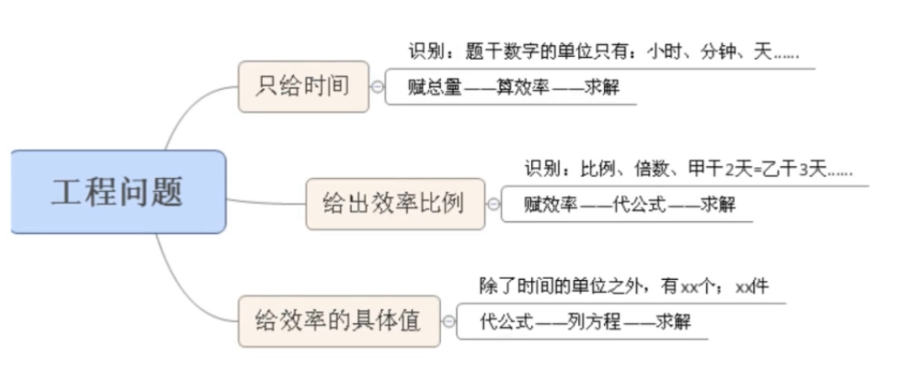

---
### 行程问题
S = V * T 

	1、等距离平均速度: V = (2 * V1 * V2) / (V1 + V2)
	2、相遇同时出发，总距离：S = (V1 + V2) * T
	3、同时出发追击距离(多走的距离)：S = (V1 - V2) * T
	4、两端出发相遇，第 n 次相遇共走了 (2n - 1) * S  
	5、流水行船：V顺 = V船 + V水，V逆 = V船 - V水

比例行程：路程相等，V1 / V2 = T2 / T1

	1、找等量
	2、找比例
	3、算分数

---
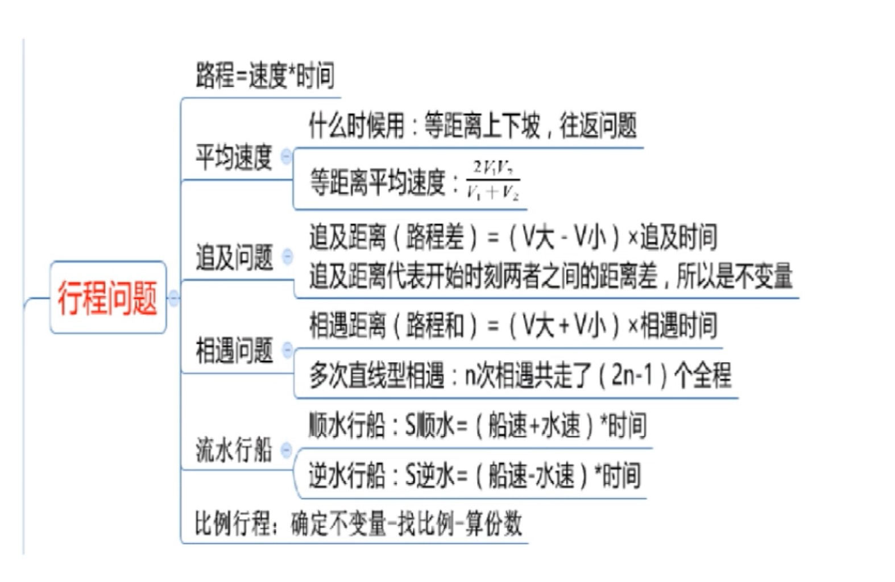

---
### 经济利润
1、利润 = 售价 - 成本

2、利润率 = 利润 / 成本

### 分段计费

总费用 = 每段费用之和

### 费用统筹

购物如何省钱
 
---
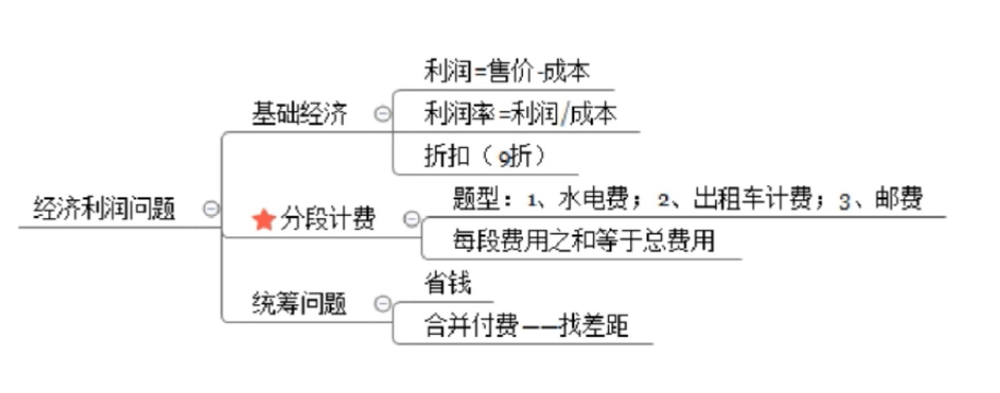

---
### 容斥原理
通常可用尾数法快速筛选答案（左是左，右是右，要想快，先消负）

1、两集合
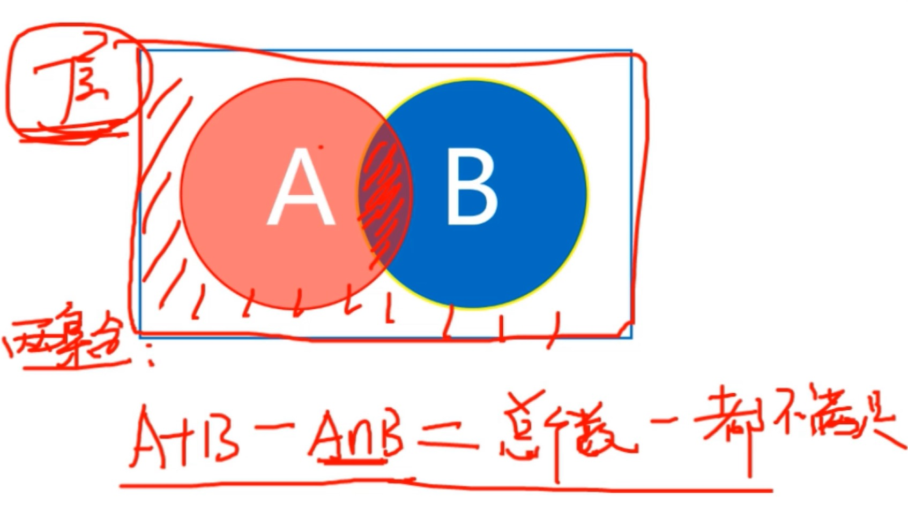
2、三集合
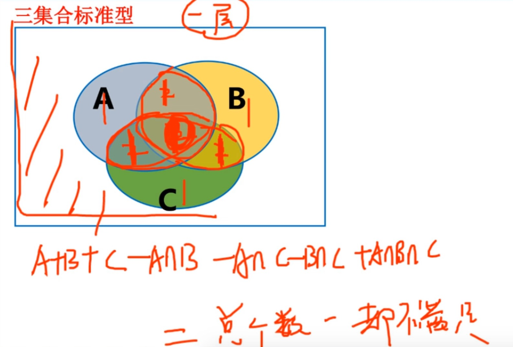

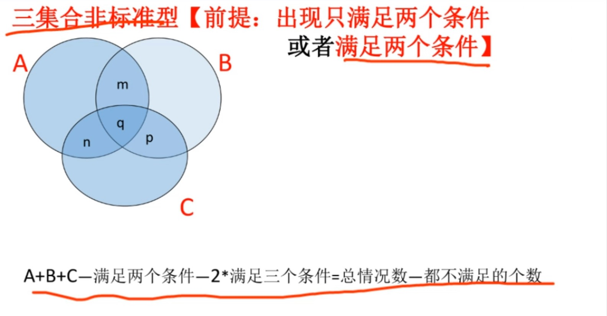

画图法
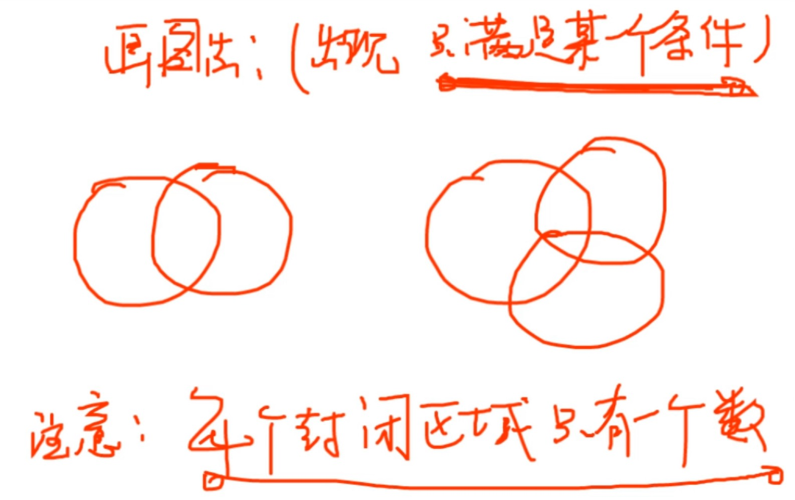

---
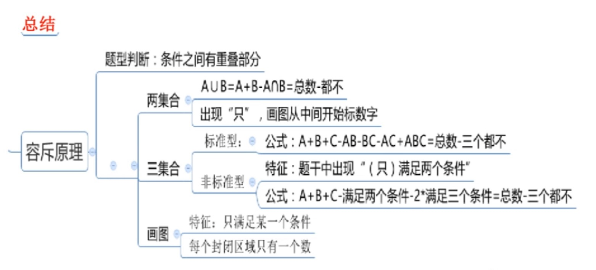
---

### 最值问题
1、最不利构造：

	特征：至少（最少）...保证...
	
	方法：答案 = 最不利情形 + 1

2、构造数列
	
	特征：某个主体...最...
	1、最...最...
	2、排名第几...最...
	
	方法：
	1、构造一个名次
	2、求谁设谁
	3、加和求解

---
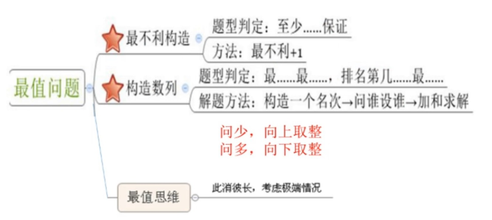

--- 

### 排列组合

1、分类、分步：

* 分类：用加法    要么...要么...（多者选其一）
* 分步：用乘法    先...后...（同时成立）

2、排列、组合

* 排列：与顺序有关 A
* 组合：与顺序无关 C
	
`判定标准：从选出的主体当中任意的挑出两个，置换顺序，有差别，与顺序有关(A)；无差别，与顺序无关(C)`

	1、捆绑法：题目要求一部分主体必须在一起，需要先将要求在一起的部分排列，然后视为一个主体，和其他主体排列

	2、插空法：题目要求一部分主体不能在一起，就需要先排列其他主体，然后把不能在一起的主体插空 

	3、插板法：题目要求每个主体至少一个时，在空隙里插板 

3、错位排列
（有4个厨师分别炒了1盘菜，每人品尝其他人的一盘菜，共有几种情况？D4 = 9）

	D1 = 0
	D2 = 1 
	D3 = 2
	D4 = 9
	D5 = 44 
	D6 = 265
	
	D2 = (D1 + D0) * 1
	D3 = (D1 + D2) * 2
	D4 = (D2 + D3) * 3
	D5 = (D4 + D3) * 4

---
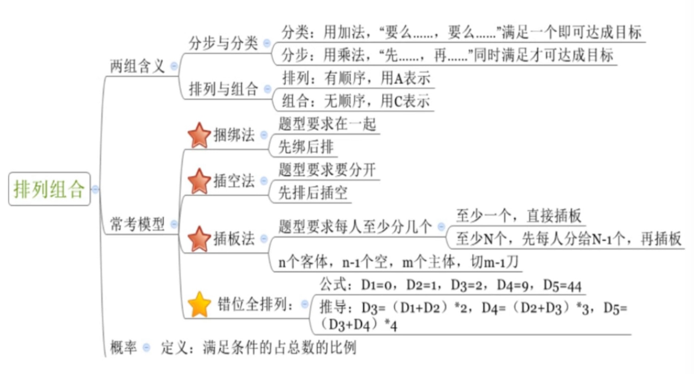 

---
### 概率
