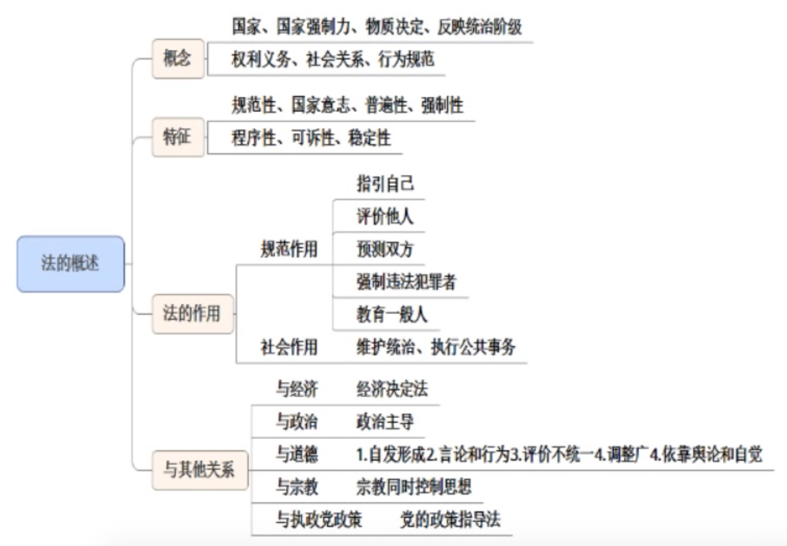
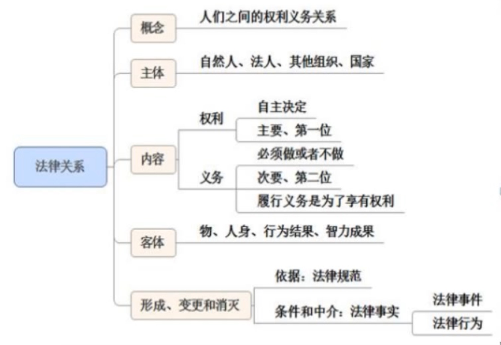

## 📣 法律思维

**1、保大放小**

两利相比取其重（**人身权**和**财产权**相比，取**人身权**）—— **紧急避险**

**2、保护弱者**

如夫妻，女方在流产半年内、分娩一年内，男方在非必要下不能提出离婚 —— **婚姻法**

**3、保护善意**

对于好人好事，法律一般不会增加额外负担

**4、打击恶意**

对一些严重行为加大打击力度

**5、利用题干关键信息来做题**

---
> 犯罪不能倒回，**已经完成**的犯罪不能因为其他行为而变为**犯罪中止**或**未遂**

---
## 📣 法的概述

#### 1、法律的概念

> 法是指有 **国家** 制定、认可并由 **国家强制力** 保障实施的，反映由特定 **物质** 生活条件决定的 **统治阶级** 意志，以 **权利义务** 为基础，以确认、保护和发展统治阶级所期望的社会关系和社会秩序为目的的 **行为** 规范体系
>  
---
> 制定：从无到有，1949年新中国成立到1954年第一部宪法
> 
> 认可：从有到认可，三个代表在2004年写入法律，表明了对三个代表的认可
> 
> 国家强制力：法律最后的保障，其他保障如宣法普法
> 
> 物质生活条件决定的：物质是经济基础，法是上层建筑，由经济基础决定上层建筑
> 
> 统治阶级：人民，共产党为执政党，工人为领导
> 
> 权利义务：
> 
> 行为：不控制思想

#### 2、法的特征

> **规范性**：制约行为
> 
> **国家意志性**：国家制定的，统治阶级的意志性
>
> **普遍性**：法律面前人人平等（包括：司法、守法、执法，不包括立法）
>
> **强制性**：必须遵守
> 
> **程序性**：民事、行政、刑事 都得走程序：起诉 —— 一审 —— 二审
> 
> **可诉性**：
> 
> **稳定性**：在一段时间内相对稳定

#### 3、法的作用
**1）法的规范作用**
> 指引作用：法律对 **个体（本人）** 行为的指引作用，包括确定的指引、有选择的指引
> 
> 评价作用：法作为尺度和标准对 **他人** 的行为的作用
> 
> 预测作用：对当事人 **双方** 之间（相互）的行为的作用
> 
> 强制作用：对 **违法犯罪者** 的行为的作用
> 
> 教育作用：对 **一般人** 的行为（案例）的作用

**2）法的社会作用**：指维护特定人群的社会关系和社会秩序

> 在阶级队里的社会中，法的社会作用大体上分为两大方面：**维护统治阶级的阶级统治**，**执行社会公共事务**

#### 4、法与其他社会现象的关系
**1）法与经济**
> 经济基础决定法，法服务于经济基础

**2）法与政治**
> 同属上建筑，法离不开政治，政治离不开法。但是 **政治主导法** 

**3）法与道德**
> 两者相互渗透，相互促进。法与道德具有 **互补性** ，同时具有 **规范性** ， **阶级性** 

区别
> 生成方式不同（国家 / 自发）
> 
> 表现形式不同（法典法条 / 言论行为）
> 
> 评价标准不同（统一 / 不统一）
> 
> 调整范围不尽相同（小 / 大）
> 
> 实施的手段不同（国家强制 / 舆论和自觉）

两个错误命题
> 违反法律的行为一定违反道德
> 
> 违反道德的行为一定违反法律

**4）法与宗教**

在一定意义都属于文化现象，在一定程度上反映特定人群的世界观和人生观，都是社会规范，都能对人的行为进行约束，但是宗教同时也能控制人的精神。

**5）法和执政党政策**：党的政策 指导 法律

区别
> 意志属性不同：（统治阶级 / 党）法是统治阶级的意志，执政党的政策是党的意志
> 
> 表现形式不同：（法典法条 / 党的决议、宣言等）
> 
> 实施的途径和保障方式不同：（国家强制力 / 党纪党章）
> 
> 稳定程度、程序化程度不同：（稳定 / 灵活，高 / 低）

---

---

## 📣 法律关系

**法律关系** 是法律规范调整社会关系的过程中所形成的人们之间的 **权利和义务关系**

#### 1、主体
> 法律关系的参加者，即权利的享有者和义务的承担着
>
> ---
> 自然人（活人）
> 
> 法人（本质是组织，可以独立担责的组织）
> 
> 其他组织（非法人组织，如合伙企业）
> 
> 国家

#### 2、内容
> 法律关系的内容，就是法律关系主体之间的法律权利和法律义务。
> 
> ---
> 权利：是指国家通过法律规定对法律关系主体可以 **自主决定** 作出某种行为的许可和保障手段。
> 
> 义务：是指国家通过法律规定的对法律关系主体必须作出一定行为或不得作出一定行为的约束，与权利相对应。

常见考点
> 权利可以放弃，义务不可以
> 
> 在民主国家里，法律优先保障权利，义务次要
> 
> 履行义务是为了更好的享受权利

#### 3、客体
> 法律关系客体是指法律关系主体之间权利和义务所指向的对象。
> 
> ---
> 物：客观的实体，人的手机衣物等
> 
> 人身：生理器官
> 
> 智力成果：知识产权，著作、商标、专利
> 
> 行为结果（行为）：

#### 4、形成、变更和消灭

**1）法律规范**：法律关系形成的 **依据**
> a 和 b 结婚，依据的是婚姻法，婚姻法即为法律规范

**2）法律事实**：法律关系间的 **中介和条件**
> a 和 b 结婚，需要到民政局登记，登记就是法律事实
> 
---
> 法律事件：不以人的意志为转移，如死亡，夫妻关系就消失了（战争也是法律事件）
> 
> 法律行为：以人的意志为转移的，如签合同

---

---
## 📣 法的效力

#### 1、法的效力的层次
指规范性法律文件之间的效力等级关系

- 上位法的效力高于下位法（立法机关的级别）
- 同一机关制定两法，特别法的效力优于一般法（**行政处罚法** 针对一般的违法行为，**治安处罚法** 针对特别的治安违法行为）
- 同一机关制定两法，新法的效力优于旧法

#### 2、法的效力范围
法的效力范围指法对什么对象、在什么时间、什么空间有效。明确法的效力范围，是法的遵守和适用的一个前提。

学术争议：
> 三分法：人、时、空
> 
> 四分法：人、时、空、事

**1）对人的效力**：指法律对谁有效力，适用于哪些人
> 属人主义（国籍，a 国人在 b 国，a 国法律理论上对其有效力）
> 
> 属地主义（地域，a 国人在 b 国，b 国法律理论上对其有效力）
> 
> 保护主义（利益，只要侵犯我国利益，不论国籍、地域，理论上有效力）
> 
> **以属地主义为主,与属人主义、保护主义相结合。（我国采用）**

**2）法的空间效力**：指法在哪些地域有效力，适用于哪些地区
> 主权范围，包括领土、领水及其底土和领空
> 
> 本国驻外使馆（领土延伸）、在外船舶及飞机（旗国主义）

**3）法的时间效力**：指法何时生效、何时终止效力以及法对其生效以前的事件和行为有无溯及力
> 法的生效时间（公布时间不一定等于生效时间，不公布就一定不生效）
> 
> 法终止生效的时间（明示，默示：新法替旧法）
> 
> 法的溯及力（原则上无溯及力）

---
