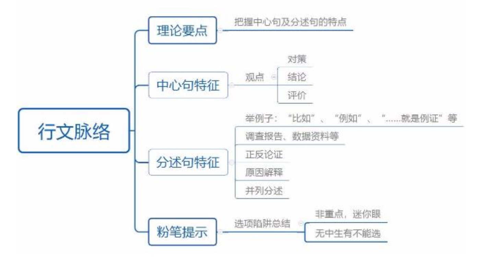
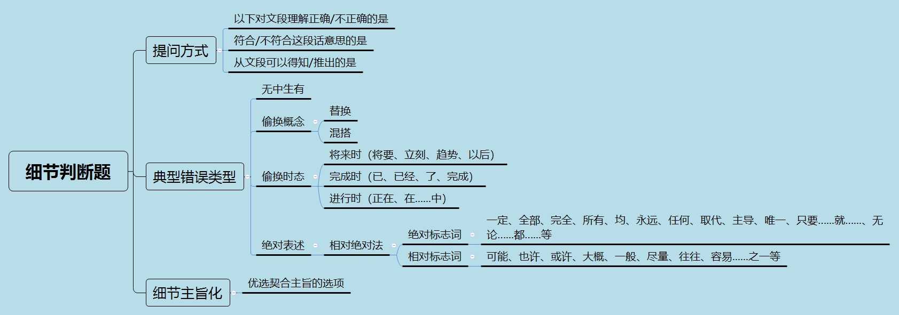
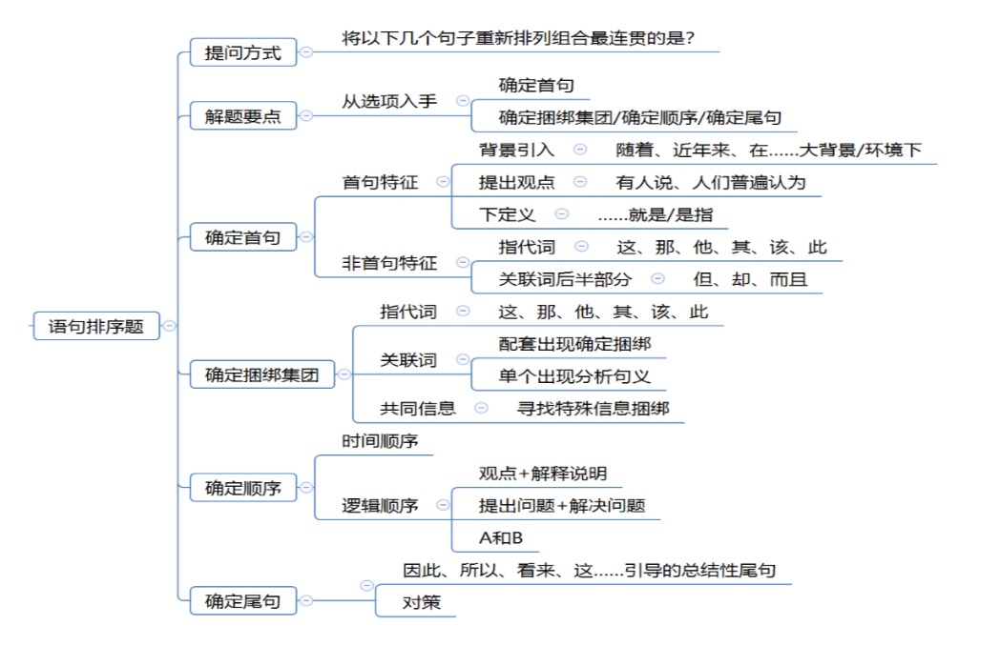
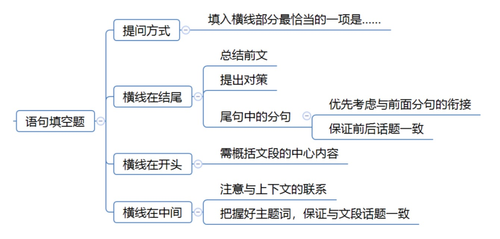
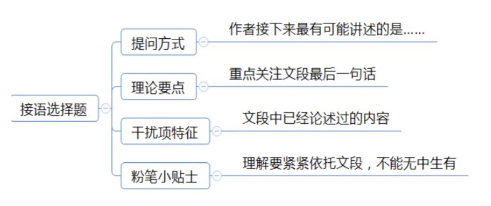
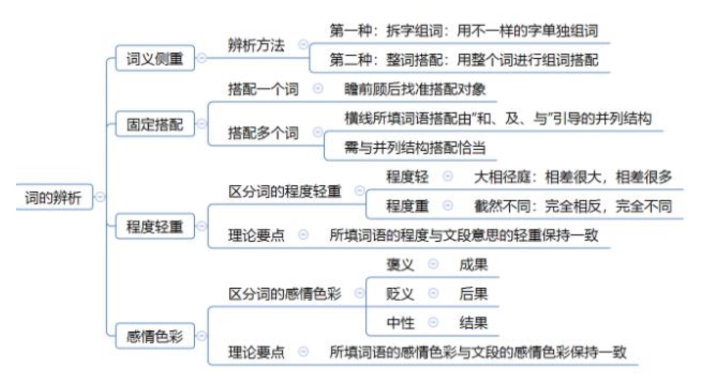

# 中心理解
#### 解题思路
1、 重点词语

> `关联词`
> `主题词`
> `程度词`

2.、行文脉络

---
	
	如果选项是答案，文段该怎么写
	
	注意文段观点是否出现并列，答案是否终结片面
	
---

### 关联词
---
**1、转折关系：转折后是重点**

常见错误:

> * 转折前的表述
* 无中生有
* 非重点（背景、举例子）
* 相对 -- 绝对
* 明确 -- 不明确（对策）

**逆向思维：转折前后句子意思相反**

**2、因果关系：结论是重点**

> “因此”在未句：多为中心句

> “因此”在中间：
1. 后面为解释说明，该句为中心句
2. 后面有其他关联关系，需要结合分析

**3、必要条件关系（只有.a.才.b.）：必要条件是重点（a）**

对策

4、提出问题--分析问题--答案为解决问题（解决问题根源的答案）

**反面论证**

如果/倘若/一旦..a.. + 不好的结果，a 反过来即为对策

**4、并列关系：全面概括**

---

### 主题词
>1. 文段围绕其展开
2. 一般高频出现
3. 多为名词
4. 前有引入或后有解释说明

---

### 程度词
> 程度词所在的语句通常为重点
> 
> 程度词后面通常紧跟主题词

---

### 行文脉络

> 1. 总 -- 分
> 2. 分 -- 总
> 3. 总 -- 分 -- 总
> 4. 分 -- 总 -- 分
> 5. 分 -- 分

---
---

# 细节理解
错误选项类型：
> 1. 无中生有
> 2. 概念偷换
> 3. 偷换时态
> 4. 绝对表述

` 优先蒙语气相对温和的答案，优先排除绝对的答案`

---
---

# 语句表达

### 语句排序
> 1. 从选项入手，确定首句
> 2. 
> - 确定捆绑集团
> - 确定顺序
> - 确定尾句
> 3. 验证（只验证基本锁定的答案）

`同一话题的两个句子要捆绑`
`注意两个句子主语是否一致`
`每一次、每一天... 之前应该出现描述`

**1、确定首句**
> - 背景引入
> - 提出观点
> - 下定义
> - 非首句特征：（1、关联词后半部分；2、指代词）

**2、确定捆绑集团**
> - 指代词捆绑
> - 关联词捆绑
> - 共同信息捆绑

**3、确定顺序**
> - 时间顺序
> - 逻辑顺序
> 	- 行文脉络
>  - A和B

**4、尾句特征**
> - 结论、对策

---
---
# 语句填空
**1、横线在结尾**
> - 总结前文
> - 提出对策
> - 应注意与前面句子的衔接，保证话题一致

**2、横线在开头**
> - 总结文段中心内容

**3、横线在中间**
> - 注意与上下文联系
> - 把握好主题词，保证前后话题一致

---
---

# 接语选择
> `重点关注文段最后一句，话题一致`
> `干扰选项：文段中已经论述过的内容，内容概括语句`

---
---

# 逻辑填空
> 词的辨析
> 
> 语境分析

**1、词的辨析**

> - 词义侧重
> 	- 拆字组词
> 	- 整词搭配
> - 固定搭配
> 	- 人、物
> 	- 上-下、下-上
> 	- 具体对象
> 	- 主动、被动
> - 程度轻重
> - 感情色彩

**2、语境分析**
> - 关联关系：转折、递进、并列
> 	- 并列关系：两个并列的话题一致
> - 对应关系：解释类、重点词句
> 	- 重点词句：

---
---