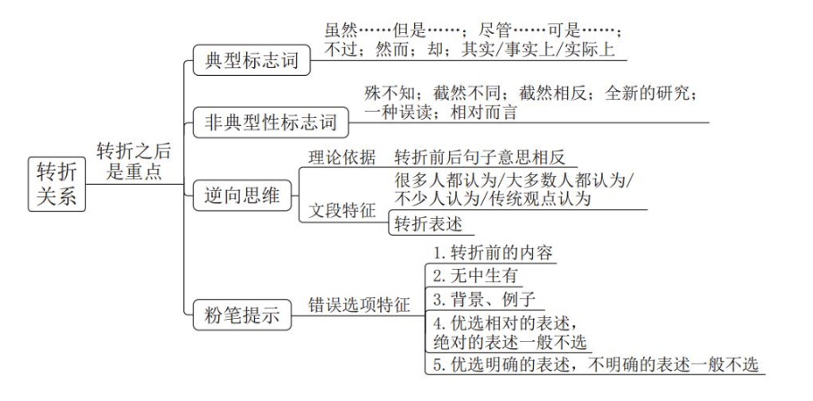
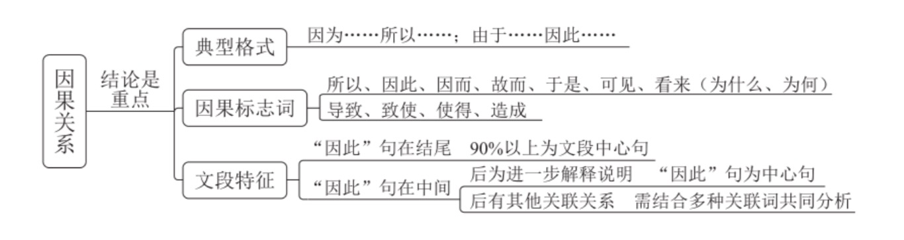
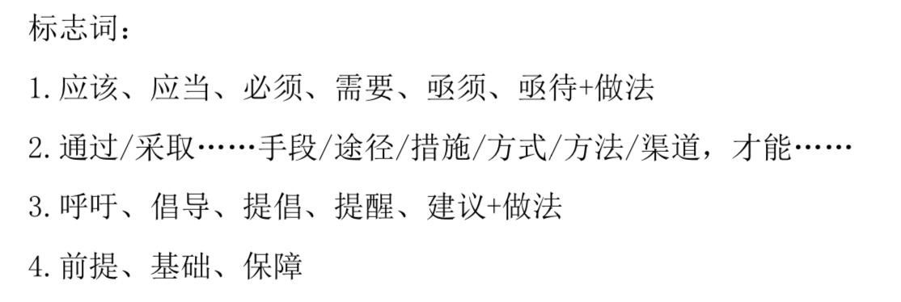
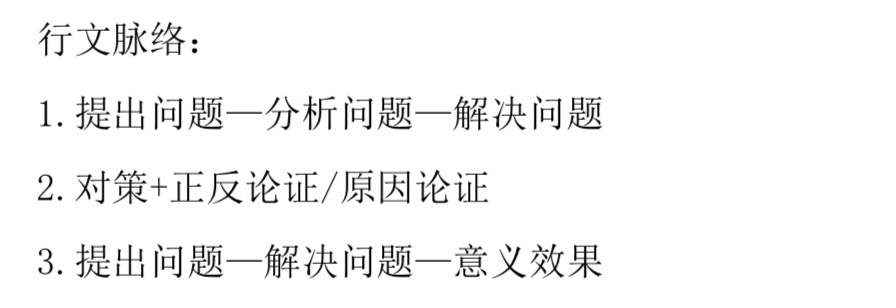
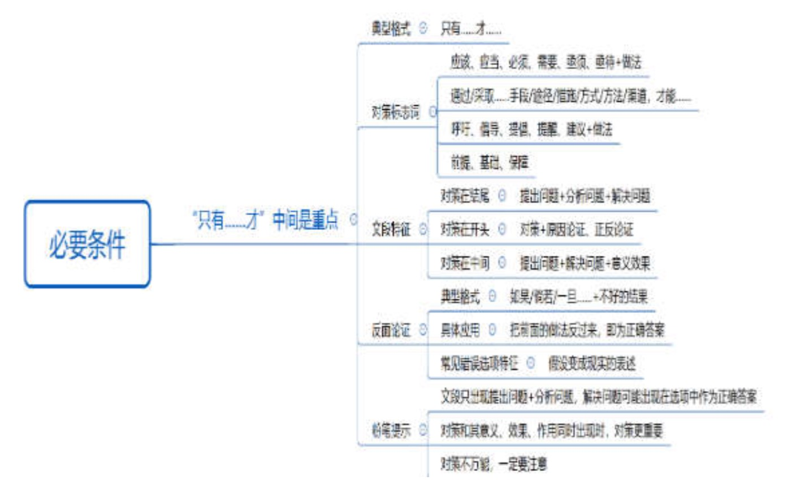
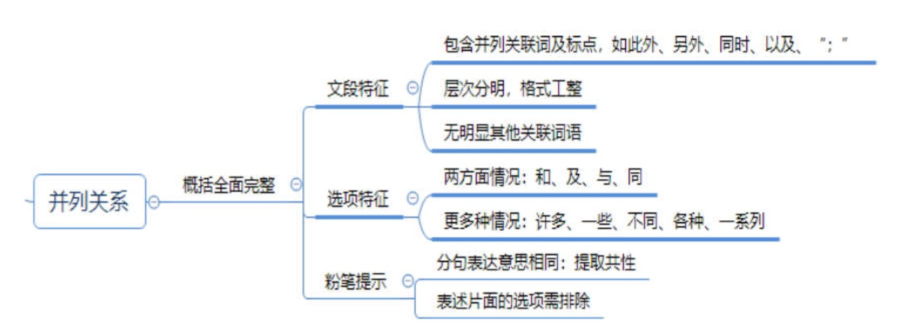
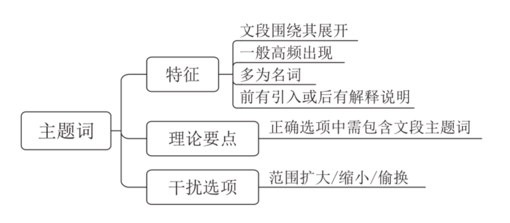
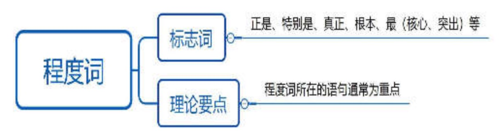

#### 解题思路
1、 重点词语

> `关联词`
> `主题词`
> `程度词`

2.、行文脉络

---
	
	如果选项是答案，文段该怎么写
	
---

### 关联词
---
**1、转折关系：转折后是重点**

常见错误:

> * 转折前的表述
* 无中生有
* 非重点（背景、举例子）
* 相对 -- 绝对
* 明确 -- 不明确（对策）

**逆向思维：转折前后句子意思相反**

**2、因果关系：结论是重点**

> “因此”在未句：多为中心句

> “因此”在中间：
1. 后面为解释说明，该句为中心句
2. 后面有其他关联关系，需要结合分析

**3、必要条件关系（只有.a.才.b.）：必要条件是重点（a）**

对策

4、提出问题--分析问题--答案为解决问题（解决问题根源的答案）

**反面论证**

如果/倘若/一旦..a.. + 不好的结果，a 反过来即为对策

**4、并列关系：全面概括**

---
---
### 主题词
>1. 文段围绕其展开
2. 一般高频出现
3. 多为名词
4. 前有引入或后有解释说明

---
---
### 程度词
> 程度词所在的语句通常为重点
> 
> 程度词后面通常紧跟主题词

