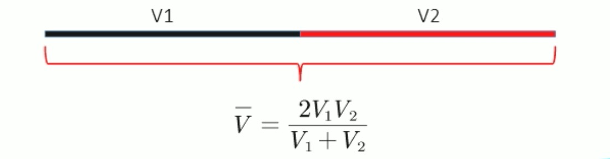
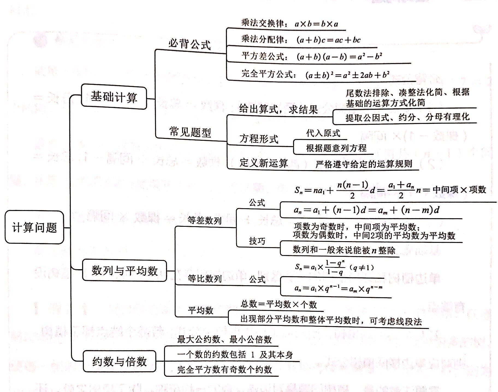

> - 质数：（素数）大于1的自然数除了1和本身没有其他因数，2、5、7
> - 自然数：大于等于0的整数，0、1、2、3、4

---

### 代入排除
> 1、先排除：奇偶、倍数、尾数、大小
> 
> 2、再代入：从简原则（简单的开始）、最值原则（问最大从最大开始）

### 数字特性
> 1、奇偶
> 
> 2、倍数：整除、余数、比例

### 赋值法
> 题干中没有给出任何具体的量，优先考虑赋值

### 方程法
> 设未知数技巧：
> 
> 1、设小不设大
> 
> 2、设中间量
> 
> 3、问谁设谁

不定方程：
> 
> 1. 奇偶特性
> 
> 2. 尾数特性（当其中一个系数为0或5时）
> 
> 3. **因数特性**
> 
> 4. 带入求解

不定方程组：
> 1. 解不一定为**整数**的情况下使用(如：钱、时间等)：**设其中一个为0**
> 
> 2. 解为整数(如：人数问题)：消元，按不定方程解
> 
> 3. 配系数

---
---

### 工程问题
> **总量 = 效率 x 时间**

> 1、给定完工时间：
> 
> - 赋总量（时间的公倍数）
> - 算效率：效率 = 总量 / 时间
> 
> 休息类的题目：可以假设不休息完成的总量 - 该完成的总量，除以效率，结果为休息的时间

> 2、给定效率比例：
> 
> - 赋效率
> - 算总量

> 3、给定具体效率：
> 
> - 设未知数
> - 解方程

### 行程问题
> **路程 = 速度 x 时间**

> 1、等距离平均速度（平路往返，**上下坡往返**）

> 2、相遇：S = (V1 + V2) * t
> 
> - 环形相遇：相遇n次 = 总共n圈

> 3、追及：S(多跑的距离) = (V1 - V2) * t
> 
> - 环形追及：追上n次 = 多跑n圈

> 4、多次相遇（两端出发）：第n次相遇 = (2n - 1) * 两端距离 = (V1 + V2) * t

> 5、流水行船
> 
> - v顺 = v船 + v水
> - v逆 = v船 - v水
> - v船 = (v顺 + v逆) / 2
> - v水 = (v顺 - v逆) / 2

> 6、比例行程：v t 成反比，S v 成正比，S t 成正比
> 
> **注意：**
>
> - v1 : v2 = a : b，则 t1 : t2 = 1/a : 1/b = b : a
> - v1 : v2 : v3 = a : b : c，则 t1 : t2 : t3 = 1/a : 1/b : 1/c **!= c : b : a**

### 经济利润
> 1. 利润 = 售价 - 成本
> 2. 利润率 = 利润 / 成本
> 3. 售价 = 成本 * (1 + 利润率) 
> 4. 折扣 = 售价 / 原价
> 5. 总价 = 单价 * 数量

> 题目只有利润等比例数据，通常将**成本**赋值为100

分段计价
> 1. 按标准，分开 
> 2. 计算后，汇总

### 排列组合
> 枚举法

> 特定题型：
> 
> 1. 不在头、尾：分步
> 2. 相邻：先捆绑，后排序
> 3. 不相邻：先排序，后插空
> 4. 同素分堆：插板法
> - 至少分一个：有“素”-1个空，插“堆”-1个板
> - 至少分n个：先每个堆分n-1个，然后插板
> 5. 错位排列
> - D1 = 0
> - D2 = 1 
> - D3 = 2
> - D4 = 9
> - D5 = 44 
> - D6 = 265
> - - D2 = (D1 + D0) * 1
> - - D3 = (D1 + D2) * 2
> - - D4 = (D2 + D3) * 3
> - - D5 = (D4 + D3) * 4

> 概率

### 容斥问题
两集合

> 全部 = A + B - A∩B + 都不

三集合

> 全部 = A + B + C - A∩B - A∩B - B∩C + A∩B∩C + 都不
> 
> 全部 = A + B + C - 两者满足 - 2*三者满足 + 都不

画图法
> 画图
> 
> 标数字 **(从里往外标)，每部分相对独立**
> 
> 列算式

### 高频几何

> 相似三角形：
> 
> - 对应边成比例
> - 面积之比 = 边长之比的平方

> 最短路径：
> 
> - 点到点直线距离最短
> - 点到线做对称，连接对称点与另一个点

---
---
### 溶液问题
> 浓度 = 溶质质量 / 溶液质量

> 线段法：
> 1. 混合之前写两端，混合之后写中间
> 2. 距离和量成反比，份数计算不能反

### 时间问题
1、年龄问题
> 带入排除法

2、周期问题

平年和与闰年
> 除以4，除尽为闰年，除不尽为平年
> 若年份后两位为0，则除以400，除尽为闰年，除不尽为平年
> 平年365天，闰年366天

> 周期余数
> 周期相遇：计算最小公倍数，定好起点终点，算余数

3、钟表问题
> - 一个指针走完一圈为360°，一个表盘360°
> - 总共分12个大格（小时）和60个小格（分钟）；一个大格30°，一个小格6°
> - 时针每分钟走0.5°，分针每分钟走6°，速度差为5.5°，速度之比为12倍
> - 特殊角度：
> -	- 直角：每小时2次，每昼夜44次（3、9、15、21点因重复计算所以减去）
> -	- 重合：每小时1次，没昼夜22次（12、24点因重复计算所以减去）
> -	- 180°：每小时一次，每昼夜22次（6、18点因重复计算所以减去）

> 1、标准钟：按上面规律算
> 
> 2、快慢钟：化为追击问题

### 计数杂题
1、植树问题
> 1. 单边线形植树(两端都植)：`棵数 = 总长 / 间隔 + 1`；`总长 = (棵数 - 1) * 间隔`
> 2. 单边线形植树(两端都不植)：`棵数 = 总长 / 间隔 - 1`；`总长 = (棵数 + 1) * 间隔`
> 3. 环形植树：`棵数 = 总长 / 间隔`；`总长 = 棵数 * 间隔`

> 从起点运树苗种树，先运到最远处种

2、方阵问题

> 若正方形方阵一边的人数为N，长方形方阵两边人数分别为M、N，则有:
> 
> - 正方形实心方阵的总人数为 NN，长方形实心方阵总人数为M N
> - 正方形方阵最外层人数为4N-4，长方形方阵最外层人数为2(M+N)-4
> - 方阵相邻两层人数相差8人

3、爬楼梯问题

> 从地面爬到地N层，需要怕(N-1)层；从第M层爬到第N层，需要爬(N-M)层

4、牛吃草问题（水池放水进水、可再生资源开采）

> 草地原有草量 = (牛吃草效率 - 每天长草效率) * 天数

*通常将吃草效率赋值为1*

5、空瓶换酒问题

> N个空瓶子换一瓶酒，则 N空瓶 = 1瓶酒 = 1空瓶+1酒，故有 (N-1)空瓶 = 1酒，即(N-1)个空瓶就能换到1瓶酒(只有酒，没有瓶)。因此 x个空瓶能最多换到 x/(N-1)瓶酒

6、比赛问题

> 1. N支队伍进行淘汰赛: 队伍两两进行比赛,输一场即淘汰出局。每一轮淘汰掉一半选手,直至产生最后的冠军。
> - 决出冠军、 亚军, 需比赛(N-1)场，无论单双只队伍
> - 决出1、2、3、4名,需比赛N场,多比了3、4名之间的1场。
> - 每场比赛淘汰1支队伍,每轮比赛淘汰一半的队伍(若总数是奇数,例如11支队伍,则淘汰5支队伍,留下6支队伍,即此轮比赛有1支队伍轮空)
> 2. N支队伍进行循环赛:每支队伍都能和其他队伍比赛一次或两次。
> - 进行单循环赛,每支队伍都能和其他队伍比赛一次,需比赛N(N-1)/2场。
> - 进行双循环赛,每支队伍都能和其他队伍比赛两次,需比赛N(N-1)场.

### 计算问题

