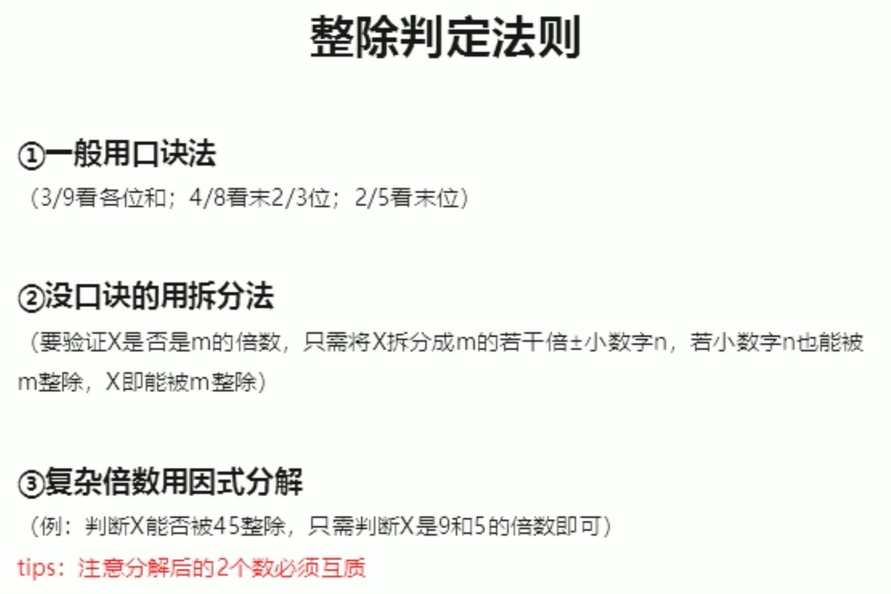

> - 质数：（素数）大于1的自然数除了1和本身没有其他因数，2、5、7
> - 自然数：大于等于0的整数，0、1、2、3、4

---

### 代入排除
> 1、先排除：奇偶、倍数、尾数、大小
> 
> 2、再代入：从简原则（简单的开始）、最值原则（问最大从最大开始）

### 数字特性
> 1、奇偶
> 
> 2、倍数：整除、余数、比例

### 方程法
> 设未知数技巧：
> 
> 1、设小不设大
> 
> 2、设中间量
> 
> 3、问谁设谁

> 不定方程：
> 
> 1、奇偶特性
> 
> 2、尾数特性
> 
> **3、因数特性**
> 
> 4、带入求解

> 不定方程组：
> 
> **1、设其中一个为0**（解不一定为整数的情况下使用）
> 
> 2、配系数

---
---

### 工程问题
> **总量 = 效率 x 时间**

> 1、给定完工时间：
> 
> - 赋总量（时间的公倍数）
> - 算效率：效率 = 总量 / 时间
> 
> 休息类的题目：可以假设不休息完成的总量 - 该完成的总量，除以效率，结果为休息的时间

> 2、给定效率比例：
> 
> - 赋效率
> - 算总量

> 3、给定具体效率：
> 
> - 设未知数
> - 解方程

### 行程问题
> **路程 = 速度 x 时间**

> 1、等距离平均速度

> 2、相遇：S = (V1 + V2) * t
> 
> - 环形相遇：相遇n次 = 总共n圈

> 3、追及：S(多跑的距离) = (V1 - V2) * t
> 
> - 环形追及：追上n次 = 多跑n圈

> 4、多次相遇（两端出发）：第n次相遇 = (2n - 1) * 两端距离 = (V1 + V2) * t

> 5、流水行船
> 
> - v顺 = v船 + v水
> - v逆 = v船 - v水
> - v船 = (v顺 + v逆) / 2
> - v水 = (v顺 - v逆) / 2

> 6、比例行程：v t 成反比，S v 成正比，S t 成正比
> 
> **注意：**
>
> - v1 : v2 = a : b，则 t1 : t2 = 1/a : 1/b = b : a
> - v1 : v2 : v3 = a : b : c，则 t1 : t2 : t3 = 1/a : 1/b : 1/c **!= c : b : a**

### 经济利润
> 1. 利润 = 售价 - 成本
> 2. 利润率 = 利润 / 成本
> 3. 售价 = 成本 * (1 + 利润率) 
> 4. 折扣 = 售价 / 原价
> 5. 总价 = 单价 * 数量

> 题目只有利润等比例数据，通常将**成本**赋值为100

分段计价
> 1. 按标准，分开 
> 2. 计算后，汇总

### 排列组合