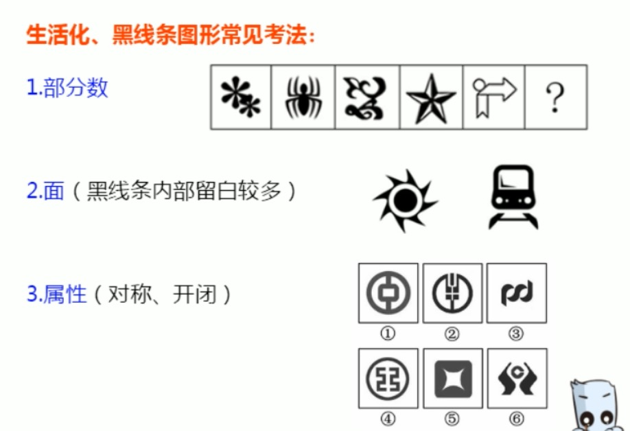
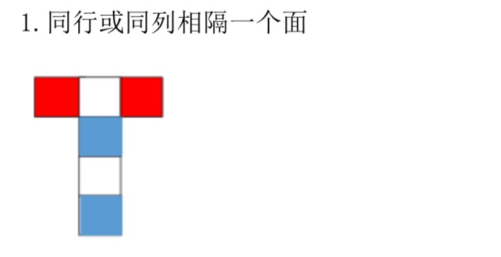
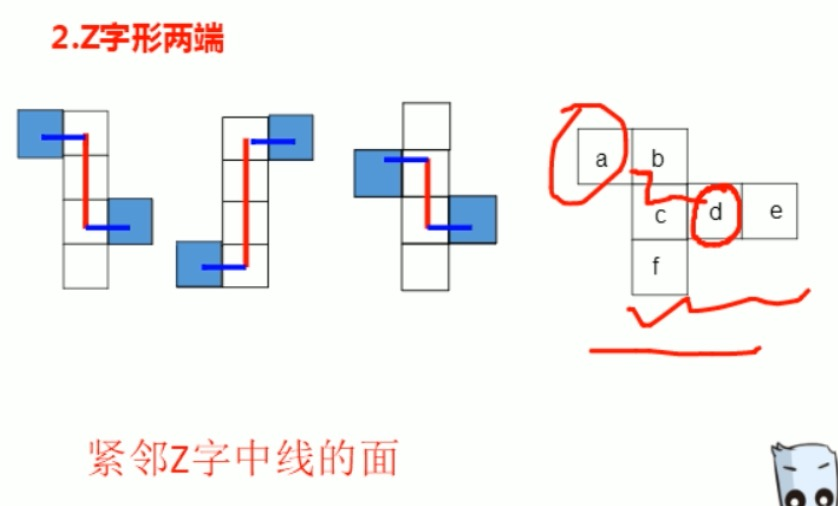
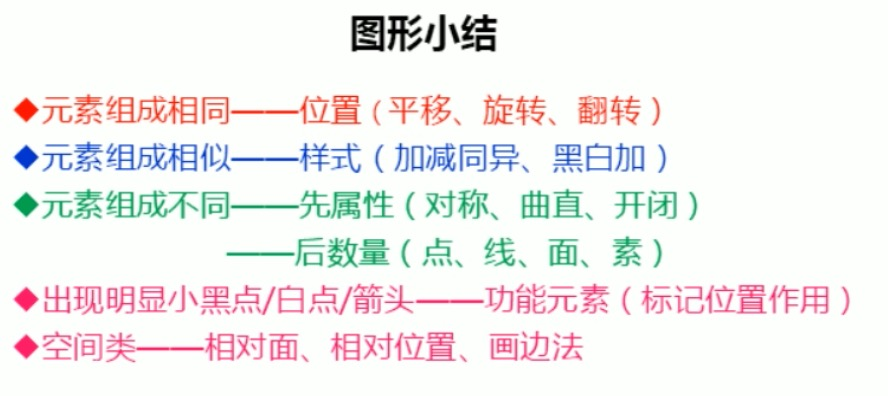
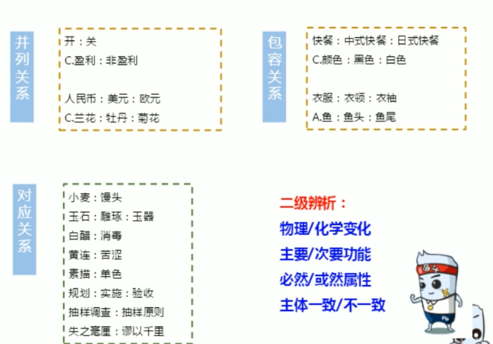
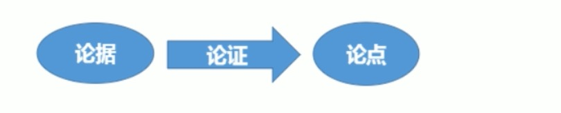

相同看位置、相似看样式、不同先属性后数量

---

> 曲直、开闭、对称、相离交压
> 
> 和差积商质幂、多重、分组、前n推n+1、拆分

# 图形推理
### 位置
1、平移
> 方向：直线（上下、左右、斜对角线）、绕圈（顺逆时针）
> 
> 步数：恒定、递增（等差）

2、旋转、翻转

### 样式
1、遍历：凑次数、凑位置

2、加减同异

3、黑白运算

### 属性
1、对称：
>轴对称：方向、数量
>
>中心对称

2、曲直：全曲、全直、曲+直

3、开闭

### 数量
> 点：曲直交点
> 
> 线
> 
> 角
> 
> 面：白色面
> 
> 素：种类、个数、部分(黑色连在一起的)

### 特殊规律
1、功能元素（**优先考虑元素标记的位置，极少考虑元素数量**）：点、箭头

2、一笔画：
> 线条之间连通
> 奇数点 = 0或2

> 多笔画：笔画数 = 奇点数 / 2

---
### 空间重构
1、相对面

相邻面
> 构成直角的两条边是同一条边

2、画边法

---

---
# 类比推理
### 语义关系
1、近义关系、反义关系
> 如果近反义选不出唯一答案，需要二级辨析
> 
> 1、感情色彩（褒义、贬义、中性）
> 
> 2、词语结构

2、比喻义、象征义

### 逻辑关系
1. 全同关系
2. 并列关系
	- 矛盾：非此即颇
	- 反对：所属同一大类
3. 包容关系
	- 种属关系：a是b的一种
	- 组成关系：a是b的组成部分
4. 交叉关系：有点a是b，有的a不是b；有的b是a，有的b不是a
5. 对应关系
	- 材料；小麦：馒头
	- 工艺（二级辨析：物理/化学变化）；白酒：发酵
	- 功能（二级辨析：主要/次要功能）；银行卡：支付
	- 属性（特点）（二级属性：必然/或然属性）；盐：咸
	- 时间（二级辨析：主体是否一致）
	- 依据
	- 因果
	- 职业

### 语法关系
1. 主谓关系
2. 动宾关系
3. 主宾关系

> 造句子

# 定义判断
1. 关键词：`主体`、`客体`
2. `条件` + `目的、结果`
3. `即`、`也就是`。。。

`出现两个意思相似、结构相似的选项，直接排除`

# 翻译推理
> 充分条件：有之必然
> 
> 必要条件：无之必不然

1、前推后
> - 如果......那么......
> - 若......，则......
> - 只要......，就......
> - 为了......，一定(必须)......
> - 所有......，都......
> - ......是......的充分条件

2、后推前
> - 只有......才......
> - 不......不......
> - 除非......否则不......
> - ......是......的基础/假设/前提/关键
> - ......是......的必要/必不可少的条件

3、且、或、要么要么

4、逆否等价、—(且或)

# 排列组合
1、代入排除法
> 排除法：读一句，排一句
> 
> 代入法：选项带入题干验证

2、最大信息
> 条件中出现次数最多的词，作为推理起点

3、画表格

# 日常结论
# 逻辑论证

`常见错误选项：
话题不一致，
主体不一致，
不明确`

`对策类选项一般不选`

找论点
> 关键词：因此、所以、由此推出、据此可得......
> 
> 首尾句原则
> 
> 结合提问（问啥找啥）

1、加强类

`加强力度：论点(通常不会考) > 论证 > 论据`
> - 搭桥：同时包含论点、论证关键词
> - 补充论据：
>	- 必要条件
>	- 解释原因
>	- 举例支持

2、削弱类

> - 削弱论点
> 	- 否定论点
> 	- 举反例
> - 拆桥
> - 否定论据