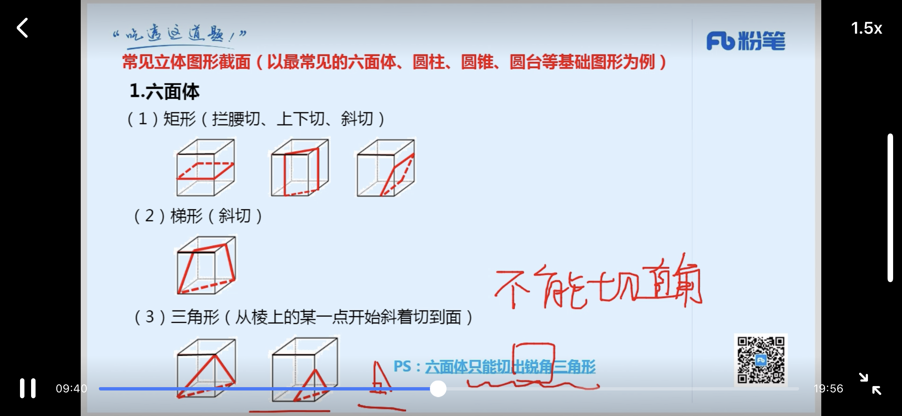
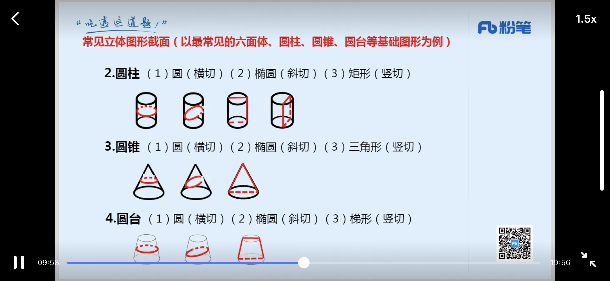
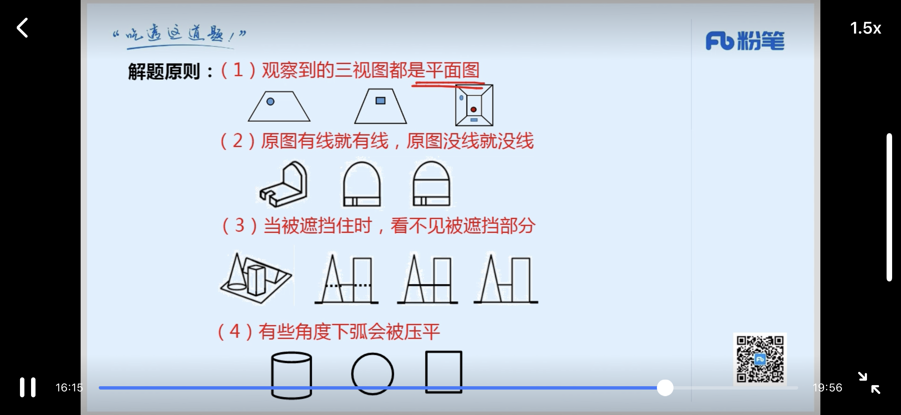

相同看位置、相似看样式、不同先属性后数量

---

> 曲直、开闭、对称、相离交压
> 
> 和差积商质幂、多重、分组、递推、拆分
> 
> 近反比喻象征义，全同、并列矛盾、并列反对、包容种属、包容组成、交叉、对应，主谓宾

# 图形推理
### 位置
1、平移
> 方向：直线（上下、左右、斜对角线）、绕圈（顺逆时针）
> 
> 步数：恒定、递增（等差）

2、旋转、翻转

### 样式
1、遍历：凑次数、凑位置

2、加减同异

3、黑白运算

### 属性
1、对称：
>轴对称：方向、数量
>
>中心对称

2、曲直：全曲、全直、曲+直

3、开闭

### 数量
> 点：曲直交点
> 
> 线
> 
> 角
> 
> 面：白色面
> 
> 素：种类、个数、部分(黑色连在一起的)

### 特殊规律
1、功能元素（**优先考虑元素标记的位置，极少考虑元素数量**）：点、箭头

2、一笔画：
> 线条之间连通
> 奇数点 = 0或2

> 多笔画：笔画数 = 奇点数 / 2

---
### 空间重构
1、相对面

相邻面
> 构成直角的两条边是同一条边

2、画边法

---

# 空间类
1、立体拼合
> 凹凸对应，优先拼特殊部分

2、截面图
> 一刀切，刀无限大，不能拐弯
> 
> 

3、三视图
> 

---
# 类比推理
### 语义关系
1、近义关系、反义关系
> 如果近反义选不出唯一答案，需要二级辨析
> 
> 1、感情色彩（褒义、贬义、中性）
> 
> 2、词语结构

2、比喻义、象征义

### 逻辑关系
1. 全同关系
2. 并列关系
	- 矛盾：非此即颇
	- 反对：所属同一大类
3. 包容关系
	- 种属关系：a是b的一种
	- 组成关系：a是b的组成部分
4. 交叉关系：有点a是b，有的a不是b；有的b是a，有的b不是a
5. 对应关系
	- 材料；小麦：馒头
	- 工艺（二级辨析：物理/化学变化）；白酒：发酵
	- 功能（二级辨析：主要/次要功能）；银行卡：支付
	- 属性（特点）（二级属性：必然/或然属性）；盐：咸
	- 时间（二级辨析：主体是否一致）；报名：考试
	- 配套；螺丝：螺丝帽
	- 因果；炎热：中暑
	- 依据
	- 职业

### 语法关系
1. 主谓关系
2. 动宾关系
3. 主宾关系

> 造句子

# 定义判断
1. 关键词：`主体`、`客体`
2. `条件` + `目的、结果`
3. `即`、`也就是`。。。

`出现两个意思相似、结构相似的选项，直接排除`

# 翻译推理
> 充分条件：有之必然
> 
> 必要条件：无之必不然

1、前推后
> - 如果......那么......
> - 若......，则......
> - 只要......，就......
> - 为了......，一定(必须)......
> - 所有......，都......
> - ......是......的充分条件

2、后推前
> - 只有......才......
> - 不......不......
> - 除非......否则不......
> - ......是......的基础/假设/前提/关键
> - ......是......的必要/必不可少的条件

3、且、或、要么要么

4、逆否等价、—(且或)

# 真假推理
1、矛盾关系（必然一真一假）
> - A 与 -A，例：是小明做的 —— 不是小明做的
> - 所有都 与 有的不，例：所有人都会说英语 —— 有的人不会说英语
> - 所有都不 与 有的，例：所有人都不是党员 —— 有的是党员
> - A—>B 与 A且-B，例：如果考上了给你买车 —— 考上了但没买车

2、反对关系
> - 有的 与 有的不（必有一真），例：有的人会说英语 —— 有的人不会说英语
> - 所有都 与 所有都不（必有一假），例：所有人都会说英语 —— 所有人都不会说英语

# 形式推理与逻辑错误
1、形式推理：**去肉留骨(重形式，看结构)**
> 1. 字母标记：题干简短，词语重复出现
> 2. 推理形式：题干较长，分析推理形式

2、逻辑错误
> - 自相矛盾
> - 偷换概念
> - 错误类比
> - 以偏概全
> - 因果倒置

# 排列组合
1、代入排除法
> 排除法：读一句，排一句
> 
> 代入法：选项带入题干验证

2、最大信息
> 条件中出现次数最多的词，作为推理起点

3、画表格

# 逻辑论证

`常见错误选项：
话题不一致，
主体不一致，
不明确`

`对策类选项一般不选`

找论点
> 关键词：因此、所以、由此推出、据此可得......
> 
> 首尾句原则
> 
> 结合提问（问啥找啥）

1、加强类

`加强力度：论点(通常不会考) > 论证 > 论据`

> - 搭桥：同时包含论点、论证关键词
> - 补充论据：
>	- 必要条件(没有这个条件，论点就不成立了)
>	- 解释原因
>	- 举例支持

> 搭桥、必要条件
> 
> - 提问方式通常为**‘前提是、假设是、必要条件是’**
> - 如果只有论点，优先考虑必要条件
> - 如果有论点和论据，优先考虑搭桥
> - 必要条件如果不成立，论点就不成立，所以可以通过否定选项看论点是否成立来确定答案

2、削弱类

> - 削弱论点
> 	- 否定论点
> 	- 举反例
> - 拆桥
> - 否定论据
> - 他因削弱

3、实验类
> 常考的加强与削弱方法：
> 
> - 实验前：被试及实验客观条件是否一致
> - 实验中：是否存在干扰因素
> - 试验后：短时间内实验结果是否有反复变化
> 
> 如果实验组是与自己比较（如：试验后下降了。。） ，不需要实验前的条件相同，通常需要补充另一组的实验结果

# 原因解释
> 提问方式：“最能解释/不能解释 上述矛盾现象”

> 1. 找矛盾
> 2. 给理由

> 常见错误：只能解释矛盾现象的一方