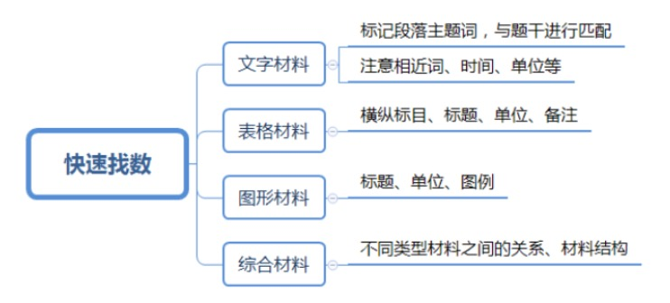

### 速算技巧
> 一个数/5，等于这个数*2，小数点向前移一位。
> 
> 一个数/25，等于这个数*4，小数点向前移两位。
> 
> 一个数/125，等于这个数*8，小数点向前移三位。

> 一个数*1.1，等于这个数错位相加。
> 
> 一个数*0.9，等于这个数错位相减。

##### 截位法（四舍五入）
> 截两位
> 
> - 选项首位不同
> - 首位相同，但第二位不同，且第二位差大于首位
> 
> 截三位
> 
> - 首位相同，第二位不同，第二位差小于等于首位
> 
> 截谁
> 
> - 一步除法：只截分母
> - 多步除法：分子分母都截

多步除法：先将所有数截掉，再约分运算

#### 比较类
> 一大一小，直接看：分子大的分数大

> 同大同小，比速度：
> 
> - 竖着直接除
> - 横着看速度：谁大谁牛气，慢的看成1
> - 横竖哪个好看看哪个

#### 快速找数

> 人口 、 航空 的单位往往有坑

---
#### 基期、现期
> 现期 = 基期 + 增长量
> 
> 现期 = 基期 * (1 + 增长率r)
> 
> 基期 = 现期 - 增长量
> 
> 基期 = 现期 / (1 + r)

速算技巧
> | r | > 5% 截位直除
> 
> | r | <= 5% 化除为乘

化除为乘
> A / (1+r) ≈ A * (1-r) = A - A * r
> 
> A / (1-r) ≈ A * (1+r) = A + A * r 

#### 同比、环比
> 同比：与上年同期相比
> 
> 环比：与紧紧相邻的上一统计周期相比（月环比、季度环比等）

#### 顺差、逆差
> 顺差（赚钱的意思）：在一个时期内，一个国家(或地区)的出口商品额大于进口商品额，叫做对外贸易顺差(又称出超)
> 
> 逆差：在一个时期内，一个国家(或地区)的出口商品额小于进口商品额，叫做对外贸易逆差(又称入超)

#### 增长率（增速、增幅、增长幅度、增值率）
> 增长率(r) = 增长量 / 基期量 = (现期量-基期量) / 基期量 = 现期量 / 基期量 - 1 = **发展速度** - 1

#### 增长率和倍数
> 倍数 = 增长率 + 1
> 
> 增长倍数 = 增长率

#### 成数、翻番
> 成数：几层等于十分之几
> 
> 翻番：1番为原来的2倍，翻2番为原来的4倍，n番为原来的2的n次方倍

#### 间隔增长率
> r = r1 + r2 + r1*r2

> 速算技巧
> 
> - r1 和 r2 均小于10%时，r1*r2 可忽略
> - 一个化成分数，一个不变
> - 一个化成小数，一个不变
> - 大胆一点

#### 年均增长率
> (1+r)的n次方 = **现期量**/基期量 (n为现期和基期的年份差)

> 技巧
> 
> - 比较：n 相同，直接比较（现期/基期）
> - 计算：选两个选项的居中数代入，利用平方数居中代入，判断选项打了还是小了，排除