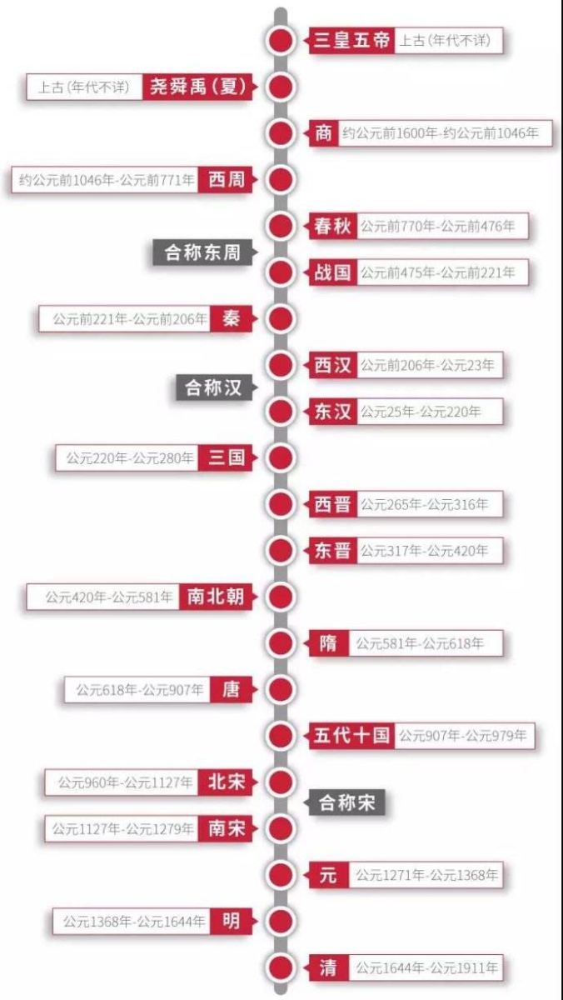
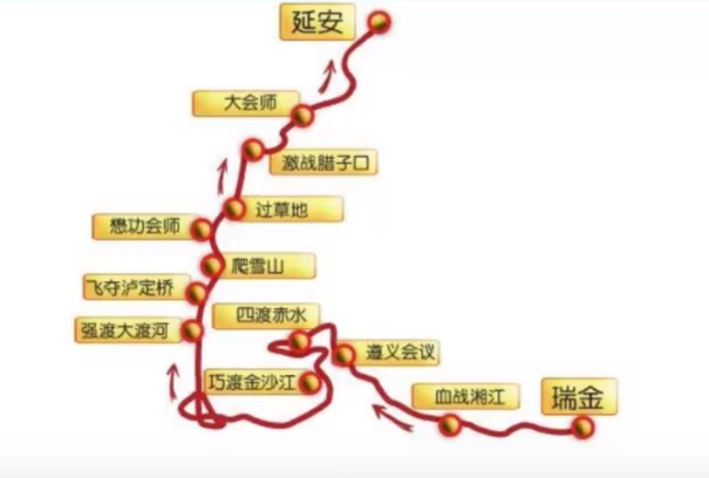
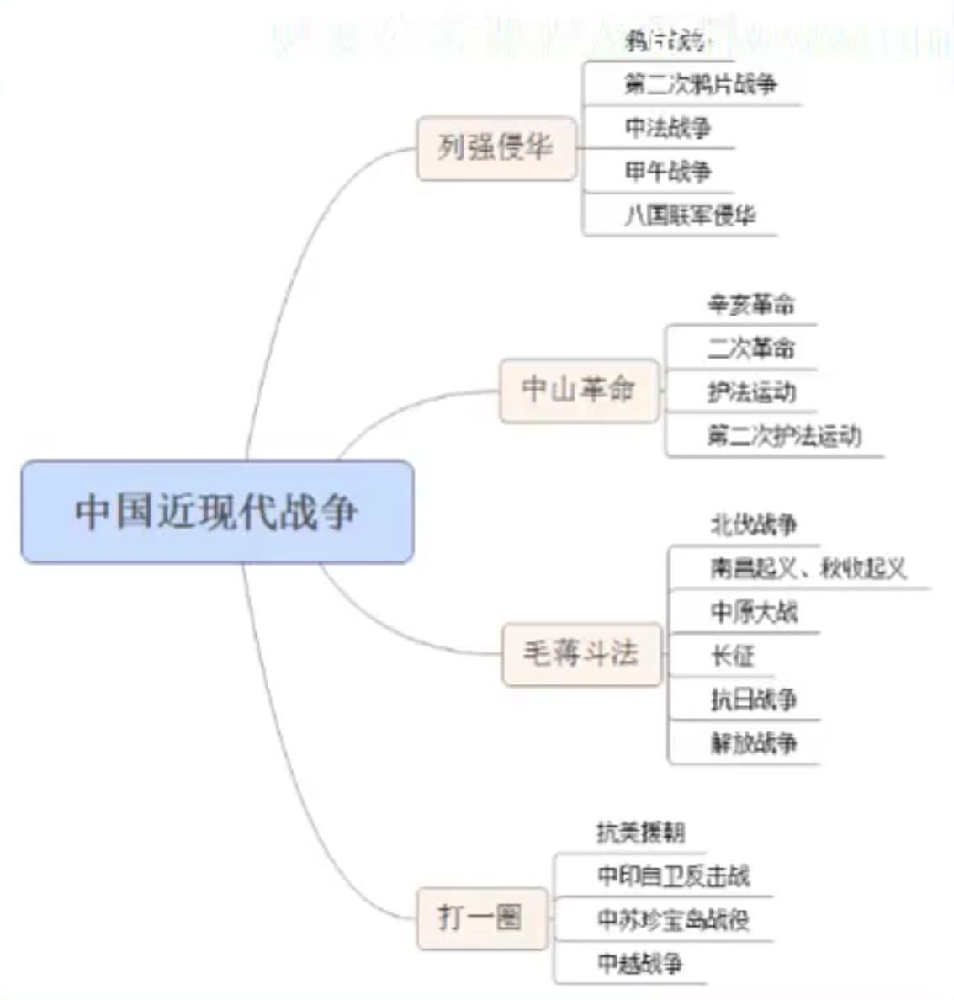
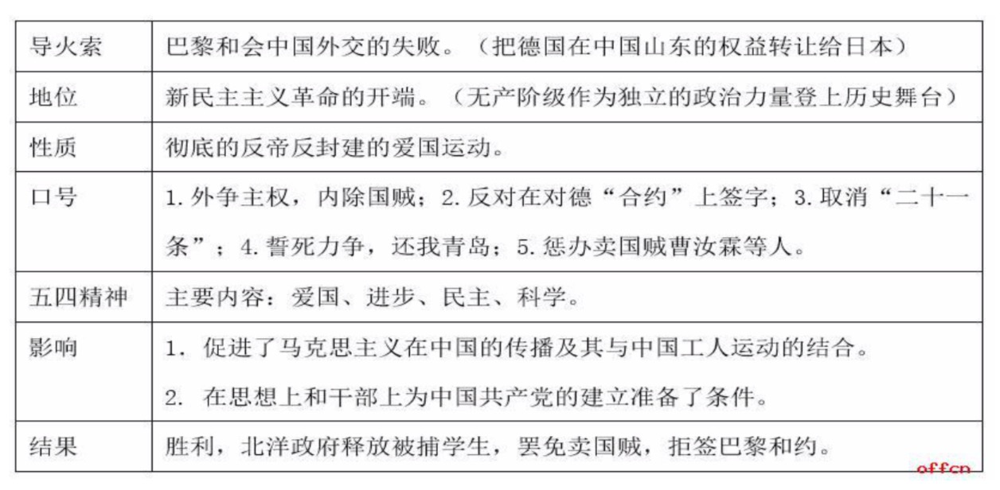
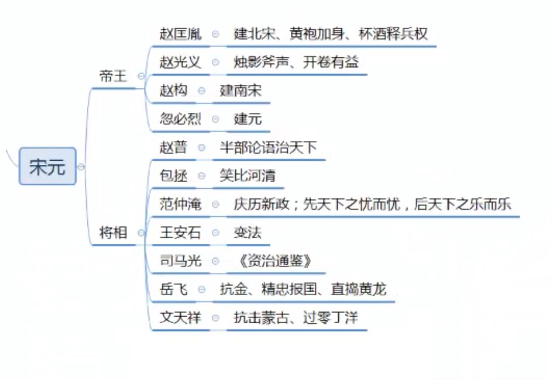
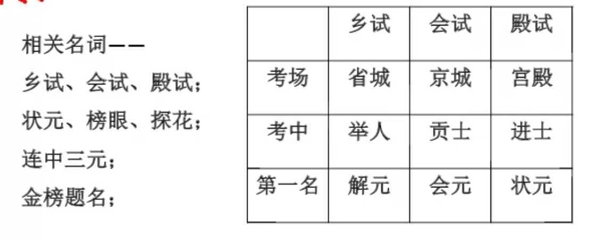
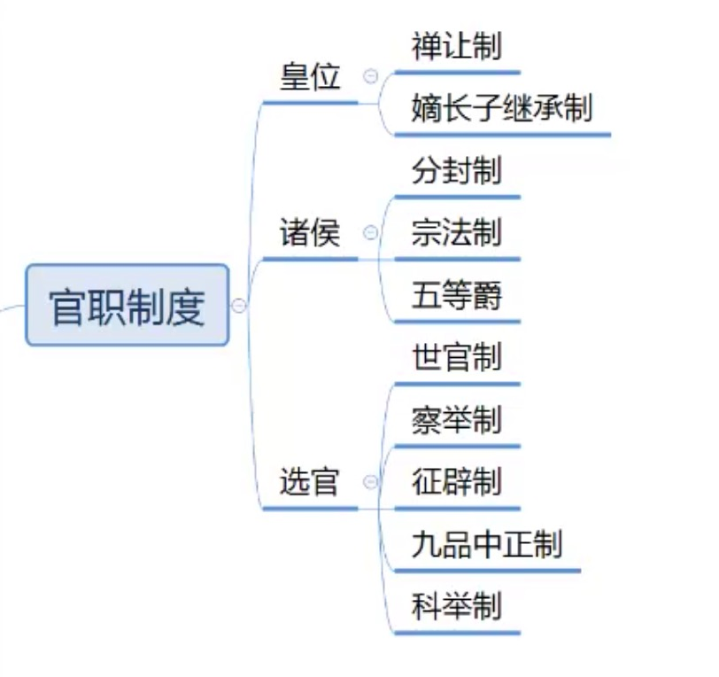
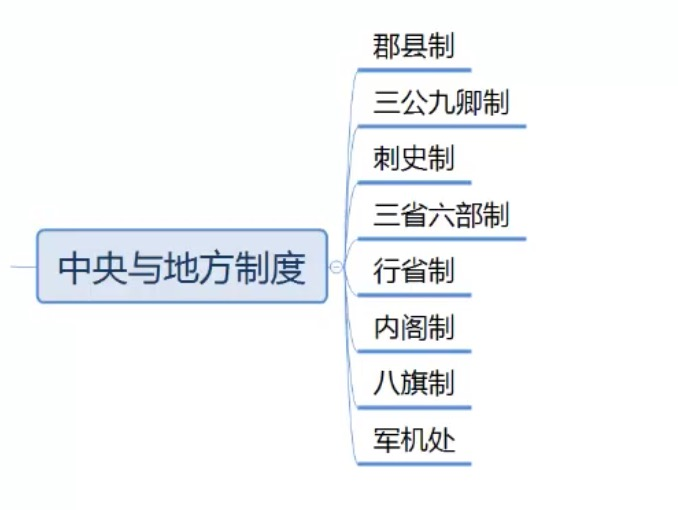
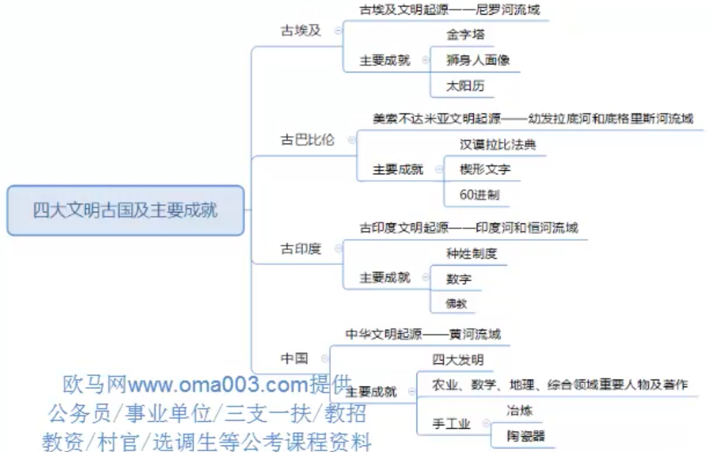

## 中国古代重要战争
### 先秦
1、**涿鹿之战**
> 上古时期（夏之前）
> 
> 华夏部落（黄帝、炎帝） vs 东夷部落（蚩尤）
> 
> 炎黄胜
> 
> - 神话传说——蚩尤请了风伯雨师
> - 后续——阪泉之战（炎黄内斗，黄帝胜）
> - 嫘祖——养蚕
> - 仓颉——造字

2、**鸣条之战**
> 夏末
> 
> 夏桀 vs 商汤
> 
> 商汤胜
> 
> - 伊尹——“调和五味”（老子《道德经》：治大国若烹小鲜）
> - 仲馗

3、**牧野之战**
> 商末
> 
> 周武王（姬发） vc 商纣王（帝辛）
> 
> 周武王胜，商纣王鹿台自焚
> 
> - 纣王：倒曳九牛、抚梁易柱
> - 临阵倒戈
> - 以少胜多：4万 vs 17万

4、**武庚之乱（三监之乱）**
> 西周
> 
> 周公（辅佐武王儿子成王） vs 武庚（纣王儿子）
> 
> 周公胜
> 
> - 周公东征
> - 周公制礼乐
> - 成康盛世（周公辅助了成王、康王）

5、**国人暴动**
> 西周
> 
> 周厉王 vs 国人
> 
> 厉王被逐、“共和行政”（周公、召公）
> 
> - 防民之口甚于防川
> - 公元前841年，我国有确切纪年的开始

6、**长勺之战**
> 春秋
> 
> 鲁国（鲁庄公） vs 齐国（齐桓公）
> 
> 鲁国胜
> 
> - 齐国：鲍叔牙，鲁国：曹刿论战（一鼓作气，再而衰，三而竭）
> - 以少胜多：一比十

7、**城濮之战**
> 春秋
> 
> 晋国（晋文公：姬重耳） vs 楚国
> 
> 晋国胜
> 
> - 晋军退避三舍（90里），诱敌深入

8、**桂陵之战**
> 战国
> 
> 齐国（孙膑） vs 魏国（庞涓）
> 
> 齐国胜
> 
> - 围魏救赵：魏国攻打赵国，赵国请求齐国帮忙，齐国攻打魏国，魏军回撤，齐国桂陵伏击

9、**马陵之战**
> 战国
> 
> 齐国（孙膑） vs 魏国（庞涓）
> 
> 齐国胜
> 
> - 减灶诱敌：魏国攻打韩国，齐国攻打魏国，魏军回撤，齐军佯装战败逃跑并减灶，伏击于马陵，庞涓毙

10、**长平之战**
> 战国
> 
> 秦国（白起） vs 赵国（赵括：纸上谈兵）
> 
> 秦国大胜，坑杀10万降卒
> 
> - 纸上谈兵
> - 战国历史的最后转折，秦国统一只是时间问题

### 秦汉
1、**巨鹿之战**
> 秦末
> 
> 楚军为首的义军（项羽） vs 秦军（章邯）
> 
> 义军胜
> 
> - 破釜沉舟
> - 新安杀降（全歼王离20万，招降章邯20万，但是全部坑杀）
> - 以少胜多：6万 vs 40万（章邯20万，王离20万）

2、**垓下之战**
> 楚汉争雄
> 
> 汉军（汉高祖刘邦） vs 楚军（项羽）
> 
> 汉军胜，项羽自杀
> 
> - 鸿沟和议（楚河汉界）
> - 十面埋伏
> - 四面楚歌
> - 霸王别姬

3、**白登之围**
> 西汉
> 
> 西汉（刘邦） vs 匈奴
> 
> 匈奴围困汉军七日，议和后撤军
> 
> - 陈平：向冒顿单于的阏氏（冒顿妻）行贿

4、**七国之乱**
> 西汉
> 
> 汉景帝、周亚夫 vs 吴王刘濞等诸侯
> 
> 叛乱被平定
> 
> - 文景之治
> - 诸侯口号：诛晁错，清君侧

5、**汉武帝反击匈奴**
> 西汉
> 
> 西汉（卫青、霍去病） vs 匈奴
> 
> 汉军胜
> 
> - 马邑之谋：出战前想伏击匈奴，结果失败
> - 三场战役：河南漠南之战（卫青、李息）、河西之战（霍去病）、漠北之战（卫青、霍去病）
> - 霍去病：封狼居胥
> - 但使龙城飞将在，不教胡马度阴山（飞将军：李广）

### 三国两晋南北朝
1、**官渡之战**
> 东汉末
> 
> 曹操 vs 袁绍
> 
> 曹操胜
> 
> - 以少胜多（3万 vs 10万）
> - 许攸投奔曹操，献计火烧乌巢（袁绍粮仓）而胜利
> - 为曹操统一北方奠定基础

2、**赤壁之战**
> 东汉末
> 
> 孙刘联军（周瑜、刘备） vs 曹军（曹操）
> 
> 孙刘联军胜
> 
> - 以少胜多（3万 vs 20万）
> - 羽扇纶巾——周瑜
> - 为三国鼎立奠定基础

3、**夷陵之战（彝陵之战、猇亭之战）**
> 三国
> 
> 蜀汉（刘备，4万） vs 孙吴（陆逊，5万）
> 
> 陆逊火烧连营，蜀汉大败
> 
> - 关羽大意失荆州，败走麦城，被吕蒙干掉，刘备为关羽报仇攻打孙吴
> - 陆逊以逸待劳，火烧连营

4、**八王之乱**
> 西晋
> 
> 西晋统治阶级内部
> 
> 东海王司马越在八王之乱中成为了最终胜利者
> 
> - 五胡乱华

5、**淝水之战**
> 东晋
> 
> 东晋（后方总指挥谢安，前线谢石、谢玄） vs 前秦（苻坚）
> 
> 8万东晋军大败80万前秦军
> 
> - 以少胜多
> - 激将法
> - 投鞭断流（苻坚说他士兵多，把马鞭扔河里能断流）
> - 草木皆兵
> - 风声鹤唳
> - 屐齿之折

## 隋唐之后
1、**安史之乱**
> 唐朝
> 
> 唐政府军（郭子仪、李光弼） vs 藩镇叛军（安禄山、史思明）
> 
> 唐政府军胜
> 
> - 马嵬坡兵变，勒死杨贵妃
> - 睢阳之战（张巡守城，7000人）vs 叛军（12万），最终守城被破，张巡被杀
> - 醉打金枝——郭子仪

2、**澶渊之盟**
> 北宋
> 
> 北宋（宋真宗） vs 辽（萧太后）
> 
> 双方订立合约

3、**郾城之战**
> 南宋
> 
> 南宋（岳飞）vs 金（完颜宗弼）
> 
> 岳家军以少胜多，重创金国精锐，大伤金国元气
> 
> - 以少胜多
> - 铁浮屠——金国
> - 直捣黄龙（今吉林一带），迎回徽钦二宗
> - 东窗事发——秦桧在东窗下密谋害岳飞，后来密谋败露

4、**靖难之役**
> 明朝
> 
> 燕王朱棣（永乐大帝，永乐盛世） vs 建文帝朱允炆
> 
> 朱棣胜，登上帝位
> 
> - 清君侧，靖国难
> - 迁都（南京->北京），修故宫

5、**土木堡之变**
> 明朝
> 
> 明朝（明英宗朱祁镇，王振）vs 瓦剌（也先）
> 
> 明朝惨败，明英宗被俘
> 
> - 于谦（北京保卫战），（《石灰吟》粉身碎骨浑不怕，要留清白在人间）
> - 夺门之变——明英宗重夺皇位，杀死于谦

6、**三藩之乱**
> 清朝
> 
> 清政府军 vs 三藩（吴三桂、尚可喜、耿精忠）
> 
> 清军胜，平定三藩

7、**雅克萨之战**
> 清朝
> 
> 清（康熙）vs 俄国
> 
> 清胜，签订《尼布楚条约》

## 中国近现代战争
列强侵华 —— 中山革命 —— 毛蒋斗法

### 列强侵华
1、**鸦片战争**
> 1840年
> 
> 中国清朝 vs 英国 
> 
> 中国失败，签订《南京条约》，赔款割地（割香港岛），开通商口岸（广州、福州、厦门、宁波、上海）
> 
> - 鸦片战争标志着中国近代史的开端，使中国开始沦为半殖民地半封建社会，丧失独立自主的地位
> - 导火线——1839年林则徐虎门销烟
> - 苟利国家生死以，岂因祸福避趋之——林则徐

2、**第二次鸦片战争**
> 1856年
>
> 英国、法国（美国、俄国） vs 清朝
> 
> 联军获胜，签订《天津条约》（1858年，英法俄美），《瑷珲条约》（1858年，俄国，侵犯我国国土最多的条约，150多万平方公里），《北京条约》（1860年，英法俄，割香港九龙半岛，增开天津通商）等不平等条约
> 
> - 中国半殖民地半封建社会加深
> - 火烧圆明园

3、**中法战争**
> 1883年
> 
> 清政府（刘永福(黑旗军)、冯子才(镇南关大捷)、刘铭传(台湾首任巡抚)） vs 法国
> 
> “法国不胜而胜，中国不败而败”，签订《中法新约》（丧失越南宗主权，西南开通商口岸）
> 
> - 法国实现了据越侵华的图谋，侵略势力伸入云南、广西，中国西南门户被打开

4、**甲午战争**
> 1894年
> 
> 清政府 vs 日本
> 
> 中国战败，北洋水师全军覆没，签订了《马关条约》（割辽东，割台湾，赔2亿两，后给了3000万赎回辽东）
> 
> - 甲午战败和《马关条约》的签订是中国陷入深重的民族危机，中国社会半殖民地化的程度**大大加深**
> - 标志洋务运动失败
> - 旅顺大屠杀，2万人

5、**八国联军侵华**
> 1900年，背景：义和团运动(农民运动)——“扶清灭洋”
> 
> 英、俄、德、法、美、日、意、奥 vs 清政府
> 
> 中国战败，与11国(荷、比、西)签订《辛丑条约》（赔4.5亿两，分39年还清，本息共9.8亿两(庚子赔款)）
> 
> - 清政府彻底成为帝国主义统治中国的工具。《辛丑条约》的签订，标志着中国半殖民地半封建社会的统治秩序完全确立 

> 1. 洋务运动(19世纪60年代)，地主阶级洋务派
> 2. 戊戌变法(1998年11月)(百日维新，维新变法，维新运动)，资产阶级革命派
> 3. 义和团运动(十九世纪末)，农民阶级
> 4. 辛亥革命(1911年)，资产阶级改良派

### 中山革命
1、**辛亥革命**
> 1911年
> 
> - 前期：黄花岗起义、保路运动
> - 标志：武昌起义（10月10日）
> - 性质：一场反帝反封建的资产阶级民主革命
> - 它推翻了统治中国二百六十多年的清王朝，结束了中国两千多年的封建君主专制制度，使民主共和的观念深入人心。但辛亥革命的果实被袁世凯所窃取，反帝反封建的革命任务没有完成，中国半殖民地半封建社会性质没有改变。
> - 1840~1949年，半殖民地半封建社会；1949~1956年，新民主主义社会；1956年，完成三大改造，社会主义社会
> - 中国近代三次巨变：1、辛亥革命；2、新中国成立+三大改造；3、改革开放

2、**二次革命**
> 1913年
> 
> 孙中山等国民党 vs 袁世凯北洋军
> 
> 革命失败，孙中山流亡海外

3、**护国运动**
> 1915年12月袁世凯称帝，唐继尧、蔡锷、李烈钧等出兵讨伐
> 
> 袁世凯受挫，83天后取消帝制，数月后病逝

4、**护法运动**
> 1917年7月~1918年5月，孙中山为首的资产阶级革命党人为维护临时约法、恢复国会
> 
> 护法失败

5、**第二次护法**
> 1921年~1922年，孙中山重组军政府，发起第二次护法
> 
> 由于陈炯明叛变，第二次护法失败
> 
> - 陈炯明炮轰总统府，孙中山躲入永丰舰，后改名中山舰。
> - 标志中国资产阶级领导的旧民主主义革命失败
> 
> 后续：1924年，中国国民党第一次全国代表大会在广州召开，大会决定联俄、联共、扶助农工三大政策，国共第一次合作。1925年孙中山病逝，“革命尚未成功，同志仍需努力”

### 毛蒋斗法
1、**北伐战争**
> 1926年7月
> 
> - 背景：国共合作
> - 目的：推翻北洋军阀（吴佩孚、孙传芳、张作霖）统治，统一全国
> - 成果：基本推翻北洋军阀统治，但反帝反封建民主革命尚未完成，双半社会性质仍未改变
> 
> 1927年蒋介石发动412反革命政变，国共破裂 
> 
> 1928年张作霖儿子张学良改投蒋介石（东北易帜），标志北伐结束，国民政府在形式上统一中国

2、**南昌起义**
> 1927年8月1日（建军节）
> 
> - 领导人：周恩来、贺龙、叶挺、朱德、刘伯承、谭平山
> - 意义：打响了武装反抗国民党反动统治的第一枪，是中国共产党独立领导革命战争和创建人民军队的开始

3、**秋收起义**
> 1927年9月，湖南江西边境
> 
> - 领导人：毛泽东
> - 意义：建立了中国第一个农村革命根据地——井冈山革命根据地
> 
> 一开始决定攻打长沙，后来失败。文家市决策（放弃城市去农村，最后走向井冈山）、三湾改编（确立党对军队的绝对领导）
> 
> - 1928年，《井冈山土地法》，我国第一部土地法

4、**中原大战**
> 1930年5月~11月，蒋介石与阎锡山、冯玉祥、李宗仁等发生的一场新军阀混战。耗时最长、规模最大的军阀混战，蒋介石胜利而告终

5、**万里长征**
> 1934年10月~1936年10月，被迫进行的战略转移
>
> 

6、**抗日战争**

时间 | 战役、事件 | |
:--: | :--: | :-- 
1931.9.18 | 九一八事变 | 沈阳；张学良东北军为了保存实力放弃抵抗；14年抗战开始(新版，旧版为8年抗战)
1935.1 ~ 7 | 华北事变 | 日本妄图让东北自治
1935.12.9 | 一二九运动 | 中共领导的学生运动
1935.12.17 | 瓦窑堡会议 | 提出抗日民族统一战线
1936.12.12 | 西安事变 | 张学良、杨虎城
1937.7.7 | 七七事变 | 北平；卢沟桥事变；全面侵华；事后国共第二次合作，一致抗日
1937秋 | 洛川会议 | 中共提出把工作重心放在战区、敌后，战区配合国民党友军，敌后建立抗日根据地
| | 淞沪太原南徐州，后面跟着地图走
1937.8.13 | 淞沪会战 | 第一场大型会战；粉碎日军三个月灭亡中国的计划；为工业内迁争取了时间
1937.9 ~ 11 |  太原会战 | 平型关大捷（林彪115师）
1937.12 | 南京保卫战 | 南京大屠杀超过30万人
1938.1 ~ 5 | 徐州会战 | 台儿庄战役（李宗仁，歼灭日军一万多人，抗日以来的最大胜利）
1938.6 ~ 10 | 武汉会战 |
1939.9 ~ 1944.8 | 长沙会战 |
1939.12 ~ 1940.1 | 昆仑关战役 | 昆仑关大捷，保住抗日大后方
1940.5 | 枣宜会战 | 张自忠以身殉国，抗日战争牺牲的最高将领（集团军总司令）
1940下半年 | 百团大战 | 彭德华，105个团，20多万中共士兵，打了1800多场战役，歼灭日本军4万多人
1940秋 | 皖南事变 | 1940年秋调兵，1941年1月发动；蒋介石攻打新四军，军长叶挺被扣押，副军长项英被杀；“千古奇冤，江南一叶；同室操戈，相煎何急！”周恩来
1944.4 ~ 12 | 豫湘桂战役 | 豫湘桂大溃退
1945.8.15 | 日本投降

7、**解放战争**

时间 | 战役、事件 | |
:--: | :--: | :-- 
1945.9 ~ 10 | 上党战役 | 发生于重庆谈判期间
1947.3 ~ 5 | 延安保卫战 | 国军胡宗南攻入延安，中共主动撤出转战陕北
1947.5 | 孟良崮战役 | 全歼张灵甫整编74师
1947.8 | 刘邓挺进大别山 | 
1948.9 ~ 11 | 辽沈战役 | 三大战役（辽沈、淮海、平津），历时142天，歼敌154万人
1948.11 ~ 1949.1 | 淮海战役 |
1948.11 ~ 1949.1 | 平津战役 | 傅作义投降
1949.4 ~ 6 | 渡江战役 | 

8、**建国后——“打一圈”**
> - 1950，抗美援朝
> - 1962，中印自卫反击战
> - 1969，中苏珍宝岛战役
> - 1979，中越自卫反击战

#### 五四运动
地位：五四运动是中国旧民主主义革命的结束和新民主主义革命的开端

------
------
------
------
------

## 诸子百家
### 儒家
1、**孔子**

春秋时期 鲁国人；“至圣”、“万世师表”
 
> 思想
> 1. 礼(等级有序)——“克己复礼”(约束自己，言行符合与礼)、“君君、臣臣、父父、子子”(做什么要有什么的样子)
> 2. 仁——“爱人”(爱人之心，体恤、宽恕)、“因民之所利而利之”(使民实现利益)
> 3. 中庸(不偏不倚，折中调和)——“过犹不及”、“和而不同”(和谐友善而不必苟同)
> 4. 德——“为政以德，譬如北辰居其所而众星拱之”(道德治国，众星拱北)

> 教育
> 1. 对象——有教无类(不问出身)；兴办私学(打破官学垄断)
> 2. 态度——“不耻下问”、“知之为知之，不知为不知，是知也”
> 3. 方法——“学(勤学多问，韦编三绝)、思、习、行”；循循善诱(引导)；因材施教；不愤不启、不悱不发(让学生思考，实在想不到了老师再去启发)；举一反三；
> 4. 内容——《诗》《书》《礼》《乐》《易》《春秋》（《乐》失传了，所以称为“五经”）

> 著作
> 
> - 《论语》——记录孔子及其弟子言行，共20篇，孔子弟子、再传弟子编著
> - 宋代朱熹将《论语》、《大学》、《中庸》、《孟子》合称为四书

2、**孟子**

战国时期；“亚圣”；“孟母三迁”

> 思想
> 1. 仁政(针对统治者)——“威天下不以兵革之利”、“乐以天下、忧以天下”、“生于忧患、死于安乐”、“天时不如地利，地利不如人和”
> 2. 义——道义(君王实行仁政，臣民忠心不二)，“得道者多助”(君王实行仁政，拥戴的人很多)、“富贵不能淫(骄奢淫逸)，贫贱不能移(改移节操)，威武不能屈(屈服意志)”(不管什么情况都要坚守道义)
> 3. 民贵君轻——“民为贵，社稷次之，君为轻”
> 4. 性善论——“恻隐之心，人皆有之”(同情怜悯之心)
> 5. 以德服人——“以德服人者，中心悦诚服也”

> 著作
> 
> - 《孟子》——作者：孟子及其弟子

3、**荀子**

战国末期 赵国；（对各家学说都有吸收，最推崇孔子），李斯、韩非为其弟子（法家）

> 思想
> 1. 性恶论(自然生存欲求)——礼法并用(用礼教化，用法惩罚)
> 2. “君者，舟也；庶人者，水也；水则载舟，水则覆舟”
> 3. 先义(正义)后利(私利)——“先义而后利这荣，先利而后义者辱”
> 4. “天行有常，不为尧存，不为桀亡”(大自然是有规律的，不因圣明而存在，不因暴虐而消失)、“制天命而用之”(掌握规律就能利用它为自身服务)

> 著作
> 
> - 《荀子》——作者：荀子及其弟子

4、其他
> 1. 董仲舒（汉武帝时期）——“罢黜百家，独尊儒术”；“大一统”；天人感应；著作《天人三策》
> 2. 朱熹（南宋）——程朱理学(程：程颐)；“存天理，灭人欲”(追逐天地之理，去除人的私欲；天理：三纲五常，三纲：君父夫，五常：仁义礼智信)；著作《四书集注》
> 3. 王阳明（明代，又称王守仁）——陆王心学(陆：南宋陆九渊；陆九渊：吾心即是宇宙，王阳明：从内心中寻找理)；“知行合一”；著作《大学问》

### 道家
> 道家与道教不是一个东西，道家是老子创立，道教是东汉张道陵创立（张天师），但是道教奉老子为道祖

1、**老子**

春秋时期，原名李耳

> 思想
> 1. “道”是世界本源；“道生一，一生二，二生三，三生万物”
> 2. 朴素的辩证法——“祸兮福所倚，福兮祸所伏”(福祸是相互依存，相互转化的)、“有无相生，难易相成，长短相形”
> 3. 无为而治(顺其自然)——“我无为，而民自化”(不过多的干预，发挥老百姓的创造力，最终自我实现价值)、“上善若水”(不争)
> 4. “小国寡民”

> 著作：
> 
> - 《道德经》（中国首部完整的哲学著作）——作者：老子

2、**庄子**

战国时期，称为南华真人

> 思想
> 1. 无为
> 2. 齐物论(一切事物都是相同的，没有差别，别有贵贱之分)
> 3. 天人合一——“万物与我为一”(宇宙万物与我浑然同为一体，人们不应该用制度、藩篱去压制自己，不应该丧失本性)
> 4. “逍遥”的人生态度(心灵不被外物所累，要自由自在、无拘无束。代表作《逍遥游》)

> 著作
> 
> - 《庄子》，亦称《南华经》——作者：庄子及其后学；“庄周梦蝶”、“知鱼之乐”、“庖丁解牛”

3、魏晋玄学
> 玄学又称新道学，是对《老子》《庄子》和《周易》的研究和解说，产生于魏晋。玄学是魏晋时期到宋朝中叶之间出现的一种崇尚老庄的思潮

### 法家
1、**商鞅**

战国，原魏国人，后辅佐秦孝公嬴渠梁

> “治世不一道，便国不法古”(不死板，不必相仿古人)

2、**韩非**

战国末期，辅佐嬴政

> 1. “事在四方，要在中央”(中央集权)
> 2. “以法为教”(法律条文充当教育内容)、“刑过不避大臣，赏善不遗匹夫”
> 3. “法”(健全法制)、“术”(策略手段)、“势”(君王权势)结合

### 墨家
> 通常跟儒家相反

1、**墨子**，名翟（dí）

战国，农民出生

> 思想（代表平民利益）
> 
> 兼爱(大爱，不分贵贱)、非攻(反对侵略战争)、节用(勤俭节约)、节葬(反对厚葬)、尚贤(唯才是举)、尚同(上下一心为民谋益)、非命(反对命运学说)、非乐(要摆脱礼乐束缚)

> 著作
> - 《墨子》——作者：墨子及其弟子
> - 《墨经》——《墨子》是总集，《墨经》是《墨子》的重要部分。《墨经》记录了很多自然科学，光学八条。“小孔成像”世界上最早记录在《墨经》

### 兵家
> 1. 孙武：春秋，效力于吴国；兵圣；《孙子兵法》(世界上最早的军事著作)
> 2. 孙膑：战国；《孙膑兵法》；“围魏救赵”、“田忌赛马”

### 杂家
> “兼儒墨，合名法”(博采众家之长)
> 
> 吕不韦：《吕氏春秋》，“一字千金”

-----
-----
-----
-----
-----

## 中国的帝王将相
### 先秦
> 1. 舜——孝感天地
> 
> 2. 禹——三过家门而不入、建夏
> 
> 3. 汤——鸣条之战、建商
> 
> 4. 周文王（姬昌）——西伯拘而演《周易》、百子锁
> 
>    周武王（姬发）——牧野之战、武王伐纣、建立西周
> 
> 5. 姜尚——百家宗师、六韬（太公兵法）、被封为齐国君主
> 
> 6. 春秋五霸——齐恒公（葵丘之盟）、晋文公（退避三舍）、楚庄王（问鼎中原、一鸣惊人）、吴王阖闾、越王勾践（卧薪尝胆）
> 
> 7. 管仲（辅佐齐桓公）——法家之驱（变法改革）、华夏第一相、尊王攘夷（遵从周天之、对抗外族，挟天子以伐不敬）、老马识途、管鲍之交
> 
> 8. 范蠡（辅佐越王勾践）——兔死狗烹、商圣（陶朱公）、西施（沉鱼(西施)落雁(王昭君)闭月(貂蝉)羞花(杨贵妃)）
> 
> 9. 伍子胥（受楚国迫害，投奔吴王阖闾）——一夜白发（过昭关）、倒行逆施、年糕
> 
> 10. 秦孝公（战国时期秦国国君）——商鞅变法
> 
> 11. 孙膑（齐国）——田忌赛马、围魏救赵、孙庞斗智（庞涓）
> 
> 12. 苏秦（为六国效力）、张仪（秦国）——合纵连横（合众弱以攻一强，六国联合抗秦）（事一强以攻众弱）、悬梁(东汉孙敬)刺股(苏秦)
> 
> 13. 蔺相如（赵国）——负荆请罪（廉颇向蔺相如请罪）、完璧归赵(秦昭襄王)、渑池之会
> 
> 14. 白起（秦国）——战神、长平之战
> 
> 15. 范睢（秦国宰相）——睚眦必报、远交近攻、固干削枝
> 
> 16. 荆轲——图穷匕见

### 秦汉
> 1. 嬴政——统一六国、书同文（李斯、小篆(官方)、隶书(非官方)）、车同轨(轮距6尺)、统一度(长度)量(容积)衡(总量)
> 
> 2. 赵高（秦二世胡亥时期）——指鹿为马
> 
> 3. 项羽——破釜沉舟（巨鹿之战）、力能扛鼎
> 
> 4. 刘邦——约法三章(为了收买人心，杀人伤人盗窃都不行)、建西汉
> 
> 5. 萧何——萧规曹随
> 
> 6. 张良——博浪沙刺秦、孺子可教
> 
> 7. 韩信——一饭千金（一字千金(吕不韦)、一顾千金(伯乐)、一诺千金(季布)）、胯下之辱、背水一战、十面埋伏、多多益善
> 
> 8. 汉文帝、汉景帝（七国之乱）——文景之治
> 
> 9. 刘彻（汉武帝）——北击匈奴、独尊儒术、盐铁官营、巫蛊之祸、金屋藏娇
> 
> 10. 司马迁——《史记》（第一部纪传体通史，《春秋》第一部编年体，《左传》第一部叙事详细编年体）
> 
> 11. 张骞——开辟西域（丝绸之路，李希霍芬提出）
> 
> 12. 主父偃——推恩令
> 
> 13. 刘秀（光武帝）——昆阳之战（以少胜多，击败王莽）、建东汉、光武中兴
> 
> 14. 马援——马革裹尸、老当益壮
> 
> 15. 班超——投笔从戎、不入虎穴焉得虎子
> 
>	   班固——班超哥哥，写史书《汉书》的

### 三国两晋南北朝
> 1. 曹操——官渡之战、赤壁之战、奸雄、望梅止渴
> 
> 2. 曹丕——建魏、典论
> 
> 3. 刘备——三顾茅庐、建蜀汉
> 
> 4. 刘禅——乐不思蜀
> 
> 5. 关羽——斩颜良、单刀赴会、水淹七军、败走麦城
> 
> 6. 诸葛亮——鞠躬尽瘁、平孟获、北伐、八阵图
> 
> 7. 孙权——建吴
> 
> 8. 周瑜——赤壁之战、羽扇纶巾
> 
> 9. 吕蒙——刮目相看
> 
> 10. 陆逊——火烧连营
> 
> 11. 司马炎——建西晋
> 
> 12. 司马睿——建东晋
> 
> 13. 谢安（东晋）——淝水之战（最著名的以少胜多）
> 
> 14. 祖逖（东晋）——闻鸡起舞、中流击楫
> 
> 15. 北魏孝文帝——汉化改革
> 
> 16. 郦道元——《水经注》（地理学著作）

### 隋唐
> 1. 杨坚——建隋、开皇之治
> 
> 2. 杨广——开科举、京杭运河
> 
> 3. 李渊——建唐
> 
> 4. 李世民（唐太宗）——玄武门之变、贞观之治
> 
> 5. 魏征——水能载舟亦能覆舟
> 
> 6. 秦琼、尉迟恭——门神
> 
> 7. 程咬金——莽汉
> 
> 8. 薛仁贵——灭高句丽、大破突厥、三箭定天山、脱帽退万敌、瞒天过海
> 
> 9. 玄奘——西行印度、《大唐西域记》
>
>	  鉴真——东渡日本
>
>	  一行——天文学家，大衍历，首测子午线长度
>
>	  怀素——书法家：草书
>
>	  惠能——六祖
>
>	  佛印（宋朝）——苏东坡好朋友
>
> 10. 武则天——举行殿试、开创武举、无字碑
> 
> 11. 狄仁杰——桃李满天下
> 
> 12. 李隆基（唐玄宗）——开元盛世、安史之乱

### 宋元
> 1. 赵匡胤——建北宋、黄袍加身、杯酒释兵权
> 
> 2. 赵光义（赵匡胤弟弟）——烛影斧声、开卷有益
> 
> 3. 赵普——半部论语治天下
> 
> 4. 包拯——笑比河清
> 
> 5. 范仲淹——庆历新政、先天下之忧而忧，后天下之乐而乐（岳阳楼记）
> 
> 6. 王安石——熙宁变法
> 
> 7. 司马光——《资治通鉴》（第一部编年体通史）
> 
> 8. 赵构——建南宋
> 
> 9. 岳飞——抗金、精忠报国、直捣黄龙
> 
> 10. 文天祥——抗击蒙古、过零丁洋
> 
> 11. 忽必烈——建元

### 明
> 1. 朱元璋——建明、洪武之治
> 
> 2. 朱棣——靖难之役、永乐盛世、建明故宫
> 
> 3. 解缙——《永乐大典》（世界最大的百科全书）
> 
> 4. 郑和——七下西洋（1405~1433年，最远到达红海）
> 
> 5. 张居正——万历新政、一条鞭法
> 
> 6. 戚继光——抗倭
> 
> 7. 郑成功——收复台湾（击败荷兰）
> 
> 8. 吴三桂——冲冠一怒为红颜

### 清
> 1. 努尔哈赤——建后金（女真族）
> 
> 2. 皇太极——改大清（改满族）
> 
> 3. 康熙、雍正、乾隆——康乾盛世
> 
> 4. 纪昀——四库全书
> 
> 5. 林则徐——虎门销烟
> 
> 6. 曾国藩——剿灭太平天国（安庆内军械所）
> 
> 7. 左宗棠——收复新疆（福州船政局）
> 
> 8. 张之洞——中学为体，西学为用（汉阳铁厂）
> 
> 9. 李鸿章——大清王朝的裱糊匠（轮船招商局，江南制造总局）
> 
> 10. 康有为、梁启超——公车上书（1895年，维新派登上历史舞台）、戊戌变法（1898年，资产阶级改良运动，君主立宪，百日维新）

## 中国的古代制度
### 官吏制度
**官职制度**
> 1. 禅让制——“天下为公，选贤为能”（原始社会末期）
> 
> 2. 嫡长子继承制——“立嫡以长不以贤”（始于商，完善于西周）

**诸侯**
> 1. 分封制——把天子亲属和异性贵族分封到各地为诸侯（商周时期，普遍推行）
> 
> 2. 宗法制——依血缘远近区别嫡庶亲疏，维护世袭统治（周代完备）
> 
> 3. 五等爵——古代的爵位登记：公、候、伯、子、男

**选官**
> 1. 世官制（世卿世禄）——贵族世代为官（先秦）
> 
> 2. 察举制——官员考察，将人才推荐给中央（汉代）
> 
> 3. 征辟制——皇帝和高官直接征聘（后汉）
> 
> 4. 九品中正制——（魏晋南北朝）
> 
> 5. 科举制——分科考试以取士（隋——清）（隋炀帝杨广——进士科）
> 

### 中央与地方制度
> 1. 郡县制（秦汉盛行）
> 
> 2. 三公九卿制（秦——隋之前）
> 
> 3. 刺史制（汉武帝）
> 
> 4. 三省六部制（隋）（元——一省六部、明清——六部）
> 
> 5. 行省制（元）（我国省制的开端）
> 
> 6. 内阁制（明）
> 
> 8. 八旗制（清，努尔哈赤）
> 
> 9. 军机处（雍正）君主专制达到顶峰

### 礼仪制度
**政治礼仪**
> 1. 礼乐制（西周，周公制礼乐）——贵贱有别，符合身份
> 
> 2. 封禅——泰山祭祀
> 
> 3. 五礼（西周）——吉（祭祀）、凶（哀鸣，吊唁）、军（军事）、嘉（喜庆）、宾（宾客，外交）

**生活礼仪**
> 1. 诞生礼——三朝、满月、百日、周岁
> 
> 2. 排行——伯、仲、叔、季
> 
> 3. 冠礼、笄礼——男子二十、女子十五
> 
> 	- 垂髫——三四岁至八九岁儿童
> 	- 总角——八九岁至十三四岁的少年
> 	- 豆蔻——十三四的女孩子
> 	- 束发——男子十五岁
> 	- 弱冠——男子二十岁
> 	- 而立——三十岁
> 	- 不惑——四十岁
> 	- 知命——五十岁
> 	- 花甲——六十岁
> 	- 古稀——七十岁
> 	- 耄耋——八九十岁
> 	- 期颐——一百岁
> 
> 4. 婚礼六礼——纳采（请媒人提亲）、问名、纳吉、纳征（送聘礼）、请期（择日）、亲迎
> 
> 5. 休妻“七出三不去”——“七出”：不顺父母、无子、淫、妒、有恶疾、多言、盗窃。“三不去”：有所取无所归（无娘家）、与更三年丧（跟丈夫守孝三年）、前贫贱后富贵
> 
> 6. 见面礼——作揖、拜、万福礼（女）
> 
> 7. 座次礼
> 
>	- 筵席——西北南东
>	- 朝会——皇帝：背北面南

--- 
### 历史时间
1、**夏**（都城：阳城，今河南登封一带）
> 禹传启，家天下 -> 划分九州 -> 桀行暴政而亡

2、**商**（都城：亳，今商丘 -> 殷，今安阳）
> 商汤鸣条之战灭夏 -> 伊尹摄政 -> 盘庚迁殷 -> 纣暴政灭国

3、**西周**（都城：镐京，今西安）
> 武王伐纣，牧野之战灭商 -> 实行分封制 -> 周公东征 -> 国人暴动 -> 幽王烽火戏诸侯 -> 犬绒攻破镐京 -> 平王(姬宜臼)东迁洛邑

4、**春秋战国**（东周——都城：洛邑，今洛阳）
> 春秋五霸（齐桓公——长勺之战、曹刿论战，晋文公——城濮之战、退避三舍，楚庄王——问鼎中原、一鸣惊人，吴王阖闾，越王勾践——卧薪尝胆） -> 百家争鸣（儒、道、法、墨、兵、杂、纵横）
>
> - 名家——辩论名(概念)实(事物)（围绕名实展开辩论）
> - 阴阳家——阴阳五行（用金木水火土解释社会，解释人事）
> - 农家——农业生产、农民思想

5、**战国七雄**（齐楚燕韩赵魏秦）
> - 从三家分晋开始（赵魏韩）、田氏代齐
> - 商鞅变法——取木立信
> - 马陵之战——减灶诱敌
> - 桂陵之战——围魏救赵
> - 长平之战——纸上谈兵
> - 荆轲刺秦——图穷匕见

6、**秦**（都城：咸阳）
> 秦灭六国 -> 郡县制、统一度量衡、统一车轨、统一文字(秦小篆)、焚书坑儒、北征匈奴、南平百越、修筑长城(孟姜女) -> 昏庸腐朽的秦二世(赵高：指鹿为马) -> 陈胜、吴广起义(大泽乡起义：揭竿而起) -> 刘邦、项羽起义 -> 刘邦灭秦

> 我国四大爱情传说：牛郎织女、孟姜女哭长城、梁山伯祝英台、白蛇传说

7、**汉**（西汉——都城：长安，今西安；东汉——都城：洛阳）
> 楚汉之争 -> 垓下之战 -> 白登之围 -> 文景之治 -> 七国之乱 -> 汉武帝击匈奴 -> 巫蛊之祸(江充诬陷太子谋反) -> 轮胎罪己诏(汉武帝晚年) -> 陈汤击匈奴(汉元帝) -> 昭君出塞 -> 王莽改制(王莽篡汉，自立为王，长安改常安)，绿林赤眉起义(王匡、王凤) -> 刘秀称帝(光武帝，打败王莽建立东汉)(手不释卷) -> 光武中兴 -> 黄巾大起义(张角，“苍天已死，黄天当立，岁在甲子，天下大吉”)

8、**三国两晋南北朝**（魏都城：洛阳；蜀都城：成都；吴都城：建业，今南京；西晋都城：洛阳；东晋都城：建康，今南京；北魏都城：平成，今山西大同->迁都洛阳；南宋都城：建康，今南京）
> 军阀割据混战 -> 官渡之战 -> 赤壁之战 -> 魏(曹丕)、蜀(刘备)、吴(孙权)三国鼎立 -> 夷陵之战 -> 魏灭蜀(钟会邓艾) -> 司马炎篡魏，建立晋国 -> 晋灭吴 -> 八王之乱 -> 五胡乱华，匈奴灭西晋 -> 司马睿称帝，史称东晋 -> 淝水之战 -> 南北朝对峙（北魏孝文帝改革）（北魏南宋，宋：宋齐梁陈）

9、**隋**（都城：长安 -> 杨广迁都：洛阳）
> 杨坚称帝(原北魏，后篡位)(新建长安城) -> 开皇之治 -> 炀帝(杨广)暴政，开科举，修运河 -> 农民起义 -> 隋炀帝被弑

10、**唐**（都城：长安）
> 李渊自立为帝，建唐朝 -> 玄武门之变 -> 贞观之治（唐太宗李世民） -> 永徽之治（唐高宗李治） -> 武则天建周（张柬之兵谏后武则天退位） -> 开元盛世（唐玄宗(唐明皇)李隆基） -> 安史之乱 -> 黄巢起义（满城尽带黄金甲） -> 亡于藩镇（朱温）

11、**宋**（北宋都城：东京，今开封，也叫汴州、汴梁；南宋都城：临安，今杭州）
> 赵匡胤(宋太祖)陈桥兵变(黄袍加身) -> 北宋建立 -> 杯酒释兵权 -> 烛影斧声(赵光义) -> 檀渊之盟 -> 庆历新政(宋仁宗) -> 王安石变法(熙宁变法)(宋神宗) -> 宋徽宗重用“六贼” -> 靖康之难 -> 康王赵构继承皇位，史称南宋 -> 岳飞抗金 -> 文天祥抗击蒙古 -> 南宋灭亡

12、**元**（都城：大都，今北京）
> 蒙古国创始人铁木真(成吉思汗) -> 忽必烈建立元朝 -> 设宣政院，西藏成为中国的一个正式行政区域 -> 在澎湖设立巡检司，正式在台湾设立行政机构 -> 元末农民起义 -> 朱元璋推翻元朝

13、**明**（都城：应天府，今南京 -> 北京）
> 朱元璋建立明朝(洪武盛世) -> 靖难之役，朱棣(永乐大帝，永乐盛世)迁都北京 -> 郑和七下西洋 -> 仁宣之治(明仁宗朱高炽，明宣宗朱瞻基)(息兵养民，停止下西洋) -> 土木堡之变(明英宗朱祁镇) -> 戚继光抗倭(嘉靖年间，明世宗) -> 张居正改革 -> 李自成起义，崇祯(朱由检)自缢煤山 

14、**清**（都城：盛京，今沈阳 -> 北京）
> 女真族努尔哈赤建立后金 -> 皇太极改国号大清 -> 吴三桂引清入关 -> 顺治入关 -> 郑成功收复台湾 -> 康乾盛世 -> 鸦片战争(道光帝，1840，《南京条约》) -> 太平天国起义(1951 ~ 1864) -> 第二次鸦片战争(1865，英法联军火烧圆明园，《天津条约》《瑷珲条约》《北京条约》) -> 洋务运动(19世纪69年代 ~ 90年代，“自强、求富”) -> 中法战争(1883《中法新约》) -> 甲午战争(1894《马关条约》) -> 戊戌变法(1898) -> 义和团(19世纪末) -> 八国联军侵华(1900《辛丑条约》) -> 清末立宪(1906，预备立宪) -> 辛亥革命(1911.10.10)

-----
-----
-----
-----
-----

## 航天史及古代天文历法
#### 航天航空
一、航空航天基本技术
> 1、三大基本技术：天地往返、出舱行走、交会对接

> 2、载人航天器：
> 
> - 载人飞船（宇宙飞船，只能用一次；神州系列）
> - 载人空间站（天宫系列）
> - 航天飞机（美国：哥伦比亚号）

> 3、宇航服：为了防辐射、反射光热，设计为白色 

二、国籍航空航天发展史
> 1. 第一个进入宇宙的人：加加林（前苏联）
> 2. 第一个太空行走的人：列昂洛夫（前苏联）
> 3. 第一个登上月球的人：阿姆斯特朗（美国，1969年7月，阿波罗11号）
> 4. 第一个发射升空的人造卫星的国家：前苏联（1957年）
> 5. **导航**系统
> 	- GPS系统（美国，全球定位系统）
> 	- 北斗系统（中国）
> 	- GLONASS系统（俄罗斯，格洛纳斯）
> 	- 伽利略卫星导航系统（欧盟）

|名称|发射时间|内容|
|:--:|:--:|:--:|
|东方红1号|1970年**4月24日**(航天日)|我国第一颗**人造卫星**上天|
|神舟1号|1999年11月20日|我国第一艘无人试验飞船|
|神舟5号|2003年10月15日|我国**首次**发射的**载人**航天飞行器(杨利伟)|
|神舟10号|2013年6月11日|我国首次太空授课(王亚平，女)|
|神舟11号|2016年10月17日|截至当时持续时间最长的一次载人飞行(景海鹏，陈冬)|
|天宫1号|2011年9月29日|我国首个目标飞行器|
|天宫2号|2016年9月15日|我国**自主研发**的第二个空间实验室|
|嫦娥3号(探月卫星)|2013年12月|**玉兔号**月球车、第三个软着陆的国家|
|长征5号|2016年11月3日|我国最大推力的新一代运载火箭|
|长征7号|2016年6月25日|可搭载货运飞船(天舟一号)|

> 我国4个发射基地：甘肃酒泉、山西太原、四川西昌、汉南文昌
> 
> 洲际导弹：可大于8000公里，东风系列

#### 古代天文历法
一、成就
> 1. 夏商时期
> 	- 《夏小正》
> 	- 殷历
> 2. 春秋战国时期
> 	- 《春秋》记载，公元前613年，“有星孛入于北斗”（哈雷彗星）
> 	- 《甘石星经》 
> 3. 秦汉时期
> 	- 汉武帝时，制定出中国第一部比较完整的历书——《太初历》
> 	- 西汉时期太黑子的记录（“有黑气大如钱”）
> 4. 隋唐时期
> 	- 僧一行，《大衍历》，子午线
> 5. 宋元时期
> 	- 郭守敬，《授时历》 

二、古代历法概念
> 1. 年月日
> 	- 日：反映太阳出没
> 	- 月：反映月相变化（阴历）
> 	- 年：反映冷暖交替的周期（阳历）
> 2. 中国历法：阴阳合历
> 3. 方位四象：东——青龙；西——白虎；南——朱雀；北——玄武

三、二十四节气
> 指导农事的补充历法
> 
> - 正月：立春、雨水
> - 二月：惊蛰、春风
> - 三月：清明、谷雨
> - 四月：立夏、小满
> - 五月：芒种、夏至
> - 六月：小暑、大暑
> - 七月：立秋、处暑
> - 八月：白露、秋分
> - 九月：寒露、霜降
> - 十月：立冬、小雪
> - 十一月：大雪、冬至
> - 十二月：小寒、大寒

四、天干纪年法
> 
> 

五、十二时辰
> 
> 

-----
-----
-----
-----
-----

## 四大文明古国
> 1. 古埃及
> 2. 古巴比伦
> 3. 古印度
> 4. 中国

> 古希腊、古罗马不是（古希腊三贤：苏格拉底、柏拉图(苏格拉底学生)、亚里士多德(柏拉图学生)）

#### 古埃及
> 文明起源：古埃及文明发源于非洲东北部 **尼罗河** 中下游地区
> 
> 起始时间：约公元前4000
> 
> 主要成就：
> 
> 1. 金字塔：现存已知80多座，最大的是胡夫金字塔
> 2. 狮身人面像（斯芬克斯像）：位于哈夫拉金字塔前；斯芬克斯之谜（复杂、神秘难解之谜）
> 3. 太阳历：创造了人类历史上最早的太阳历

#### 古巴比伦
> 文明起源：发源于幼发拉底河和底格里斯河流域，今伊拉克境内，称为美索不达米亚文明
> 
> 起始时间：打字公元前5000~公元前4000年，苏美尔人来此定居
> 
> 主要成就：
> 
> 1. 汉谟拉比法典：世界上现存的古代第一部比较完备的成文法典
> 2. 楔形文字：苏美尔人发明了楔形文字
> 3. 60进制
> 4. 空中花园

#### 古印度
> 文明起源：古印度文明起源于印度河和恒河形成的冲击平原
> 
> 起始时间：大致从公元前2500年开始
> 
> 主要成就：
> 
> 1. 种姓制度
> 2. 数字：
> 	- 公元前3世纪前后，出现数的记号（阿拉伯数字）
> 	- 公元5世纪初，创造了0的概念和符号
> 3. 佛教：
> 	- 起源时间：公元前6世纪~公元前5世纪
> 	- 诞生地：迦毗罗卫国（尼泊尔境内）
> 	- 创始人：释迦牟尼
> 	- 教徒：释家弟子、沙门释子
> 	- 世界三大宗教：基督教(巴勒斯坦，人数最多)、伊斯兰教(阿拉伯半岛)、佛教
> 	- 印度最流行的不是佛教，是印度教

#### 中国（华夏文明）
> 文明起源：中华文明最早起源于黄河流域
> 
> 起始时间：大约在公元前五六千年前
> 
> 古代中国的主要科技成就
> 
> 1、四大发明：
> 
> - 指南针：最早的指南仪器——战国时期：司南；宋代时，指南针在航海业中发挥作用（水手之友）
> - 造纸术：东汉蔡伦在前人造纸经验的基础上进行**改进**，制成的纸被称为“蔡侯纸”
> - 印刷术：隋朝：雕版印刷术；唐代雕版刻印的《金刚经》，世界上最早印有日期的印刷品；北宋，毕昇，活字印刷术
> - 火药：中国炼丹家发明；唐末，火药开始应用于军事；宋朝，军事上广泛使用火药，南宋时期发明了突火枪；火药为资本主义的到来吹响了号角
> 
> 2、农业
> 
> |朝代|人物|著作|影响及意义|
> |:--:|:--:|:--:|:--:|
> |西汉|氾胜之|《氾胜之书》|最早的农书，原书已失传|
> |北魏|贾思勰|《齐民要术》|现存最早最完整的农业科学著作|
> |元代|王祯|《王祯农书》|综合了黄河和江南流域生产经验|
> |明代|徐光启|《农政全书》|对古代农学系统总结|
> 
> 3、数学
> 
> |朝代|人物|著作|简介|
> |:--:|:--:|:--:|:--:|
> |汉|不详|《周髀算经》|现存最古老的的数学著作，叙述了勾三股四玄五的规律|
> |汉|多人总结|《九章算术》|标志中国古代数学体系初步形成|
> |魏晋|刘徽|《九章算术注》|创立了“割园术”计算圆周率，得出3.1416|
> |南北朝|祖冲之|《缀术》|把圆周率推算到小数点后七位|
> 
> 4、地理与综合
> 
> |领域|朝代|人物|著作|简介|
> |:--:|:--:|:--:|:--:|:--:|
> |地理|北魏|郦道元|《水注经》|系统地介绍了水道所流经地区的自然地理和经济地理等诸方面内容|
> |地理|明朝|徐霞客|《徐霞客游记》|世界上最早记述石灰岩溶蚀地貌|
> |综合|北宋|沉括|《梦溪笔谈》|被称为“中国科学史上里程碑”|
> |综合|明朝|宋应星|《天工开物》|世界第一部关于农业和手工业生产的综合性著作，“中国17世纪的工艺百科全书”|
> |综合|明朝|解缙等|《永乐大典》|“世界有史以来最大的百科全书”|
> 
> 5、手工业
> 
> - 冶炼
> 	- 原始社会晚期：掌握冶铜技术
> 	- 商周时期：青铜器(最早的合金)铸造进入繁盛时期（后母戊鼎、四羊方尊）
> 	- 西周晚期：已有铁器
> 
> - 陶瓷器
> 
> 	陶器：彩陶、黑陶、白陶
> 
> 	- 半坡原始居民掌握较高的制陶技术，出现彩陶
> 	- 大汉口文化中出现黑陶和白陶
> 	- 唐代：唐三彩（主要：黄绿白）
> 
> 	瓷器
> 
> 	- 商朝：原始瓷器
> 	- 东汉：成熟青瓷
> 	- 北朝：成熟白瓷
> 	- 宋代：彩瓷（釉下彩：青花瓷等；釉上彩：五彩、粉彩、珐琅彩等；五大瓷窑：汝窑、官窑、哥窑、钧窑、定窑）

-----
-----
-----
-----
-----

## 我国民族节日及文化习俗
#### 汉族传统节日及习俗
1、春节
> 时间及古称：农历正月初一，古称元日、元旦等
> 
> 起源：农业，《太初历》
> 
> 主要习俗：祭灶、扫尘、贴春联（桃符）、除夕守岁、拜年、压岁钱等
> 
> 文化意蕴：团聚、对幸福生活的向往
> 
> 参考相关诗词句：
> 
> - 爆竹声中一岁除，春风送暖入屠苏(酒)，千门万户曈曈日、总把新桃换旧符。——王安石《元日》
> - 桃符呵笔写，椒酒过花斜。——陆游《己酉元旦》

2、元宵节
> 时间及古称：农历正月十五，古称上元节，元夕等
> 
> 起源：1、佛事；2、道教（七月十五：中元节；十月十五：下元节）；3、驱除虫害
> 
> 主要习俗：吃元宵（浮元子）、赏花灯、猜灯谜、迎紫姑等
> 
> 文化意蕴：如意太平、团团圆圆
> 
> 参考相关诗词句：
> 
> - 去年元夜时，花市灯如昼。月到柳梢头，人约黄昏后。——欧阳修《生查子·元夕》
> - 众里寻他千百度，蓦然回首。那人却在，灯火阑珊处。——辛弃疾《青玉案·元夕》
> - 身闲不睹中兴盛，羞逐乡人赛紫姑。——李商隐《观灯乐行》

3、寒食节
> 时间及古称：清明节前二日，古称禁烟节，冷节等
> 
> 起源：纪念介子推
> 
> 主要习俗：禁烟、冷食等
> 
> 文化意蕴：拜扫祭祖
> 
> 参考相关诗词句：
> 
> - 马上逢寒食，途中属暮春。——宋之问《途中寒食》
> - 雨中禁火空斋冷，江上流莺独坐听。把酒看花想诸弟，杜陵寒食草青青。——韦应物《寒食寄京师诸弟》

4、清明节
> 时间及古称：春分后十五日，农历三月份
> 
> 起源：清明节得名于中国农历二十四节气中的清明节气
> 
> 主要习俗：扫墓、戴柳（插柳）、植树、踏青、荡秋千、放风筝等
> 
> 文化意蕴：对现任的缅怀、人与自然的和谐相处
> 
> 参考相关诗词句：
> 
> - 清明时节雨纷纷，路上行人欲断魂。——杜牧《清明》
> - 好风胧月清明夜，碧砌红轩刺史家。——白居易《清明夜》

5、端午节
> 时间及古称：农历五月初五，又称五月节、浴兰节、重五等
> 
> 起源：传说（伍子胥、曹儿、**屈原**）
> 
> 主要习俗：吃粽子、赛龙舟、挂菖蒲、艾草、佩香囊、饮雄黄酒等
> 
> 文化意蕴：爱国情怀、适应节令、驱邪避害
> 
> 参考相关诗词句：
> 
> - 粽包分两鬓，艾束著危冠。——陆游《乙卯重五诗》
> - 轻汗微微透碧纨，明朝端午浴芳兰。——苏轼《浣溪沙·端午》
> - 莫唱江南古调，怨抑难招，楚江沉魄。——吴文英《澡兰香·淮安重午》

6、七夕节
> 时间及古称：农历七月初七，又称乞巧节等
> 
> 起源：传说（牛郎织女）
> 
> 主要习俗：乞巧、拜魁星
> 
> 文化意蕴：崇尚美好与幸福
> 
> 参考相关诗词句：
> 
> - 柔情似水，佳期如梦，忍顾鹊桥归路。两情若是久长时，又岂在朝朝暮暮。——秦观《鹊桥仙·纤云弄巧》
> - 天阶夜色凉如水，坐看牵牛织女星。——杜牧《秋夕》

7、中秋节
> 时间及古称：农历八月十五，又称团圆节、八月节、追星节等
> 
> 起源：“中秋”一词，最早见于**《周礼》**，传说（后羿嫦娥）
> 
> 主要习俗：拜月、吃月饼（《梦梁录》）等
> 
> 文化意蕴：对团圆的渴望
> 
> 参考相关诗词句：
> 
> - 但愿人长久，千里共婵娟（月亮）。——苏轼《水调歌头·明月几时有》
> - 此生此夜不长好。明月明年何处看。——苏轼《阳关曲·中秋作》

8、重阳节
> 时间及古称：农历九月初九，又称重九节、登高节等
> 
> 起源：《易经》有关
> 
> 主要习俗：登高、赏菊、饮菊花酒、佩茱萸等
> 
> 文化意蕴：步步高升、高寿的意愿；对亲朋好友的思念
> 
> 参考相关诗词句：
> 
> - 独在异乡为异客，每逢佳节倍思亲。遥知兄弟登高处，遍插茱萸少一人。——王伟《九月九日忆山东兄弟》
> - 九日黄花酒。登高会昔闻。——岑参《奉陪封大夫九日登高》
> - 佳节又重阳，玉枕纱橱，半夜凉初透。东篱把酒黄昏后，有暗香盈袖。——李清照《醉花阴·薄雾浓云愁永昼》

#### 少数民族特色节日、代表性饮食及文化
1、壮族
> 三月三
> 
> 代表性饮食：五色糯米饭

2、傣族
> 特色节日：泼水节（浴佛节）
> 
> 代表性文化：孔雀舞

3、藏族
> 特色节日：雪顿节（酸奶宴）
> 
> 代表性饮食：青稞酒、酥油茶
> 
> 代表性文化：格萨尔王

4、回族（清真寺、伊斯兰教、真主安拉、信徒穆斯林）
> 特色节日：1、开斋节；2、古尔邦节
> 
> 特色性饮食：馓子

5、蒙古族
> 特色节日：那达慕大会
> 
> 代表性饮食：马奶酒、手抓羊肉
> 
> 代表性文化：蒙古长调、嘎达梅林

6、维吾尔族（伊斯兰教）
> 代表性饮食：馕
> 
> 代表性文化：阿凡提的故事

7、满族
> 特色节日：背灯祭
> 
> 代表性饮食：萨其马、满汉全席

8、朝鲜族
> 特色节日：老人节
> 
> 代表性饮食：泡菜、打糕
> 
> 代表性文化：《阿里郎》民谣

-----
-----
-----
-----
-----

## 音乐与戏曲
#### 音乐（声乐、器乐）
1、分类
> 传统分类法（材质）：我国八音分类法：金（钟）、石（罄）、丝（弦类）、竹（笛、箫）、匏（竽、笙）、土（埙）、革（皮类、鼓）、木（敔）
> 
> 现代分类法（震动、演奏方式）：
> 
> - 体鸣乐器：梆子等
> - 膜鸣乐器：军鼓、手鼓等
> - 气鸣乐器：箫、笛、唢呐、埙等
> - 弦鸣乐器：
> 	- 擦奏（拉弦）弦鸣乐器：小提琴、二胡、马头琴等
> 	- 拨奏（弹拨、弦拨）弦鸣乐器：琵琶、吉他、古筝、三弦等
> 	- 击奏弦鸣乐器：扬琴、钢琴等
> - 电鸣乐器：电吉他、电子琴等

2、我国传统乐器
> 古琴（瑶琴、玉琴、丝桐）：通常以桐木为主
> 
> 相关典故及人物：俞伯牙、钟子期（高山流水觅知音）；嵇康
> 
> 代表曲目：《广陵散》（嵇康）、《高山流水》（俞伯牙、钟子期）、《阳关三叠》

> 琵琶（批把）：胜于唐朝
> 
> 代表曲目：《十面埋伏》《霸王卸甲》（项羽刘邦）

> 古筝
> 
> 代表曲目：《渔舟唱晚》《高山流水》《林冲奔夜》《汉宫秋月》

> 阮
> 
> 相关人物：阮咸

> 马头琴——蒙古族
> 
> 冬不拉——哈萨克族
> 
> 达卜——维吾尔族
> 
> 葫芦丝——傣族
> 
> 朝鲜长鼓——朝鲜族
> 
> 扎木聂——藏族

3、专业术语
> 五音：宫、商、角、徵、羽

4、音乐作品
> 抗战时期
> 
> 1. 《义勇军进行曲》——田汉、聂耳（1935）
> 2. 《游击队之歌》——贺绿汀（1937）
> 3. 《黄河大合唱》——光未然、冼星海（1939）
> 4. 《东方红》——1943

> 建国后
> 
> 1. 《歌唱祖国》——1950
> 2. 《我们走在大路上》——1963
> 3. 《在希望的田野上》——1978
> 4. 《春天的故事》——1992

> 世界著名音乐大师及作品
> 
> |姓名|称号|国籍|代表作品|
> |:--:|:--:|:--:|:--:|
> |贝多芬|乐圣|德国|《英雄》(第三交响曲)、《命运》(第五交响曲)、《欢乐颂》（第九交响曲第四章）|
> |巴赫|音乐之父|德国|《勃兰登堡协奏曲》、《马太受难曲》|
> |莫扎特|音乐神童|奥地利|《安魂曲》、歌剧《费加罗的婚礼》、《魔笛》|
> |小约翰.施特劳斯|圆舞曲之王|奥地利|《蓝色多瑙河》、《维也纳森林的故事》、《春之声圆舞曲》|
> |威尔第|歌剧之王|意大利|歌剧《假面舞会》、《弄臣》、《茶花女》|
> |肖邦|钢琴诗人|波兰|《叙事曲》、《降E大调夜曲》|
> |柴可夫斯基|旋律大师|俄国|歌剧《黑桃皇后》、舞剧《天鹅湖》、《睡美人》|

#### 戏曲
> 发展：萌芽期（傩戏）——发展期（宋元时期，杂剧）——演变期（明朝中叶，昆腔）——鼎盛期（明末清初，地方戏）
> 
> 表演手法：唱、念、做、打

主要地方剧钟：
> 1、昆曲——“百戏之祖”
> 
> 形成：江苏昆山
> 
> 代表剧目——《十五贯》

> 2、京剧（三大国粹：中医、京剧、国画） 
> 
> 形成：清朝时由“徽戏、秦腔、汉调”融合
> 
> 角色：生（男性）、旦（女性；青衣(正旦，稳重)、花旦(活泼)、老旦、刀马旦）、净（男性）、丑
> 
> 京剧脸谱：
> 
> - 红色——忠勇侠义(关羽)
> - 黑色——勇猛智慧、正直刚毅(包拯、张飞)
> - 白色——阴险狡诈(曹操)
> - 蓝色——刚强粗暴(夏侯惇)
> - 金色——神仙高人
> 
> 四大名旦：梅兰芳、程砚秋、尚小云、荀慧生
> 
> 传统剧目（历史、军事题材居多）：《贵妃醉酒》(梅兰芳)、《霸王别姬》、《长坂坡》、《空城计》

> 3、越剧
> 
> 形成：浙江嵊州
>  
> 传统剧目（多以“才子佳人”为主，有“女子之戏”之称）：《梁山伯与祝英台》、《红楼梦》、《西厢记》、《柳毅传书》、《白蛇传》

> 4、黄梅戏
> 
> 形成：最初是湖北省黄梅县民间流行的采茶调，后传入安徽省安庆县，就此扎根发芽（优先选安徽）
> 
> 传统剧目：《天仙配》(七仙女董永)、《女驸马》

> 5、豫剧
> 
> 形成：河南省，又叫“河南梆子”
> 
> 豫剧名家：常香玉
> 
> 传统剧目：《花木兰》、《穆桂英挂帅》

> 6、评剧
> 
> 起源：河北滦县的小曲“对口莲花落”，又称“蹦蹦戏”
> 
> 传统剧目：《杨三姐告状》、《花为媒》

> |发源省份|部分剧种|
> |:--:|:--:|
> |山西|蒲州梆子|
> |山东|吕剧|
> |陕西|秦腔|
> |四川|川剧|
> |湖南|花鼓戏|
> |广东|粤剧|

-----
-----
-----
-----
-----

## 中国古代建筑及园林
#### 中国古代建筑
> 特征
> 
> - 建筑风格多样
> - 以木架构为主（斗拱：榫卯(凸凹)）
> - 单体建筑的构成
> - 建筑群组合
> - 注重与环境协调

1、主要建筑
> 宫廷建筑
> 
> |宫廷建筑|朝代|相关考点|
> |:--:|:--:|:--:|
> |鹿台|商|商纣王所建|
> |阿房宫|秦|始建于秦始皇时期;唐代杜牧《阿房宫赋》|
> |未央宫|汉|汉高祖时期所建，汉朝政令中心|
> |思子宫|汉|汉武帝晚年丧子，宫内建思子台，以寄哀思|
> |台城|东晋至南朝|皇宫所在地；南梁侯景之乱，梁武帝饿死台城|
> |大明宫|唐|始建于唐太宗年间，大唐帝国的皇宫
> |北京故宫|明清|旧称紫禁城，明清的皇家宫殿;分为外朝和内廷。外朝中心为太和殿、中和殿、保和殿;内廷主要包括乾清宫、交泰殿、坤宁宫|

> 故宫，又称紫禁城（北极星相关）
> 
> |名称|匾额|作用|
> |:--:|:--:|:--:|
> |太和殿|建极绥猷|俗称金銮殿，供天子登基，颁布重要政令，元旦、冬至、皇帝生日之用|
> |中和殿|允执厥中|供皇帝大典前休息用|
> |保和殿|皇建有极|宴请王公贵族和文武大臣的地方，举行殿试|
> |乾清宫|正大光明|前殿用以皇帝处理日常政务，后殿为皇帝寝宫|
> |坤宁宫|——|在明朝时皇后的寝宫，清代改成祭神和皇帝结婚的洞房|
> |养心殿|中正仁和|清雍正开始，皇帝在此居住和理政|

2、防御建筑——长城
> 1、春秋战国长城（多认为楚国最先修建）
> 
> 背景：王室衰减、诸侯并起，北方游牧民族骚扰
> 
> 位置：诸侯国边境，中原北部

> 2、秦长城
> 
> 背景：匈奴崛起，侵扰掠夺
> 
> 位置：西起临洮，东至辽东，长达五千多千米

> 3、汉长城
> 
> 背景：匈奴强大，威胁中原
> 
> 位置：向西延伸到盐泽，超过一万多千米，是中国历史上最长的长城

> 4、明长城（现在的长城所指）
> 
> 背景：蒙古族、女真族威胁
> 
> 位置：东起辽宁鸭绿江，西至甘肃嘉峪关，全长6000多千米，至今大部分保存完好

> 防御体系组成：城墙、关城、烽燧、城障、军用道路等
> 
> |关城名称|位置|相关诗句|
> |:--:|:--:|:--:|
> |阳关|甘肃敦煌西南|劝君更尽一杯酒，西出阳关无故人。——唐.王维《送元二使安西》|
> |玉门关|甘肃敦煌西北|羌笛何须怨杨柳，春光不度玉门关。——唐.王之涣《凉州词》|
> |嘉峪关|甘肃嘉峪关市西|长城饮马寒育月，古戍盘雕大漠风。——清.林则徐《出嘉峪关感赋》|
> |雁门关|山西忻州市代县|黑云压城城欲摧，甲光向日金鳞开。——唐.李贺《雁门太守行》|
> |居庸关|北京市昌平区|古镇青山口，寒风落日时。岩峦鸟不过，冰雪马堪迟。——唐.高适《使青夷军入居庸三首》其二|
> |山海关|河北省秦皇岛市东北|出关去，往辽东，诏徙十万填新丰。——清.尤侗《出关行》|

3、宗教建筑——石窟（佛教）（南北朝时期来源于印度）
> |名称|位置|价值及成就|
> |:--:|:--:|:--:|
> |莫高窟|甘肃敦煌|俗称千佛洞，集泥塑、壁画等于一-体;1987年，被列为世界文化遗产|
> |龙门石窟|河南洛阳|2000年，被列为世界文化遗产|
> |云冈石窟|山西大同|2001年，被列为世界文化遗产|
> |麦积山石窟|甘肃天水|保存泥塑造像较多|

#### 中国古代园林
> 园林四要素：山、水、植物、建筑
> 
> 主要园林：皇家园林、私家园林、寺观园林

1、常考园林
> ||名称|位置|类型|相关考点|
> |:--:|:--:|:--:|:--:|:--:|
> |四大名园|颐和园|北京|皇家园林|初建于清朝乾隆年间，原名清漪园；由万寿山和昆明湖组成|
> ||承德避暑山庄|河北|皇家园林|建造于清朝，历经**康熙**、雍正、乾隆三代帝王，是清代皇家园林中规模最大的一座|
> ||拙政园|苏州|私家园林|明代王献臣所建，园中部有南北中轴线，但不对称|
> ||留园|苏州|私家园林|始建于明代，特色“书条石”、太湖石|
> |其他
> |圆明园|北京|皇家园林|被称为“万园之园”，“十二生肖兽首铜像|

2、四大名楼
> |名称|地点|相关人物|作品|著名诗句|
> |:---:|:---:|:---:|:---:|:--|
> |岳阳楼|湖南|范仲淹|《岳阳楼记》|“先天下之忧而忧，后天下之乐而乐”、“不以物喜，不以已悲”|
> |||杜甫|《登岳阳楼》|昔闻洞庭水，今上岳阳楼。吴楚东南坼，乾坤日夜浮。 亲朋无一字，老病有孤舟。戎马关山北，凭轩涕泗流。|
> |滕王阁|江西|王勃|《滕王阁序》|落霞与孤鹜齐飞，秋水共长天一色。  老当益壮，宁移白首之心?穷且益坚，不坠青云之志。|
> |||王勃|《滕王阁诗》|滕王高阁临江渚，佩玉鸣鸾罢歌舞。画栋朝飞南浦云，珠帘暮卷西山雨。闲云潭影日悠悠，物换星移几度秋。阁中帝子今何在?槛外长江空自流。|
> |黄鹤楼|湖北|崔颢|《黄鹤楼》|昔人已乘黄鹤去，此地空余黄鹤楼。黄鹤一去不复返，白云千载空悠悠。晴川历历汉阳树，芳草姜萋鹦鹉洲。日暮乡关何处是，烟波江上使人愁。|
> |||李白|《黄鹤楼送盂浩然之广陵》|故人西辞黄鹤楼，烟花三月下扬州。孤帆远影碧空尽，唯见长江天际流。|
> |鹳雀楼|山西|王之涣|《登鹳雀楼》|白日依山尽，黄河入海流。欲穷千里目，更上一层楼。|
> |||李益|《同崔邡登鹳雀楼》|鹳雀楼西百尺檣，汀洲云树共茫茫，汉家箫鼓空流水，魏国山河半夕阳。事去千年犹恨速，愁来一日即为长。风烟并起思归望，远目非春亦自伤。|

3、四大名亭
> |名称|位置相关人物及作品|
> |:---:|:---:|:---:|
> |醉翁亭|安徽滁州|醉翁之意不在酒，在乎山水之间也——北宋.欧阳修《醉翁亭记》|
> |爱晚亭|湖南长沙|停车坐爱枫林晚，霜叶红于二月花——唐.杜牧《山行》|
> |陶然亭|北京|更待菊黄家酿熟，与君一醉一陶然——唐.白居易《与梦得沽酒闲饮且约后期》|
> |湖心亭|浙江杭州|《湖心亭看雪》——明.张岱|

-----
-----
-----
-----
-----

## 中国书法艺术
> 皇帝吏官仓颉造字

1、先秦
> 甲骨文：商朝；也称“契文”或“卜辞文字”；甲骨文之父“王懿荣”(清)，刘鹗《铁云藏龟》(清)
> 
> 金文：又称钟鼎文；《毛公鼎》出土的青铜器铭文最长

2、秦朝
> 小篆：“书同文，车同轨”；李斯——小篆之祖；由大篆简化而来

3、汉朝
> 隶书：小篆加以简化；“蚕头燕尾”、“一波三折”；起源于秦朝，由程邈整理，东汉大道顶峰，“汉隶唐楷”；蔡邕——“飞白书”
> 
> 草书：分章草、今草；章草是隶书的快写体；今草有张芝在章草的基础上创立；张芝——“临池”

4、魏晋
> 楷书：又称“真书”、“正书”或“正楷”；由隶书演变而成；东汉末年形成，魏晋成熟；钟繇——《宣示表》
> 
> 行书：始于汉末盛于东晋；
> 
> - 王羲之——东晋书法家，原籍琅琊人(今山东临沂)，人称“王右军”，享有“书圣”美誉，代表作有《兰亭序》(天下第一行书)、《快雪时晴帖》等，“入木三分”、“东床快婿”
> - 王献之——王羲之第七个儿子，与其父有“二王”之称，代表作为《中秋帖》
> - 《三希堂法帖》——乾隆，“三希”——王羲之《快雪时晴帖》、王献之《中秋帖》、王珣《伯远帖》

5、唐朝
> 楷书 
> 
> - 初唐：虞世南、欧阳询、褚遂良、薛稷；“欧体”；代表作《九成宫醴泉铭》
> - 中唐：颜真卿——继王羲之后成就最高、影响最大的书法家，世称“颜体”，代表作《多宝塔碑》(楷书)、《祭侄季明文稿》(行书)
> - 晚唐：柳公权——与颜真卿齐名，“颜筋柳骨”，代表作《玄秘塔碑》
> - “楷书四大家”——欧阳询、颜真卿、柳公权、赵孟頫(元朝)

> 草书（狂草）
> 
> - 张旭：“草圣”，代表作《千文断碑》、《肚痛贴》
> - 怀素：与张旭齐名，人称“张颠素狂”或“颠张醉素”，代表作《自叙帖》

6、宋朝
> 北宋四大书法家：苏轼(行)、黄庭坚(行)、米芾(行)、蔡襄(楷)
> 
> - 苏轼——代表作《寒食贴》——天下第三行书
> - 宋徽宗赵佶——独创“瘦金体”

7、元
> 赵孟頫

-----
-----
-----
-----
-----

## 中国绘画艺术
#### 人物画
> **东晋**
> 
> - 顾恺之——“以形写神”，代表作《女史箴图》、《洛神赋图》
> 
> **唐代**
> 
> - 周昉《簪花仕女图》
> - 张萱《虢国夫人游春图》、《捣练图》
> - 阎立本《历代帝王图》(汉~隋)、《步辇图》(唐太宗下嫁文成公主也吐蕃王松赞干布联姻)
> - 吴道子（画圣）《送子天王图》“吴带当风”
> 
> **五代十国**
> 
> - 顾闳中《韩熙载夜宴图》

#### 山水画
> **隋唐**(青绿山水画)
> 
> - 展子虔《游春图》(最古老的独立山水画)
> 
> **唐代**(水墨山水画)
> 
> - 王维——“诗中有画，画中有诗”，《江山雪霁图》
> 
> **元朝**
> 
> - 黄公望《富春山居图》
> 
> **明**
> 
> - 明四家——“沈周、文征明、唐寅、仇英”
> 
> **清**
> 
> - 清四僧——原济(石涛，“搜尽奇峰打草稿”)、朱耷(八大山人)、髡残(石溪)、渐江(弘仁)

#### 花鸟画
> **唐**
> 
> - 韩滉《五牛图》
> 
> **明**
> 
> - 徐渭《墨葡萄图》
> 
> **清**
> 
> - 郑板桥(郑燮)《竹石图》《兰石图》“难得糊涂”
> - “扬州八怪”：金农、郑燮、黄慎、李鱓、李方膺、汪士慎、罗聘、高翔
> - 四君子：梅、兰、竹、菊
> - 岁寒三友：梅、松、竹

#### 风俗画
> 北宋：张择端《清明上河图》，汴京

#### 近现代四大杰出画家
> - 徐悲鸿：以画马闻名；代表作《负伤之狮》《愚公移山》《奔马图》
> - 张大千：泼墨画家；被徐悲鸿推誉“五百年来一大千”，人称“东方毕加索”；代表作《庐山图》《长江万里图》《天女散花》
> - 傅抱石：《韶山》《江山如此多娇》(与关山月合作)
> - 齐白石：以画花鸟虾蟹闻名；代表作《蛙声十里出山泉》《墨虾》

-----
-----
-----
-----
-----

