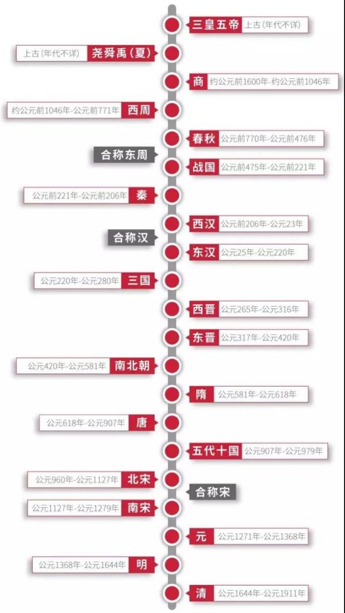
## 中国古代重要战争
### 先秦
1、**涿鹿之战**
> 上古时期（夏之前）
> 
> 华夏部落（黄帝、炎帝） vs 东夷部落（蚩尤）
> 
> 炎黄胜
> 
> - 神话传说——蚩尤请了风伯雨师
> - 后续——阪泉之战（炎黄内斗，黄帝胜）
> - 嫘祖——养蚕
> - 仓颉——造字

2、**鸣条之战**
> 夏末
> 
> 夏桀 vs 商汤
> 
> 商汤胜
> 
> - 伊尹——“调和五味”（老子《道德经》：治大国若烹小鲜）
> - 仲馗

3、**牧野之战**
> 商末
> 
> 周武王（姬发） vc 商纣王（帝辛）
> 
> 周武王胜，商纣王鹿台自焚
> 
> - 纣王：倒曳九牛、抚梁易柱
> - 临阵倒戈
> - 以少胜多：4万 vs 17万

4、**武庚之乱（三监之乱）**
> 西周
> 
> 周公（辅佐武王儿子成王） vs 武庚（纣王儿子）
> 
> 周公胜
> 
> - 周公东征
> - 周公制礼乐
> - 成康盛世（周公辅助了成王、康王）

5、**国人暴动**
> 西周
> 
> 周厉王 vs 国人
> 
> 厉王被逐、“共和行政”（周公、召公）
> 
> - 防民之口甚于防川
> - 公元前841年，我国有确切纪年的开始

6、**长勺之战**
> 春秋
> 
> 鲁国（鲁庄公） vs 齐国（齐桓公）
> 
> 鲁国胜
> 
> - 齐国：鲍叔牙，鲁国：曹刿论战（一鼓作气，再而衰，三而竭）
> - 以少胜多：一比十

7、**城濮之战**
> 春秋
> 
> 晋国（晋文公：姬重耳） vs 楚国
> 
> 晋国胜
> 
> - 晋军退避三舍（90里），诱敌深入

8、**桂陵之战**
> 战国
> 
> 齐国（孙膑） vs 魏国（庞涓）
> 
> 齐国胜
> 
> - 围魏救赵：魏国攻打赵国，赵国请求齐国帮忙，齐国攻打魏国，魏军回撤，齐国桂陵伏击

9、**马陵之战**
> 战国
> 
> 齐国（孙膑） vs 魏国（庞涓）
> 
> 齐国胜
> 
> - 减灶诱敌：魏国攻打韩国，齐国攻打魏国，魏军回撤，齐军佯装战败逃跑并减灶，伏击于马陵，庞涓毙

10、**长平之战**
> 战国
> 
> 秦国（白起） vs 赵国（赵括：纸上谈兵）
> 
> 秦国大胜，坑杀10万降卒
> 
> - 纸上谈兵
> - 战国历史的最后转折，秦国统一只是时间问题

### 秦汉
1、**巨鹿之战**
> 秦末
> 
> 楚军为首的义军（项羽） vs 秦军（章邯）
> 
> 义军胜
> 
> - 破釜沉舟
> - 新安杀降（全歼王离20万，招降章邯20万，但是全部坑杀）
> - 以少胜多：6万 vs 40万（章邯20万，王离20万）

2、**垓下之战**
> 楚汉争雄
> 
> 汉军（汉高祖刘邦） vs 楚军（项羽）
> 
> 汉军胜，项羽自杀
> 
> - 鸿沟和议（楚河汉界）
> - 十面埋伏
> - 四面楚歌
> - 霸王别姬

3、**白登之围**
> 西汉
> 
> 西汉（刘邦） vs 匈奴
> 
> 匈奴围困汉军七日，议和后撤军
> 
> - 陈平：向冒顿单于的阏氏（冒顿妻）行贿

4、**七国之乱**
> 西汉
> 
> 汉景帝、周亚夫 vs 吴王刘濞等诸侯
> 
> 叛乱被平定
> 
> - 文景之治
> - 诸侯口号：诛晁错，清君侧

5、**汉武帝反击匈奴**
> 西汉
> 
> 西汉（卫青、霍去病） vs 匈奴
> 
> 汉军胜
> 
> - 马邑之谋：出战前想伏击匈奴，结果失败
> - 三场战役：河南漠南之战（卫青、李息）、河西之战（霍去病）、漠北之战（卫青、霍去病）
> - 霍去病：封狼居胥
> - 但使龙城飞将在，不教胡马度阴山（飞将军：李广）

### 三国两晋南北朝
1、**官渡之战**
> 东汉末
> 
> 曹操 vs 袁绍
> 
> 曹操胜
> 
> - 以少胜多（3万 vs 10万）
> - 许攸投奔曹操，献计火烧乌巢（袁绍粮仓）而胜利
> - 为曹操统一北方奠定基础

2、**赤壁之战**
> 东汉末
> 
> 孙刘联军（周瑜、刘备） vs 曹军（曹操）
> 
> 孙刘联军胜
> 
> - 以少胜多（3万 vs 20万）
> - 羽扇纶巾——周瑜
> - 为三国鼎立奠定基础

3、**夷陵之战（彝陵之战、猇亭之战）**
> 三国
> 
> 蜀汉（刘备，4万） vs 孙吴（陆逊，5万）
> 
> 陆逊火烧连营，蜀汉大败
> 
> - 关羽大意失荆州，败走麦城，被吕蒙干掉，刘备为关羽报仇攻打孙吴
> - 陆逊以逸待劳，火烧连营

4、**八王之乱**
> 西晋
> 
> 西晋统治阶级内部
> 
> 东海王司马越在八王之乱中成为了最终胜利者
> 
> - 五胡乱华

5、**淝水之战**
> 东晋
> 
> 东晋（后方总指挥谢安，前线谢石、谢玄） vs 前秦（苻坚）
> 
> 8万东晋军大败80万前秦军
> 
> - 以少胜多
> - 激将法
> - 投鞭断流（苻坚说他士兵多，把马鞭扔河里能断流）
> - 草木皆兵
> - 风声鹤唳
> - 屐齿之折

## 隋唐之后
1、**安史之乱**
> 唐朝
> 
> 唐政府军（郭子仪、李光弼） vs 藩镇叛军（安禄山、史思明）
> 
> 唐政府军胜
> 
> - 马嵬坡兵变，勒死杨贵妃
> - 睢阳之战（张巡守城，7000人）vs 叛军（12万），最终守城被破，张巡被杀
> - 醉打金枝——郭子仪

2、**澶渊之盟**
> 北宋
> 
> 北宋（宋真宗） vs 辽（萧太后）
> 
> 双方订立合约

3、**郾城之战**
> 南宋
> 
> 南宋（岳飞）vs 金（完颜宗弼）
> 
> 岳家军以少胜多，重创金国精锐，大伤金国元气
> 
> - 以少胜多
> - 铁浮屠——金国
> - 直捣黄龙（今吉林一带），迎回徽钦二宗
> - 东窗事发——秦桧在东窗下密谋害岳飞，后来密谋败露

4、**靖难之役**
> 明朝
> 
> 燕王朱棣（永乐大帝，永乐盛世） vs 建文帝朱允炆
> 
> 朱棣胜，登上帝位
> 
> - 清君侧，靖国难
> - 迁都（南京->北京），修故宫

5、**土木堡之变**
> 明朝
> 
> 明朝（明英宗朱祁镇，王振）vs 瓦剌（也先）
> 
> 明朝惨败，明英宗被俘
> 
> - 于谦（北京保卫战），（《石灰吟》粉身碎骨浑不怕，要留清白在人间）
> - 夺门之变——明英宗重夺皇位，杀死于谦

6、**三藩之乱**
> 清朝
> 
> 清政府军 vs 三藩（吴三桂、尚可喜、耿精忠）
> 
> 清军胜，平定三藩

7、**雅克萨之战**
> 清朝
> 
> 清（康熙）vs 俄国
> 
> 清胜，签订《尼布楚条约》

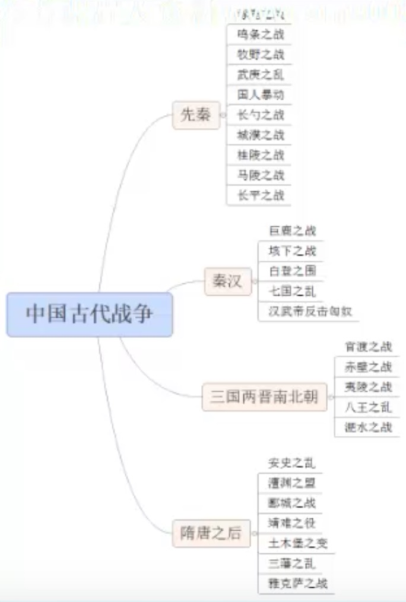

## 中国近现代战争
列强侵华 —— 中山革命 —— 毛蒋斗法

### 列强侵华
1、**鸦片战争**
> 1840年
> 
> 中国清朝 vs 英国 
> 
> 中国失败，签订《南京条约》，赔款割地（割香港岛），开通商口岸（广州、福州、厦门、宁波、上海）
> 
> - 鸦片战争标志着中国近代史的开端，使中国开始沦为半殖民地半封建社会，丧失独立自主的地位
> - 导火线——1839年林则徐虎门销烟
> - 苟利国家生死以，岂因祸福避趋之——林则徐

2、**第二次鸦片战争**
> 1856年
>
> 英国、法国（美国、俄国） vs 清朝
> 
> 联军获胜，签订《天津条约》（1858年，英法俄美），《瑷珲条约》（1858年，俄国，侵犯我国国土最多的条约，150多万平方公里），《北京条约》（1860年，英法俄，割香港九龙半岛，增开天津通商）等不平等条约
> 
> - 中国半殖民地半封建社会加深
> - 火烧圆明园

3、**中法战争**
> 1883年
> 
> 清政府（刘永福(黑旗军)、冯子才(镇南关大捷)、刘铭传(台湾首任巡抚)） vs 法国
> 
> “法国不胜而胜，中国不败而败”，签订《中法新约》（丧失越南宗主权，西南开通商口岸）
> 
> - 法国实现了据越侵华的图谋，侵略势力伸入云南、广西，中国西南门户被打开

4、**甲午战争**
> 1894年
> 
> 清政府 vs 日本
> 
> 中国战败，北洋水师全军覆没，签订了《马关条约》（割辽东，割台湾，赔2亿两，后给了3000万赎回辽东）
> 
> - 甲午战败和《马关条约》的签订是中国陷入深重的民族危机，中国社会半殖民地化的程度**大大加深**
> - 标志洋务运动失败
> - 旅顺大屠杀，2万人

5、**八国联军侵华**
> 1900年，背景：义和团运动(农民运动)——“扶清灭洋”
> 
> 英、俄、德、法、美、日、意、奥 vs 清政府
> 
> 中国战败，与11国(荷、比、西)签订《辛丑条约》（赔4.5亿两，分39年还清，本息共9.8亿两(庚子赔款)）
> 
> - 清政府彻底成为帝国主义统治中国的工具。《辛丑条约》的签订，标志着中国半殖民地半封建社会的统治秩序完全确立 

> 1. 洋务运动(19世纪60年代)，地主阶级洋务派
> 2. 戊戌变法(1998年11月)(百日维新，维新变法，维新运动)，资产阶级革命派
> 3. 义和团运动(十九世纪末)，农民阶级
> 4. 辛亥革命(1911年)，资产阶级改良派

### 中山革命
1、**辛亥革命**
> 1911年
> 
> - 前期：黄花岗起义、保路运动
> - 标志：武昌起义（10月10日）
> - 性质：一场反帝反封建的资产阶级民主革命
> - 它推翻了统治中国二百六十多年的清王朝，结束了中国两千多年的封建君主专制制度，使民主共和的观念深入人心。但辛亥革命的果实被袁世凯所窃取，反帝反封建的革命任务没有完成，中国半殖民地半封建社会性质没有改变。
> - 1840~1949年，半殖民地半封建社会；1949~1956年，新民主主义社会；1956年，完成三大改造，社会主义社会
> - 中国近代三次巨变：1、辛亥革命；2、新中国成立+三大改造；3、改革开放

2、**二次革命**
> 1913年
> 
> 孙中山等国民党 vs 袁世凯北洋军
> 
> 革命失败，孙中山流亡海外

3、**护国运动**
> 1915年12月袁世凯称帝，唐继尧、蔡锷、李烈钧等出兵讨伐
> 
> 袁世凯受挫，83天后取消帝制，数月后病逝

4、**护法运动**
> 1917年7月~1918年5月，孙中山为首的资产阶级革命党人为维护临时约法、恢复国会
> 
> 护法失败

5、**第二次护法**
> 1921年~1922年，孙中山重组军政府，发起第二次护法
> 
> 由于陈炯明叛变，第二次护法失败
> 
> - 陈炯明炮轰总统府，孙中山躲入永丰舰，后改名中山舰。
> - 标志中国资产阶级领导的旧民主主义革命失败
> 
> 后续：1924年，中国国民党第一次全国代表大会在广州召开，大会决定联俄、联共、扶助农工三大政策，国共第一次合作。1925年孙中山病逝，“革命尚未成功，同志仍需努力”

### 毛蒋斗法
1、**北伐战争**
> 1926年7月
> 
> - 背景：国共合作
> - 目的：推翻北洋军阀（吴佩孚、孙传芳、张作霖）统治，统一全国
> - 成果：基本推翻北洋军阀统治，但反帝反封建民主革命尚未完成，双半社会性质仍未改变
> 
> 1927年蒋介石发动412反革命政变，国共破裂 
> 
> 1928年张作霖儿子张学良改投蒋介石（东北易帜），标志北伐结束，国民政府在形式上统一中国

2、**南昌起义**
> 1927年8月1日（建军节）
> 
> - 领导人：周恩来、贺龙、叶挺、朱德、刘伯承、谭平山
> - 意义：打响了武装反抗国民党反动统治的第一枪，是中国共产党独立领导革命战争和创建人民军队的开始

3、**秋收起义**
> 1927年9月，湖南江西边境
> 
> - 领导人：毛泽东
> - 意义：建立了中国第一个农村革命根据地——井冈山革命根据地
> 
> 一开始决定攻打长沙，后来失败。文家市决策（放弃城市去农村，最后走向井冈山）、三湾改编（确立党对军队的绝对领导）
> 
> - 1928年，《井冈山土地法》，我国第一部土地法

4、**中原大战**
> 1930年5月~11月，蒋介石与阎锡山、冯玉祥、李宗仁等发生的一场新军阀混战。耗时最长、规模最大的军阀混战，蒋介石胜利而告终

5、**万里长征**
> 1934年10月~1936年10月，被迫进行的战略转移
>
> 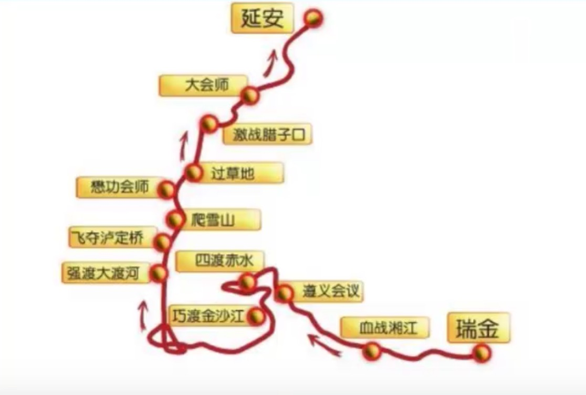

6、**抗日战争**

时间 | 战役、事件 | |
:--: | :--: | :-- 
1931.9.18 | 九一八事变 | 沈阳；张学良东北军为了保存实力放弃抵抗；14年抗战开始(新版，旧版为8年抗战)
1935.1 ~ 7 | 华北事变 | 日本妄图让东北自治
1935.12.9 | 一二九运动 | 中共领导的学生运动
1935.12.17 | 瓦窑堡会议 | 提出抗日民族统一战线
1936.12.12 | 西安事变 | 张学良、杨虎城
1937.7.7 | 七七事变 | 北平；卢沟桥事变；全面侵华；事后国共第二次合作，一致抗日
1937秋 | 洛川会议 | 中共提出把工作重心放在战区、敌后，战区配合国民党友军，敌后建立抗日根据地
| | 淞沪太原南徐州，后面跟着地图走
1937.8.13 | 淞沪会战 | 第一场大型会战；粉碎日军三个月灭亡中国的计划；为工业内迁争取了时间
1937.9 ~ 11 |  太原会战 | 平型关大捷（林彪115师）
1937.12 | 南京保卫战 | 南京大屠杀超过30万人
1938.1 ~ 5 | 徐州会战 | 台儿庄战役（李宗仁，歼灭日军一万多人，抗日以来的最大胜利）
1938.6 ~ 10 | 武汉会战 |
1939.9 ~ 1944.8 | 长沙会战 |
1939.12 ~ 1940.1 | 昆仑关战役 | 昆仑关大捷，保住抗日大后方
1940.5 | 枣宜会战 | 张自忠以身殉国，抗日战争牺牲的最高将领（集团军总司令）
1940下半年 | 百团大战 | 彭德华，105个团，20多万中共士兵，打了1800多场战役，歼灭日本军4万多人
1940秋 | 皖南事变 | 1940年秋调兵，1941年1月发动；蒋介石攻打新四军，军长叶挺被扣押，副军长项英被杀；“千古奇冤，江南一叶；同室操戈，相煎何急！”周恩来
1944.4 ~ 12 | 豫湘桂战役 | 豫湘桂大溃退
1945.8.15 | 日本投降

7、**解放战争**

时间 | 战役、事件 | |
:--: | :--: | :-- 
1945.9 ~ 10 | 上党战役 | 发生于重庆谈判期间
1947.3 ~ 5 | 延安保卫战 | 国军胡宗南攻入延安，中共主动撤出转战陕北
1947.5 | 孟良崮战役 | 全歼张灵甫整编74师
1947.8 | 刘邓挺进大别山 | 
1948.9 ~ 11 | 辽沈战役 | 三大战役（辽沈、淮海、平津），历时142天，歼敌154万人
1948.11 ~ 1949.1 | 淮海战役 |
1948.11 ~ 1949.1 | 平津战役 | 傅作义投降
1949.4 ~ 6 | 渡江战役 | 

8、**建国后——“打一圈”**
> - 1950，抗美援朝
> - 1962，中印自卫反击战
> - 1969，中苏珍宝岛战役
> - 1979，中越自卫反击战

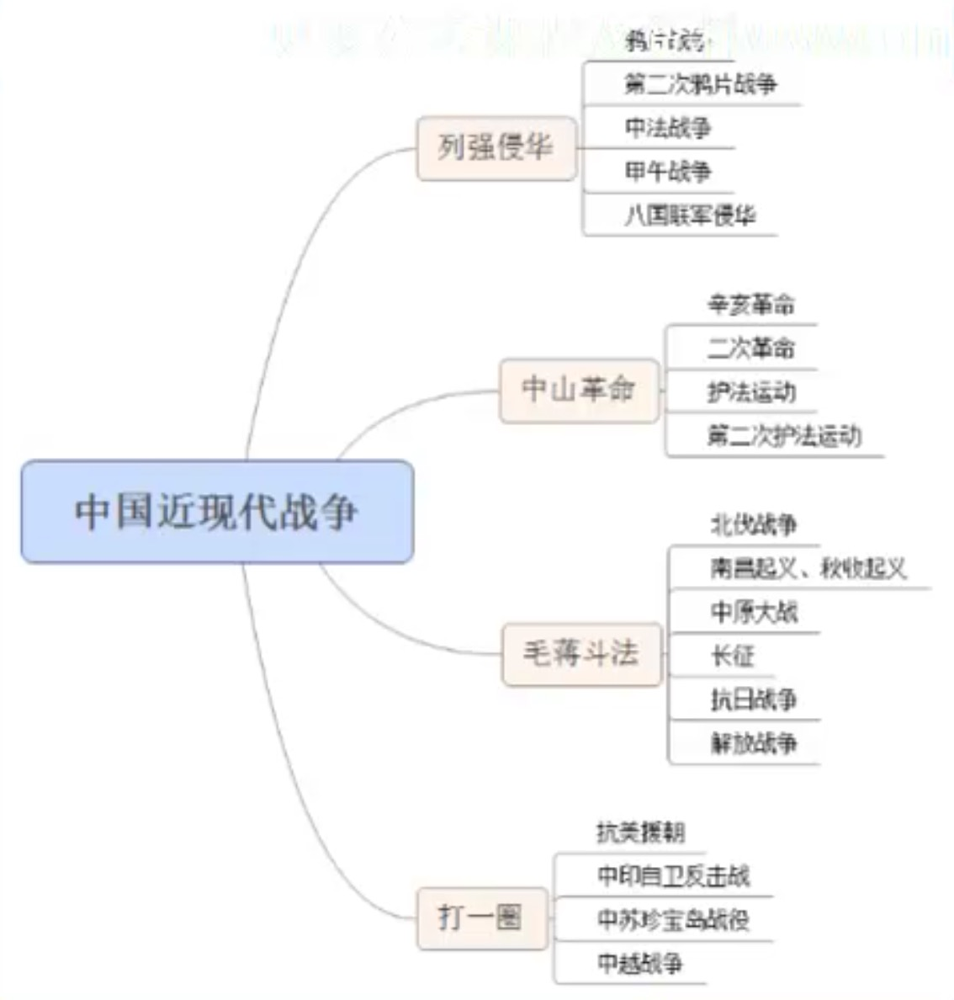

## 中国的帝王将相
### 先秦
> 1. 舜——孝感天地
> 
> 2. 禹——三国家门而不入、建夏
> 
> 3. 汤——鸣条之战、建商
> 
> 4. 周文王（姬昌）——西伯拘而演《周易》、百子锁
> 
>    周武王（姬发）——牧野之战、武王伐纣、建立西周
> 
> 5. 姜尚——百家宗师、六韬（太公兵法）、被封为齐国君主
> 
> 6. 春秋五霸——齐恒公（葵丘之盟）、晋文公（退避三舍）、楚庄王（问鼎中原、一鸣惊人）、吴王阖闾、越王勾践（卧薪尝胆）
> 
> 7. 管仲（辅佐齐桓公）——法家之驱（变法改革）、华夏第一相、尊王攘夷（遵从周天之、对抗外族，挟天子以伐不敬）、老马识途、管鲍之交
> 
> 8. 范蠡（辅佐越王勾践）——兔死狗烹、商圣（陶朱公）、西施（沉鱼(西施)落雁(王昭君)闭月(貂蝉)羞花(杨贵妃)）
> 
> 9. 伍子胥（受楚国迫害，投奔吴王阖闾）——一夜白发（过昭关）、倒行逆施、年糕
> 
> 10. 秦孝公（战国时期秦国国君）——商鞅变法
> 
> 11. 孙膑（齐国）——田忌赛马、围魏救赵、孙庞斗智（庞涓）
> 
> 12. 苏秦（为六国效力）、张仪（秦国）——合纵连横（合众弱以攻一强，六国联合抗秦）（事一强以攻众弱）、悬梁(东汉孙敬)刺股(苏秦)
> 
> 13. 蔺相如（赵国）——负荆请罪（廉颇向蔺相如请罪）、完璧归赵(秦昭襄王)、渑池之会
> 
> 14. 白起（秦国）——战神、长平之战
> 
> 15. 范睢（秦国宰相）——睚眦必报、远交近攻、固干削枝
> 
> 16. 荆轲——图穷匕见

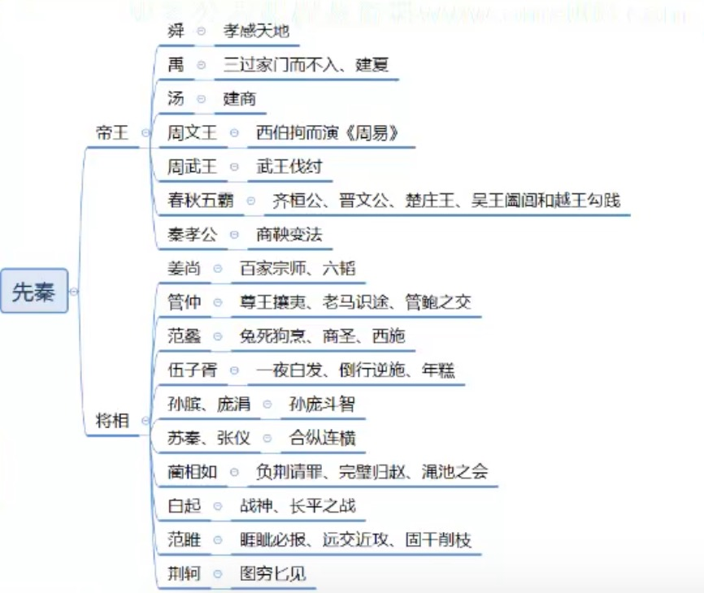

### 秦汉
> 1. 嬴政——统一六国、书同文（李斯、小篆(官方)、隶书(非官方)）、车同轨(轮距6尺)、统一度(长度)量(容积)衡(总量)
> 
> 2. 赵高（秦二世胡亥时期）——指鹿为马
> 
> 3. 项羽——破釜沉舟（巨鹿之战）、力能扛鼎
> 
> 4. 刘邦——约法三章(为了收买人心，杀人伤人盗窃都不行)、建西汉
> 
> 5. 萧何——萧规曹随
> 
> 6. 张良——博浪沙刺秦、孺子可教
> 
> 7. 韩信——一饭千金（一字千金(吕不韦)、一顾千金(伯乐)、一诺千金(季布)）、胯下之辱、背水一战、十面埋伏、多多益善
> 
> 8. 汉文帝、汉景帝（七国之乱）——文景之治
> 
> 9. 刘彻（汉武帝）——北击匈奴、独尊儒术、盐铁官营、巫蛊之祸、金屋藏娇
> 
> 10. 司马迁——《史记》（第一部纪传体通史，《春秋》第一部编年体，《左传》第一部叙事详细编年体）
> 
> 11. 张骞——开辟西域（丝绸之路，李希霍芬提出）
> 
> 12. 主父偃——推恩令
> 
> 13. 刘秀（光武帝）——昆阳之战（以少胜多，击败王莽）、建东汉、光武中兴
> 
> 14. 马援——马革裹尸、老当益壮
> 
> 15. 班超——投笔从戎、不入虎穴焉得虎子
> 
>	   班固——班超哥哥，写史书《汉书》的

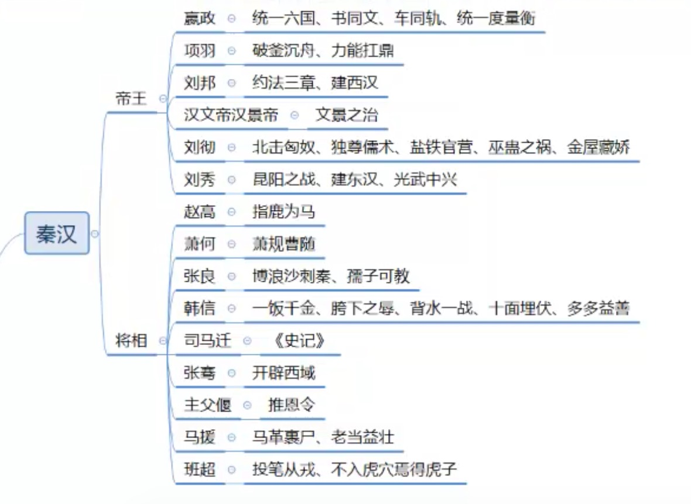

### 三国两晋南北朝
> 1. 曹操——官渡之战、赤壁之战、奸雄、望梅止渴
> 
> 2. 曹丕——建魏、典论
> 
> 3. 刘备——三顾茅庐、建蜀汉
> 
> 4. 刘禅——乐不思蜀
> 
> 5. 关羽——斩颜良、单刀赴会、水淹七军、败走麦城
> 
> 6. 诸葛亮——鞠躬尽瘁、平孟获、北伐、八阵图
> 
> 7. 孙权——建吴
> 
> 8. 周瑜——赤壁之战、羽扇纶巾
> 
> 9. 吕蒙——刮目相看
> 
> 10. 陆逊——火烧连营
> 
> 11. 司马炎——建西晋
> 
> 12. 司马睿——建东晋
> 
> 13. 谢安（东晋）——淝水之战（最著名的以少胜多）
> 
> 14. 祖逖（东晋）——闻鸡起舞、中流击楫
> 
> 15. 北魏孝文帝——汉化改革
> 
> 16. 郦道元——《水经注》（地理学著作）

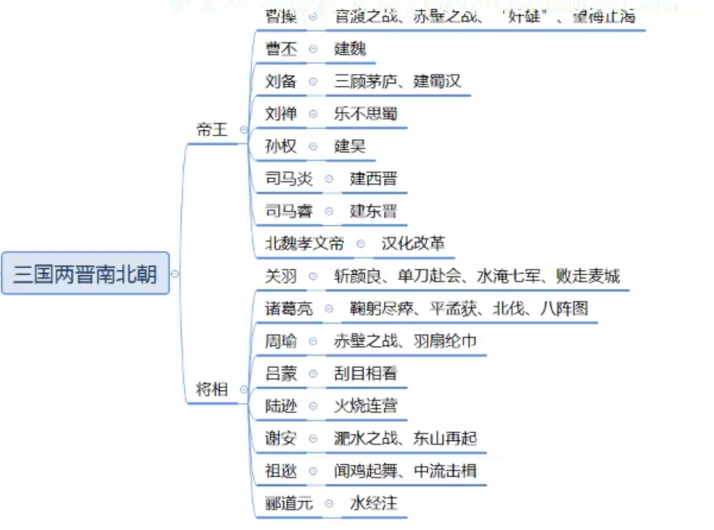

### 隋唐
> 1. 杨坚——建隋、开皇之治
> 
> 2. 杨广——开科举、京杭运河
> 
> 3. 李渊——建唐
> 
> 4. 李世民（唐太宗）——玄武门之变、贞观之治
> 
> 5. 魏征——水能载舟亦能覆舟
> 
> 6. 秦琼、尉迟恭——门神
> 
> 7. 程咬金——莽汉
> 
> 8. 薛仁贵——灭高句丽、大破突厥、三箭定天山、脱帽退万敌、瞒天过海
> 
> 9. 玄奘——西行印度、大唐西域记
>
>	  鉴真——东渡日本
>
>	  一行——天文学家，大衍历，首测子午线长度
>
>	  怀素——书法家：草书
>
>	  惠能——六祖
>
>	  佛印（宋朝）——苏东坡好朋友
>
> 10. 武则天——举行殿试、开创武举、无字碑
> 
> 11. 狄仁杰——桃李满天下
> 
> 12. 李隆基（唐玄宗）——开元盛世、安史之乱

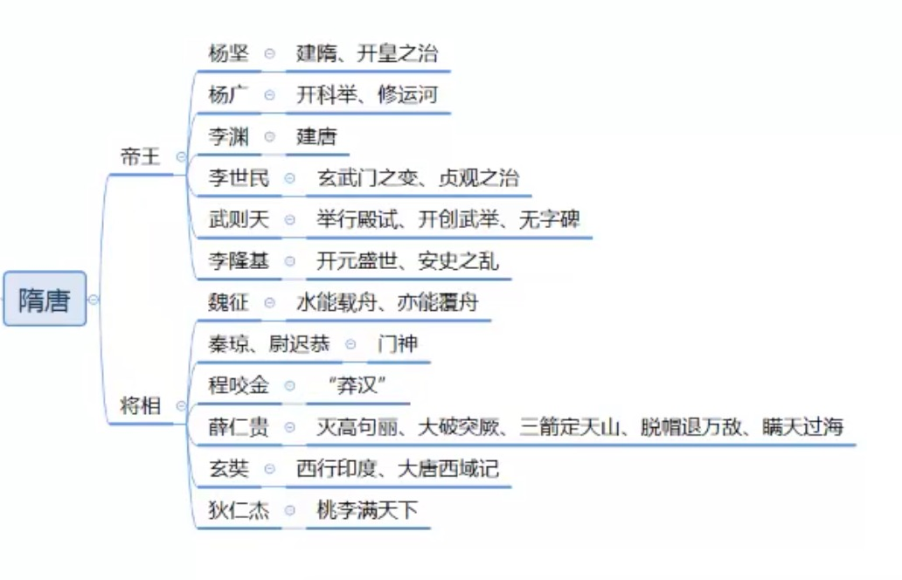

### 宋元
> 1. 赵匡胤——建北宋、黄袍加身、杯酒释兵权
> 
> 2. 赵光义（赵匡胤弟弟）——烛影斧声、开卷有益
> 
> 3. 赵普——半部论语治天下
> 
> 4. 包拯——笑比河清
> 
> 5. 范仲淹——庆历新政、先天下之忧而忧，后天下之乐而乐（岳阳楼记）
> 
> 6. 王安石——熙宁变法
> 
> 7. 司马光——《资治通鉴》（第一部编年体通史）
> 
> 8. 赵构——建南宋
> 
> 9. 岳飞——抗金、精忠报国、直捣黄龙
> 
> 10. 文天祥——抗击蒙古、过零丁洋
> 
> 11. 忽必烈——建元

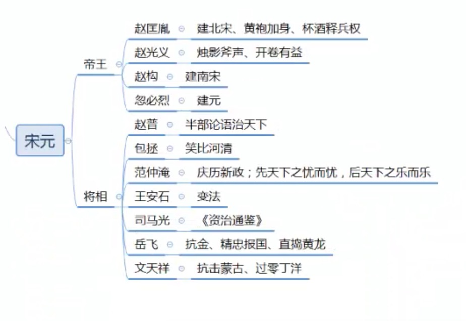

### 明
> 1. 朱元璋——建明、洪武之治
> 
> 2. 朱棣——靖难之役、永乐盛世、建明故宫
> 
> 3. 解缙——《永乐大典》（世界最大的百科全书）
> 
> 4. 郑和——七下西洋（1405~1433年，最远到达红海）
> 
> 5. 张居正——万历新政、一条鞭法
> 
> 6. 戚继光——抗倭
> 
> 7. 郑成功——收复台湾（击败荷兰）
> 
> 8. 吴三桂——冲冠一怒为红颜

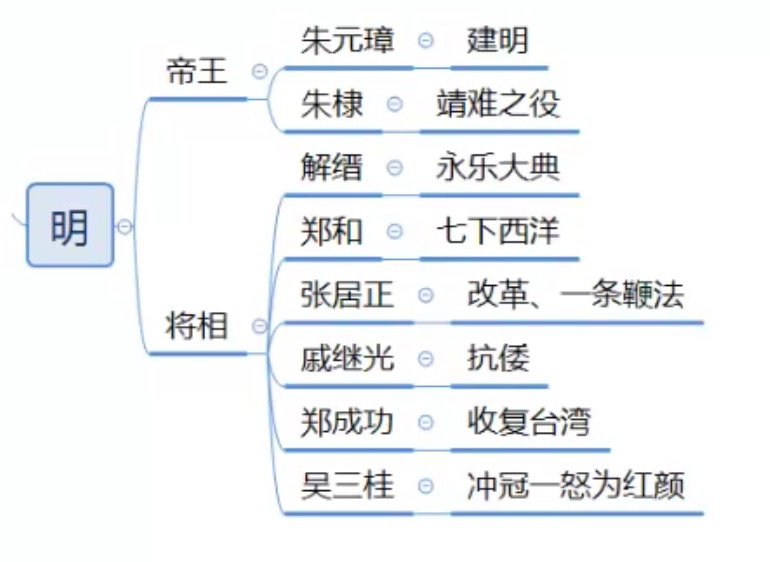

### 清
> 1. 努尔哈赤——建后金（女真族）
> 
> 2. 皇太极——改大清（改满族）
> 
> 3. 康熙、雍正、乾隆——康乾盛世
> 
> 4. 纪昀——四库全书
> 
> 5. 林则徐——虎门销烟
> 
> 6. 曾国藩——剿灭太平天国（安庆内军械所）
> 
> 7. 左宗棠——收复新疆（福州船政局）
> 
> 8. 张之洞——中学为体，西学为用（汉阳铁厂）
> 
> 9. 李鸿章——大清王朝的裱糊匠（轮船招商局，江南制造总局）
> 
> 10. 康有为、梁启超——公车上书（1895年，维新派登上历史舞台）、戊戌变法（1898年，资产阶级改良运动，君主立宪，百日维新）

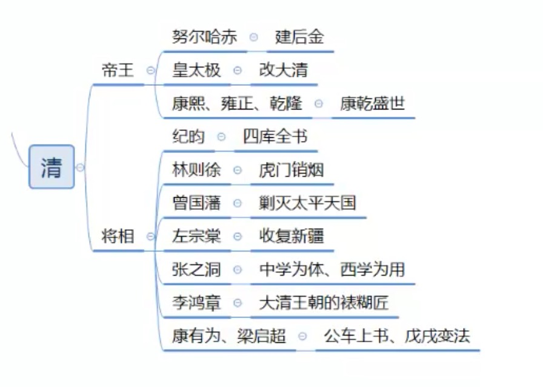

## 中国的古代制度
### 官吏制度
**官职制度**
> 1. 禅让制——“天下为公，选贤为能”（原始社会末期）
> 
> 2. 嫡长子继承制——“立嫡以长不以贤”（始于商，完善于西周）

**诸侯**
> 1. 分封制——把天子亲属和异性贵族分封到各地为诸侯（商周时期，普遍推行）
> 
> 2. 宗法制——依血缘远近区别嫡庶亲疏，维护世袭统治（周代完备）
> 
> 3. 五等爵——古代的爵位登记：公、候、伯、子、男

**选官**
> 1. 世官制（世卿世禄）——贵族世代为官（先秦）
> 
> 2. 察举制——官员考察，将人才推荐给中央（汉代）
> 
> 3. 征辟制——皇帝和高官直接征聘（后汉）
> 
> 4. 九品中正制——（魏晋南北朝）
> 
> 5. 科举制——分科考试以取士（隋——清）（隋炀帝杨广——进士科）
> 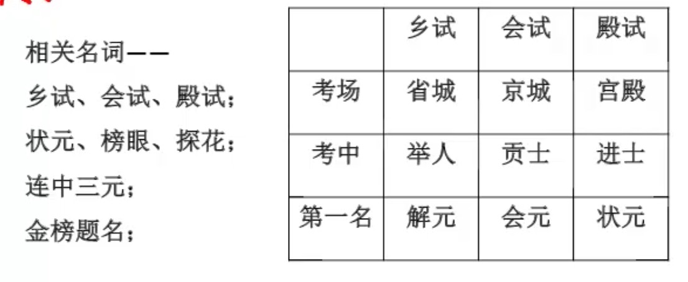

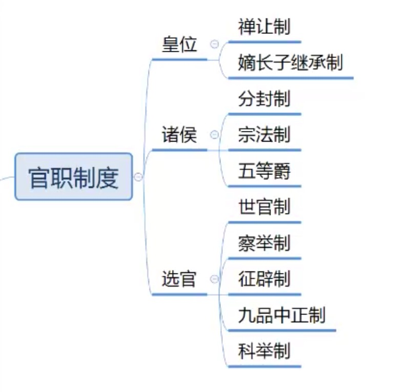

### 中央与地方制度
> 1. 郡县制（秦汉盛行）
> 
> 2. 三公九卿制（秦——隋之前）
> 
> 3. 刺史制（汉武帝）
> 
> 4. 三省六部制（隋）（元——一省六部、明清——六部）
> 
> 5. 行省制（元）（我国省制的开端）
> 
> 6. 内阁制（明）
> 
> 8. 八旗制（清，努尔哈赤）
> 
> 9. 军机处（雍正）君主专制达到顶峰

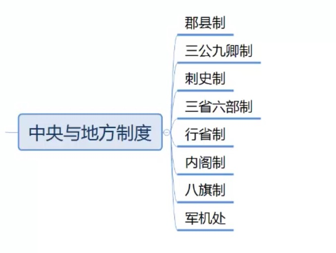

### 礼仪制度
**政治礼仪**
> 1. 礼乐制（西周，周公制礼乐）——贵贱有别，符合身份
> 
> 2. 封禅——泰山祭祀
> 
> 3. 五礼（西周）——吉（祭祀）、凶（哀鸣，吊唁）、军（军事）、嘉（喜庆）、宾（宾客，外交）

**生活礼仪**
> 1. 诞生礼——三朝、满月、百日、周岁
> 
> 2. 排行——伯、仲、叔、季
> 
> 3. 冠礼、笄礼——男子二十、女子十五
> 
> 	- 垂髫——三四岁至八九岁儿童
> 	- 总角——八九岁至十三四岁的少年
> 	- 豆蔻——十三四的女孩子
> 	- 束发——男子十五岁
> 	- 弱冠——男子二十岁
> 	- 而立——三十岁
> 	- 不惑——四十岁
> 	- 知命——五十岁
> 	- 花甲——六十岁
> 	- 古稀——七十岁
> 	- 耄耋——八九十岁
> 	- 期颐——一百岁
> 
> 4. 婚礼六礼——纳采（请媒人提亲）、问名、纳吉、纳征（送聘礼）、请期（择日）、亲迎
> 
> 5. 休妻“七出三不去”——“七出”：不顺父母、无子、淫、妒、有恶疾、多言、盗窃。“三不去”：有所取无所归（无娘家）、与更三年丧（跟丈夫守孝三年）、前贫贱后富贵
> 
> 6. 见面礼——作揖、拜、万福礼（女）
> 
> 7. 座次礼
> 
>	- 筵席——西北南东
>	- 朝会——皇帝：背北面南

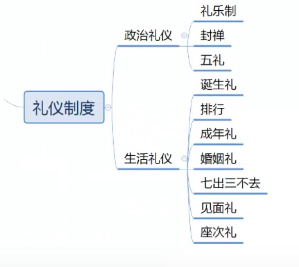

--- 
### 历史时间
一、**夏**（都城：阳城，今河南登封一带）
> 禹传启，家天下 -> 划分九州 -> 桀行暴政而亡

二、**商**（都城：亳，今商丘 -> 殷，今安阳）
> 商汤鸣条之战灭夏 -> 伊尹摄政 -> 盘庚迁殷 -> 纣暴政灭国

---
---

#### 天干地支：干支纪年法
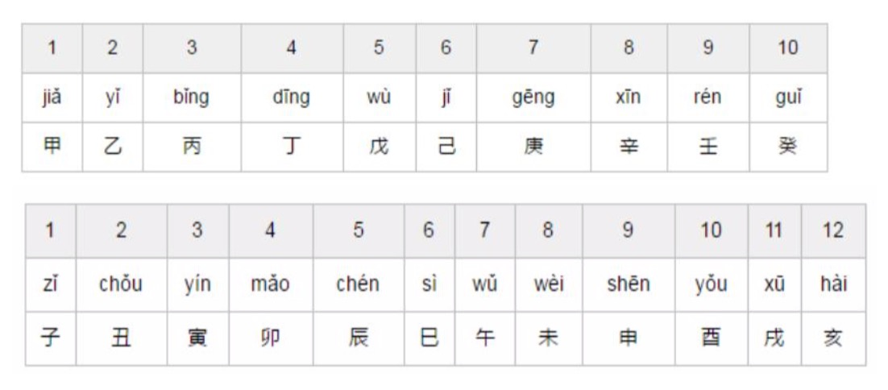

#### 十二生肖
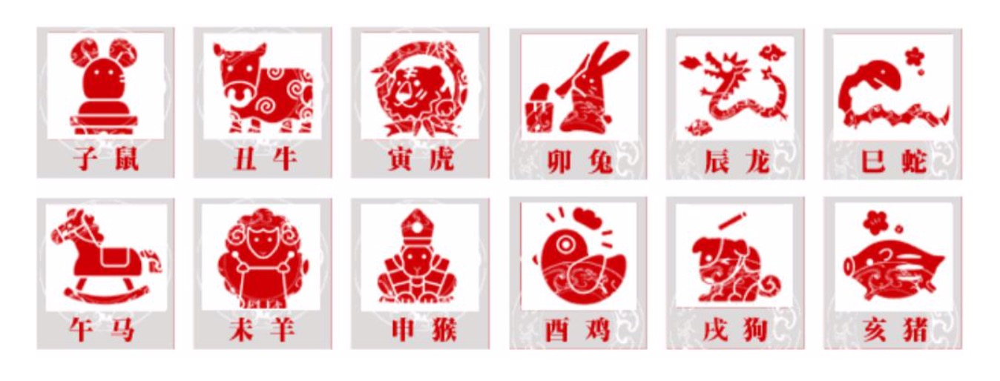

#### 十二时辰
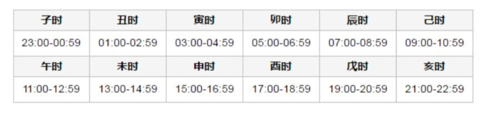
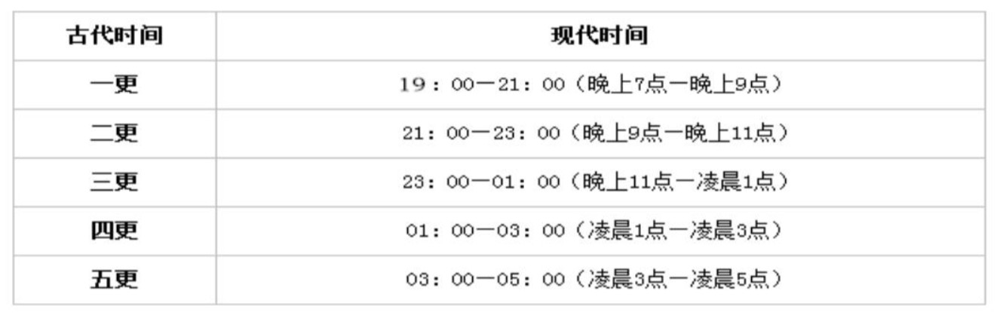

#### 五四运动
地位：五四运动是中国旧民主主义革命的结束和新民主主义革命的开端
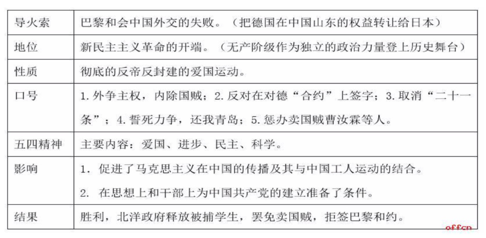
