> 语言理解
> 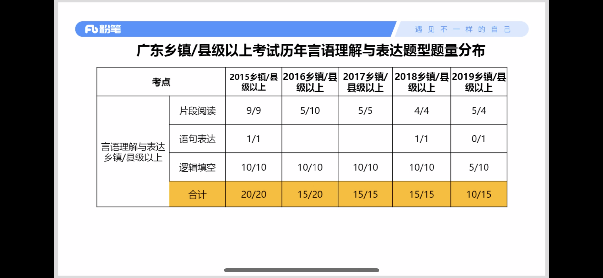

> 数量关系
> 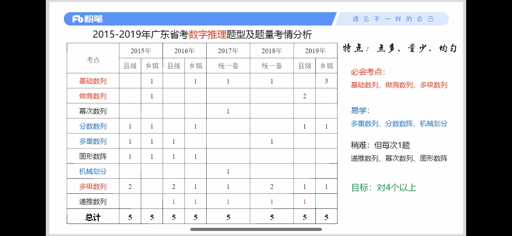
> 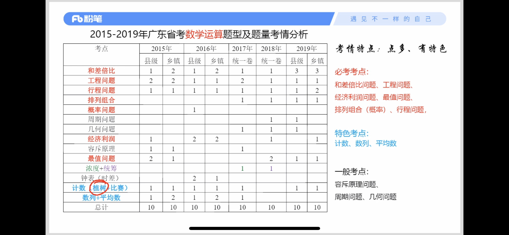

> 判断推理
> 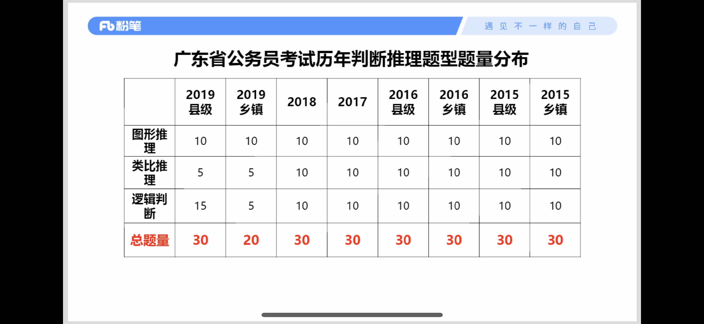
> 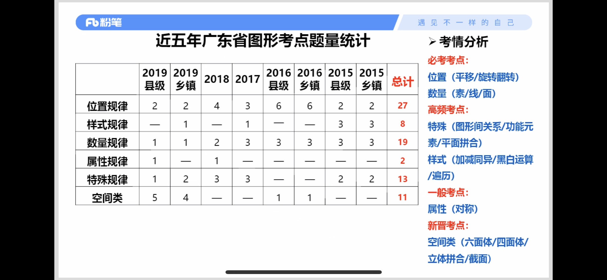
> 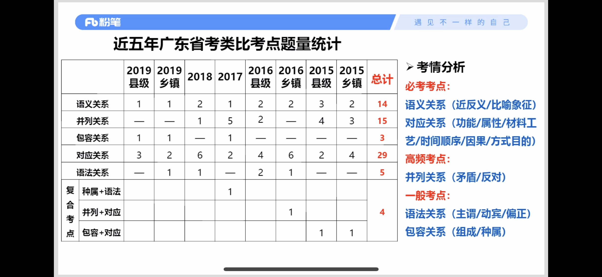
> 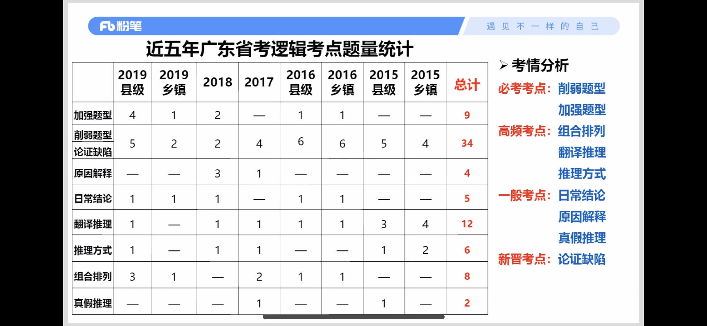

> 科学推理
> 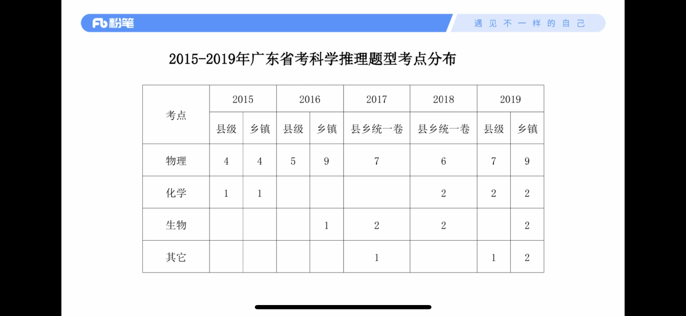
> 

> 常识
> 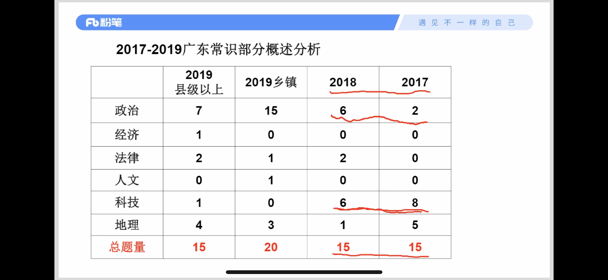
> 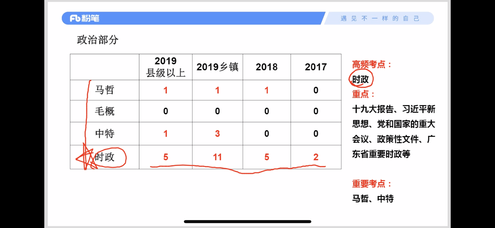

> 资料分析
> 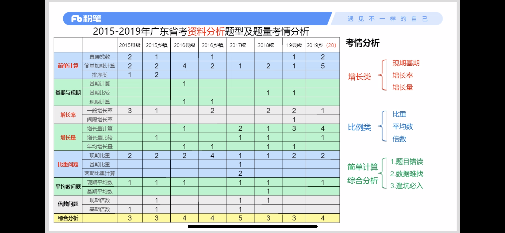

---

## 语言理解
#### 中心理解
> 关联词：转折、因果、必要(对策)、并列
> 
> 主题词
> 
> 程度词

#### 细节理解
> 相对绝对：优先验证相对绝对的选项

## 数量关系
#### 最值问题

> 利润最大
> 
> 1. 根据条件列出利润式子，写成两个括号相乘形式
> 2. 分别算出两个括号算式等于0时x的值
> 3. 计算两个x的平均值，此时利润最大
> 
> ---
> 
> 
> 1. `利润=(6+x)(100-10x)` 
> 2. `x1=-6` `x2=10`  
> 3. `x1、x2 平均值为2，所以当售价提高2元时，利润最大`

## 判断推理

## 资料分析

