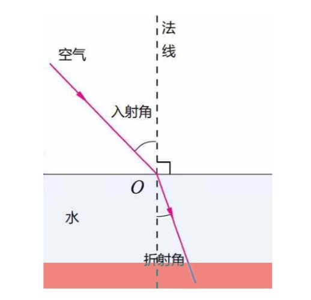

## 物理
### 光学
1、光的反射

2、平面镜成像
> 大小相等
> 
> 距离相等
> 
> 连线与镜面垂直
> 
> 成像为虚像

3、光的折射
 

> 从空气射入水：折射光线向法线偏折，折射角小于入射角；从水射入空气相反
> 
> 折射现象：池水看起来比实际的浅；海市蜃楼
> 
> 光线穿过一块**平行**介质上，入射光线和出射光线平行。如果垂直射入的话，垂直射出，在同一只直线上

4、漫反射
> 光投射在粗糙表面上向各个方向反射现象。如：黑板

5、色散
> 红、橙、黄、绿、蓝、靛、紫
> 
> 三原色(不能再分解的三种颜色)：品红、黄、青
> 
> 三基色(无法通过其他颜色混合而得)：红、绿、蓝
 
<!---->

### 力学
> 力的符号F，单位牛顿，简称牛，符号N

1、重力，通常用字母 G 表示
> 大小：G = mg，其中g = 9.8 N/kg
> 
> 方向：竖直向下
> 
> 作用点：重心

2、压力与压强
> 压力、支持力
> 
> - 相互**接触**的两个物体相互**挤压**
> - 压力与支持力大小相等、方向相反，与受力面垂直

> 压强
> 
> 物体所受的压力大小与受力面积之比：p = F / S 

> 密度：ρ = m / v 

> 液体内部压强：p = ρgh

3、浮力
> 浸在液体中的物体受到**向上**的浮力，浮力的大小等于排开他的液体所受的重力——阿基米德原理
> 
> F浮 = G排 = ρ液gV排

> 漂浮、悬浮、沉底
> 
> 悬浮：可以在水中的任何位置，F浮 = G物
> 
> 

4、摩擦力 
> 产生条件：
> 
> - 相互接触的物体间**存在压力**
> - 接触面不光滑
> - 接触的物体之间有**相对运动**或**相对运动的趋势**

> 滑动摩擦力
> 
> f = μ * FN，FN 为压力，μ 为动摩擦因数
> 
> 通常 μ < 1

> 静摩擦力
> 
> 静摩擦力大于0，小于最大静摩擦力

5、受力分析
> 平衡力：大小相等，方向相反，同一直线，作用于**同一物体**
> 
> 作用力与反作用力：大小相等，方向相反，同一直线，作用于**不同物体**

6、杠杆
> - 支点：杠杆绕着转动的点
> - 力臂：从支点到**力的作用线**的距离(l1、l2)
> - 
> - 杠杆平衡条件（杠杆原理）：支点两侧力与力臂之积相等，F1 * l1 = F2 * l2

7、滑轮及滑轮组
> - 定滑轮：轴的位置固定不变。改变用力方向，不省力
> - 动滑轮：轴的位置随被拉物体一起运动。不改变用力方向，省一半力
> 
> 滑轮组：有几根绳子吊着动滑轮，提起物体所用的力就是重物的几分之一
> 

### 运动
> - 参照物
> - 质点：主观创造的，有质量没体积
> - 位移：由初位置到末位置的有向线段，**包括大小和方向**，位移 ≠ 路程
> - 加速度：a = △v / △t ，单位是 m/s²

1、牛顿运动定律
>  惯性定律（牛顿第一定律）：任何物体在不受力作用时，总保持静止或匀速直线运动状态
> 
> - 一切物体都有惯性
> - 惯性只与物体的质量有关，质量越大惯性越大

> 牛顿第二定律：物体的加速度跟物体所受的力成正比，跟物体的质量成反比
> 
> F = m * a，a 与 F 方向相同

> 牛顿第三定律：两个物体之间的作用力与反作用力大小相等，方向相反，作用在同一直线上

2、直线运动
> 1. 匀速直线运动：v 不变，s = v * t
> 2. 匀变速直线运动：a 不变
> 
> 	- 自由落体运动：初速度为0的匀加速直线运动
> 	- 自由落体的加速度：a = F / m = G / m = g
> 	- 自由落体速度：v = g * t
> 	- 自由落体位移：s = (v0 + vt) / 2 * t = 1/2 * g * t² = h

3、功与机械能
> 功：一个物体在 **力的作用** 下作了 **一段位移**，我们就说这个力对物体做了功
> 
> - 单位：焦耳，简称焦，符号 J
> - W = F * s

> 机械能
> 
> - 动能：物体运动而具有的能。动能 = 1/2 * m * v²
> - 势能：
> 	- 重力势能：物体由于被举高而具有的能。重力势能 = m * g * h
> 	- 弹性势能：物体由于发生弹性形变而具有的势能。同一物体在一定范围能形变越大，具有的弹性势能就越多

### 声
> - 声音的发生：由物体的振动而产生，振动停止，发声也停止 
> - 声音的传播：声音靠介质传播，真空不能传声

> 乐音的三个特征：音调、响度、音色
> 
> - 音调：是指声音的高低，它与发声体的频率有关系。
> 	- 敲水杯：由水震动产生声音，水越多，震动的频率越低，音调越低
> 	- 吹瓶子：由空气震动产生声音，瓶子越大，空气震动频率越低，音调越低
> - 响度：是指声音的大小，跟发声体的振幅、声源与听者的距离有关系

> - 可听声的范围：频率在20Hz～20000Hz之间的声波
> - 超声波：频率高于20000Hz的声波
> - 次声波：频率低于20Hz的声波