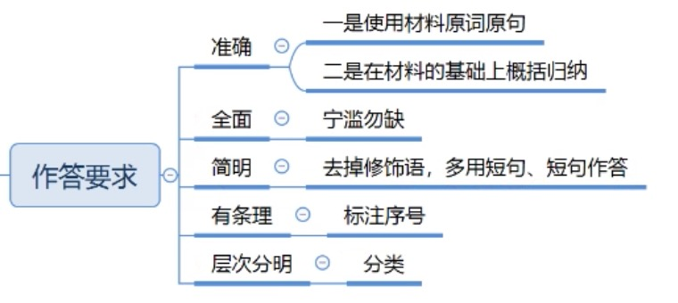

> 要素：含义、问题、原因、意义、危害、对策 等

### 单一题
1、问题
> - 负面标志词汇：
> 	- 不科学、不合理、不到位、不均衡、不完善、不健全、不足
> 	- 缺乏、缺少、流失
> 	- 少、低、差、弱、陈旧、单一等
> 	- 过于...
> - 对策推导问题

2、影响**（注意不是做法）**
> - 正面影响
> 	- 标志词：促进了、改善了、增加了、提高了、减轻了、实现了、弘扬了、节约了、保护了、方便了、倒逼等
> 	- 问题危害推导
> 	- 目的推导
> - 负面影响
> 	- 标志词：降低了、减少了、破坏了、阻碍了、引发了、加重了、激化了等

3、原因
> 原因并非一种独立的要素，其构成也并不“固定”。做题时要依据因果关系来判断具体要点
> 
> - 负面事物的原因多数情况下是负面的——消极词汇
> - 正面事物的原因多数情况下是正面的——积极词汇

4、对策
> 常见命题的方式：答题元素中的常见词汇代表对策，如:做法、措施、举措、建议、对策、意见、解决方法；**经验、启示**等。
> 
> 启示：
> 
> 	- 经验：借鉴好的做法
> 	- 教训：改掉不好的做法

> - 直接摘抄。资料中出现对策标志性动词时，该处往往有得分点。常见的动词有: 建立、健全、统筹、创新、规范、整顿、打击、扶持、规划、设置等。
> - 经验借鉴。其他地区或国家的成功经验可以拿来借鉴。**（通常要总结概括）**
> - 问题反推。当题干要求我们针对......问题，提出建议的时候。
> 

> 矛盾纠纷处理：
> 
> 

### 综合题
`释义 + 相关要素(问题、危害、意义、**事例**等) + 对策(非重点)`
> - 释义：一般根据与解释词句相近的句子，比如专家观点、权威观点、总结句等，得出词句的表面含义
> - 相关要素：根据词句的感情色彩或文段，选择写**负面的危害**还是**正面的意义**。如果文段中有大段的事例，要通过简单的一句话提到事例。**如果分不清要素属于原因还是意义，分开 正面写一堆，负面写一堆。**
> - 对策：非重点，文段有提就写。如果字数允许，可以通过问题稍微提出对策

### 公文题
> 标题
> 
> - 发文机关 + 事由 + 文种，一般发文机关没有，可用“关于”代替。例：关于生猪养殖进入信息化时代的经验介绍讲话稿
> - 居中，一行写不完分两行居中

> 称谓或主送机关
> 
> - 称谓（对象为人），例：尊敬的与会嘉宾
> - 主送机关（对象为单位），例：各社区、各街道办
> - 标题下一行顶格

> 落款
> 
> - 单位（个人 xxxx），例：某企业工会
> - 时间，例：2019年xx年xx月
> - 右下角，时间位于正文右下角倒数四个格子，单位位于日期上面与时间居中

1、方案类

2、总结类

> 结尾不一定要有，文章有适合的就直接摘抄。如题目要求语言生动，结尾需号召

3、宣传类

4、评论类

### 大作文
`文章得分点：主题和观点、结构+论证、语言+卷面`
> 策论文
> 
> - 文章思路通常是“提出问题—分析问题—解决问题”
> 	- 第一段：提出问题
> 	- 第二点：分析问题
> 	- 第三段——第n段：对策
> 	- 结尾
> - 以对策为观点的议论文，且对策紧扣资料，具有客观性

1、主题和观点
> - 主题：即议论对象、写作对象
> - 观点：即文章写作的角度， 其实可以等同于小题中的“要素”
>	- 在实际考试中，找准主题后，可以从阐释含义，分析原因或意义、危害，提出对策等角度切入进行展开。围绕一个特定主题，从关系、问题、原因、意义、危害、对策等 角度提出观点，并结合资料内容和社会实际例子展开论述

2、标题
> 主题词 + 重要性描述
> 
> - 把xx放在最 **关键、核心、重要、首要、明显、突出** 的位置
> - xx事关 **全局、全域、整体**
> - xx需要注重xx
> - xx要夯实xx **基础、保证、保障、前提**

> 对称式标题
> 
> 动词加名词，左边对策右边意义。主题词一般在左边
> 
> 例：放慢脚步，收获幸福；盘活老品牌，换发新生命

> 比喻/拟人式标题
> 
> 主题词 + 重要性描述（比喻/拟人）
> 
> - xx是xx的（拐点、标杆、推手、航标、引擎、脊梁、底线）
> - xx是xx的（牵引机、发动机、原动力、方向标）
> - 对/与xx（零容忍、零懈怠、保持零距离）
> - 为xx推开另一扇窗
> - 为xx注入xx的基因
> - 为xx披上xx的外衣

> 警醒式标题
> 
> 莫让、勿让、不是、切莫。。。（表示不要干什么） 

3、开头
> 阐释式
> 
> - 引出主题词 + 解释主题词

> 评论式
> 
> - 引出题干观点 + 自己的态度（这是一个很大的误解） + 正确的说法

> 总结式
> 
> - 摆出所有的观点

4、论证
> 观点（段落开头） + 论据（中间展开）

> 观点的表达
> 
> - xx是xx的（根本、关键、基础、核心、前提）
> - xx是xx（之基、之源、之本、之依）
> - xx是xx的（重中之重、当务之急、燃眉之急、必然要求）
> - 之所以会xx，究其根本/追根溯源xx
> - 所谓xx是xx；xx是指xx
> - 要xx，就要加强、加大、完善xx

5、结尾
> - 总结式：对策换句话再说一次
> - 展望式：我相信xxxx就会、必将
> - 呼吁号召式：让我们一起来吧
> - 补充式：已经说过的观点 + 还需要 **没说的观点** + 才能 

----
> - 缺乏、打击、严惩、欠缺
> - 建立、完善、填补漏洞
> - 提高、加强、增强、转变
> - 加快、增强前瞻性、预见性
> - 引导、普及、